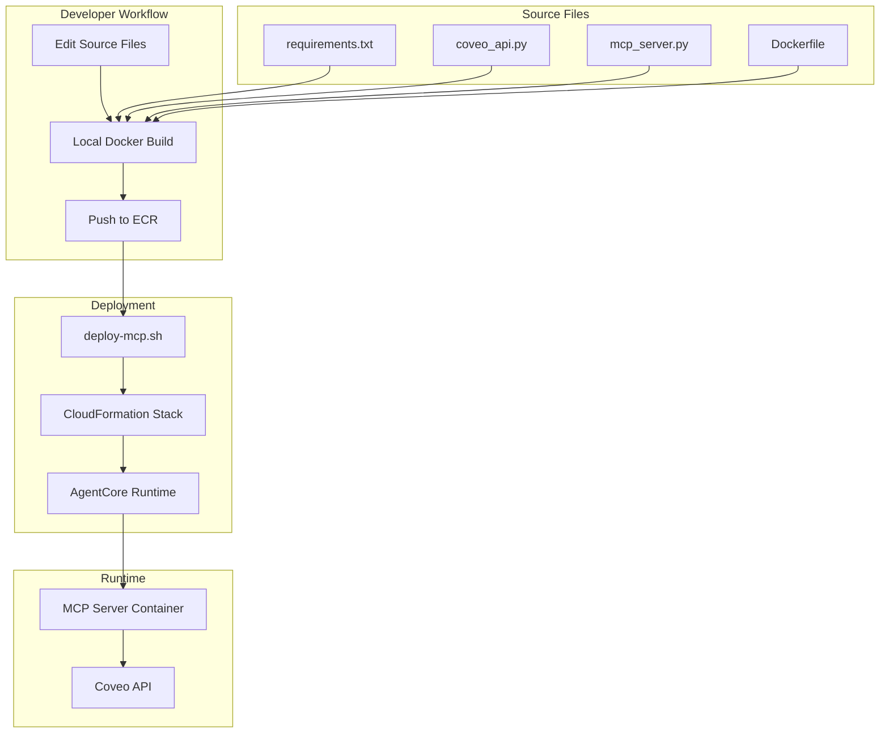

# Design Document: MCP Server Refactoring

## Overview

This design refactors the MCP (Model Context Protocol) server deployment from a CloudFormation-managed CodeBuild approach with inline code to a local Docker build approach with modular source files. The refactoring follows the same pattern successfully used by the `coveo-agent` deployment, improving developer experience while maintaining all business logic and functionality.

### Goals

1. **Improve Developer Experience**: Enable local editing, testing, and version control of MCP server code
2. **Simplify Deployment**: Remove CodeBuild dependency and build Docker images locally
3. **Maintain Consistency**: Follow the same deployment pattern as `coveo-agent` for uniformity
4. **Preserve Functionality**: Keep all business logic, API integrations, and tool definitions unchanged
5. **Enable Faster Iteration**: Reduce deployment time by eliminating CodeBuild wait times

### Non-Goals

- Modifying MCP server business logic or Coveo API integration
- Changing SSM parameter paths or naming conventions
- Altering Agent Runtime integration or MCP tool definitions
- Modifying the complete workshop deployment workflow

## Architecture

### Current Architecture (Before Refactoring)

```
deploy-mcp.sh
    ↓
CloudFormation Stack Creation
    ↓
CodeBuild Project (with inline BuildSpec)
    ├── Generates requirements.txt
    ├── Generates coveo_api.py (inline)
    ├── Generates mcp_server.py (inline)
    ├── Generates Dockerfile (inline)
    ├── Builds Docker image
    └── Pushes to ECR
    ↓
AgentCore Runtime (uses ECR image)
```

**Issues with Current Approach:**
- Code embedded in CloudFormation BuildSpec (hard to edit/test)
- CodeBuild adds 5-10 minutes to deployment time
- No local testing capability
- Version control only tracks template, not actual code
- Debugging requires CloudWatch Logs inspection

### Target Architecture (After Refactoring)

```
deploy-mcp.sh
    ↓
Local Docker Build
    ├── Uses coveo-mcp-server/requirements.txt
    ├── Uses coveo-mcp-server/coveo_api.py
    ├── Uses coveo-mcp-server/mcp_server.py
    ├── Uses coveo-mcp-server/Dockerfile
    ├── Builds Docker image locally
    └── Pushes to ECR
    ↓
CloudFormation Stack Creation
    ↓
AgentCore Runtime (uses ECR image)
```

**Benefits of New Approach:**
- Source files in version control and easily editable
- Local Docker build (faster, testable)
- Consistent with `coveo-agent` deployment pattern
- Simplified CloudFormation template (no CodeBuild)
- Faster iteration cycle (no CodeBuild wait)

### Architecture Diagram



## Components and Interfaces

### 1. Source File Structure

**Directory Layout:**
```
coveo-mcp-server/
├── 
│── requirements.txt      # Python dependencies
│── coveo_api.py          # Coveo API client (business logic)
│── mcp_server.py         # MCP server implementation
├── Dockerfile                # Container build instructions
├── mcp-server-template.yaml  # Simplified CloudFormation template
└── requirements.txt          # Kept for backward compatibility
```

**Design Decision:** Keep all source files in the main `coveo-mcp-server/` directory for simplicity and consistency with the existing `coveo-agent` structure.

### 2. Source Files

#### 2.1 requirements.txt

**Location:** `coveo-mcp-server/requirements.txt`

**Content:** Exact copy from current inline BuildSpec
```
mcp>=1.10.0
boto3>=1.26.0
httpx>=0.25.0
python-dotenv>=0.19.0
bedrock-agentcore
asyncio
dataclasses
typing-extensions
```

**Design Decision:** Keep exact dependencies to ensure no behavioral changes.

#### 2.2 coveo_api.py

**Location:** `coveo-mcp-server/coveo_api.py`

**Responsibilities:**
- Read Coveo credentials from SSM Parameter Store
- Implement Coveo API client functions:
  - `make_coveo_request()` - Search API
  - `retrieve_passages()` - Passages API
  - `generate_answer()` - Answer API (streaming)
- Format API responses
- Handle errors and logging

**Key Interfaces:**
```python
# SSM Parameter Reading
def get_ssm_parameter(name: str) -> str

# API Functions
async def make_coveo_request(payload: Dict[str, Any]) -> Optional[Dict[str, Any]]
async def retrieve_passages(query: str, number_of_passages: int = 5) -> Dict
async def generate_answer(query: str) -> str
```

**SSM Parameters Used:**
- `/{STACK_PREFIX}/coveo/search-api-key` - Coveo API key
- `/{STACK_PREFIX}/coveo/org-id` - Coveo organization ID
- `/{STACK_PREFIX}/coveo/answer-config-id` - Answer configuration ID

**Design Decision:** Extract as-is from BuildSpec without modifications to preserve exact business logic and error handling.

#### 2.3 mcp_server.py

**Location:** `coveo-mcp-server/mcp_server.py`

**Responsibilities:**
- Initialize FastMCP server with stateless HTTP transport
- Define MCP tools:
  - `search_coveo()` - Metadata and URL retrieval
  - `passage_retrieval()` - Content extraction
  - `answer_question()` - Curated answers
- Handle tool invocations and error responses
- Run HTTP server on port 8000

**Key Interfaces:**
```python
# MCP Tool Definitions
@mcp.tool()
async def search_coveo(query: str, numberOfResults: int = 5) -> Dict[str, Any]

@mcp.tool()
async def passage_retrieval(query: str, numberOfPassages: int = 5) -> Dict[str, Any]

@mcp.tool()
async def answer_question(query: str) -> Dict[str, Any]
```

**Design Decision:** Preserve exact tool signatures and response formats to maintain compatibility with Agent Runtime.

#### 2.4 Dockerfile

**Location:** `coveo-mcp-server/Dockerfile`

**Build Strategy:**
```dockerfile
FROM public.ecr.aws/docker/library/python:3.11-slim

WORKDIR /app

# Install dependencies
COPY requirements.txt requirements.txt
RUN pip install --no-cache-dir -r requirements.txt

# Set AWS environment
ENV AWS_REGION=us-east-1
ENV AWS_DEFAULT_REGION=us-east-1

# Create non-root user
RUN useradd -m -u 1000 bedrock_agentcore
COPY . .
RUN chown -R bedrock_agentcore:bedrock_agentcore /app

USER bedrock_agentcore
EXPOSE 8000

CMD ["python", "-m", "mcp_server"]
```

**Design Decisions:**
- Use Python 3.11 slim image for smaller size
- Copy all files from `coveo-mcp-server/` directory
- Non-root user for security (UID 1000 for AgentCore compatibility)
- Module syntax (`-m mcp_server`) required by FastMCP
- No build args needed (credentials from SSM at runtime)

### 3. Deployment Script (deploy-mcp.sh)

**Responsibilities:**
1. Check for orphaned resources and clean up
2. Retrieve Cognito configuration from main stack
3. Build Docker image locally using `docker buildx`
4. Authenticate to ECR
5. Push image to ECR with timestamp tag
6. Deploy/update CloudFormation stack with image URI
7. Save runtime ARN to SSM

**Key Changes from Current Version:**

**Before (CodeBuild approach):**
```bash
# Upload template to S3
aws s3 cp mcp-server-template.yaml "s3://${S3_BUCKET}/..."

# Create stack (CodeBuild builds image)
aws cloudformation create-stack \
    --template-url "$TEMPLATE_URL" \
    ...

# Wait for stack (includes CodeBuild time)
aws cloudformation wait stack-create-complete
```

**After (Local build approach):**
```bash
# Build image locally
cd coveo-mcp-server
docker buildx build \
    --platform linux/arm64 \
    -t "$ECR_REPO:$IMAGE_TAG" \
    --push \
    .

# Create stack (image already in ECR)
aws cloudformation create-stack \
    --template-body file://coveo-mcp-server/mcp-server-template.yaml \
    --parameters \
        ParameterKey=ImageUri,ParameterValue="$ECR_REPO:$IMAGE_TAG" \
    ...
```

**Design Decisions:**
- Use `docker buildx` for ARM64 builds (AgentCore Runtime requirement)
- Tag images with timestamp for versioning: `latest` and `YYYYMMDD-HHMMSS`
- Push image before CloudFormation to avoid race conditions
- Use `--template-body file://` instead of S3 upload (simpler)
- Maintain backward compatibility with existing flags

### 4. CloudFormation Template

**Simplified Template Structure:**

**Resources to Remove:**
- `CodeBuildRole` - No longer needed
- `MCPServerImageBuildProject` - No longer needed
- `CodeBuildTriggerFunction` - No longer needed
- `CustomResourceRole` - No longer needed
- `TriggerCodeBuild` - No longer needed

**Resources to Keep:**
- `ECRRepository` - Still needed for image storage
- `AgentExecutionRole` - Required by AgentCore Runtime
- `MCPServerRuntime` - The actual runtime
- `CoveoSearchApiKeyParameter` - SSM parameters
- `CoveoOrgIdParameter`
- `CoveoAnswerConfigIdParameter`

**New Parameters:**
```yaml
Parameters:
  ImageUri:
    Type: String
    Description: "ECR image URI (e.g., 123456789.dkr.ecr.us-east-1.amazonaws.com/repo:tag)"
```

**Updated Runtime Resource:**
```yaml
MCPServerRuntime:
  Type: AWS::BedrockAgentCore::Runtime
  Properties:
    AgentRuntimeName: !Sub "${StackPrefix}_mcp_server_coveo_mcp_tool_runtime"
    AgentRuntimeArtifact:
      ContainerConfiguration:
        ContainerUri: !Ref ImageUri  # From parameter instead of ECR output
    RoleArn: !GetAtt AgentExecutionRole.Arn
    NetworkConfiguration:
      NetworkMode: !Ref NetworkMode
    ProtocolConfiguration: MCP
```

**Design Decision:** Remove all CodeBuild-related resources to simplify template. Accept image URI as parameter since image is built before stack creation.

### 5. Integration Points

#### 5.1 Agent Runtime Integration

**Interface:** Agent Runtime calls MCP Runtime via ARN
```
Agent Runtime → MCP Runtime ARN → MCP Server Container → Coveo API
```

**No Changes Required:** MCP tool definitions and response formats remain identical.

#### 5.2 SSM Parameter Store

**Read Parameters (at runtime):**
- `/{STACK_PREFIX}/coveo/search-api-key`
- `/{STACK_PREFIX}/coveo/org-id`
- `/{STACK_PREFIX}/coveo/answer-config-id`

**Write Parameters (by deploy script):**
- `/{STACK_PREFIX}/coveo/mcp-runtime-arn`
- `/{STACK_PREFIX}/coveo/mcp-url`

**No Changes Required:** Parameter paths and usage remain identical.

#### 5.3 Complete Workshop Deployment

**Current Flow:**
```
deploy-complete-workshop.sh
    ↓
deploy-main-infra.sh
    ↓
deploy-mcp.sh (CodeBuild approach)
    ↓
deploy-agent.sh (Local build approach)
    ↓
deploy-ui-apprunner.sh
```

**After Refactoring:**
```
deploy-complete-workshop.sh
    ↓
deploy-main-infra.sh
    ↓
deploy-mcp.sh (Local build approach) ← Changed
    ↓
deploy-agent.sh (Local build approach)
    ↓
deploy-ui-apprunner.sh
```

**No Changes Required:** `deploy-complete-workshop.sh` calls `deploy-mcp.sh` the same way. Internal implementation change is transparent.

## Data Models

### Docker Image Metadata

```yaml
Image:
  Repository: ${STACK_PREFIX}-mcp-server
  Tags:
    - latest                    # Always points to most recent
    - YYYYMMDD-HHMMSS          # Timestamp for versioning
  Platform: linux/arm64         # AgentCore Runtime requirement
  Size: ~200MB                  # Estimated (Python 3.11 + dependencies)
```

### CloudFormation Stack Parameters

```yaml
StackParameters:
  StackPrefix: workshop                    # Fixed prefix
  ImageUri: 123456789.dkr.ecr.us-east-1.amazonaws.com/workshop-mcp-server:20250121-143022
  CognitoUserPoolId: us-east-1_XXXXXXXXX  # From main stack
  CognitoUserPoolClientId: XXXXXXXXX       # From main stack
  NetworkMode: PUBLIC                      # Default
```

### SSM Parameter Structure

```yaml
SSMParameters:
  # Written by CloudFormation
  /{STACK_PREFIX}/coveo/search-api-key:
    Type: String
    Value: "xx00000000-0000-0000-0000-000000000000"
  
  /{STACK_PREFIX}/coveo/org-id:
    Type: String
    Value: "your-coveo-org-id"
  
  /{STACK_PREFIX}/coveo/answer-config-id:
    Type: String
    Value: "00000000-0000-0000-0000-000000000000"
  
  # Written by deploy-mcp.sh
  /{STACK_PREFIX}/coveo/mcp-runtime-arn:
    Type: String
    Value: "arn:aws:bedrock-agentcore:us-east-1:123456789:runtime/..."
  
  /{STACK_PREFIX}/coveo/mcp-url:
    Type: String
    Value: "https://bedrock-agentcore.us-east-1.amazonaws.com/runtimes/..."
```

## Error Handling

### Build-Time Errors

**Docker Build Failures:**
```bash
# Error: Docker not running
if ! docker info > /dev/null 2>&1; then
    echo "❌ Docker is not running"
    exit 1
fi

# Error: Build fails
if ! docker buildx build ...; then
    echo "❌ Docker build failed"
    exit 1
fi
```

**ECR Push Failures:**
```bash
# Error: Authentication fails
if ! aws ecr get-login-password | docker login ...; then
    echo "❌ ECR authentication failed"
    exit 1
fi

# Error: Push fails
if ! docker push "$ECR_REPO:$IMAGE_TAG"; then
    echo "❌ ECR push failed"
    exit 1
fi
```

### Deployment-Time Errors

**Missing Dependencies:**
```bash
# Error: MCP runtime not found
if [ -z "$MCP_RUNTIME_ARN" ]; then
    echo "❌ MCP runtime ARN not found"
    echo "   Deploy MCP server first: bash scripts/deploy-mcp.sh"
    exit 1
fi
```

**CloudFormation Failures:**
```bash
# Error: Stack creation fails
aws cloudformation wait stack-create-complete ... || {
    echo "❌ Stack creation failed"
    echo "   Check CloudFormation console for details"
    exit 1
}
```

### Runtime Errors

**SSM Parameter Access:**
```python
def get_ssm_parameter(name):
    try:
        response = ssm.get_parameter(Name=name, WithDecryption=True)
        return response['Parameter']['Value']
    except Exception as e:
        print(f"ERROR: Failed to get SSM parameter {name}: {e}")
        raise
```

**Coveo API Errors:**
```python
async def make_coveo_request(payload):
    try:
        response = await client.post(endpoint, ...)
        response.raise_for_status()
        return response.json()
    except httpx.HTTPStatusError as e:
        error_msg = f"HTTP {e.response.status_code}: {e.response.text}"
        logger.error(f"Coveo API error: {error_msg}")
        return {"error": error_msg}
    except Exception as e:
        logger.error(f"Request failed: {str(e)}")
        return {"error": f"Request failed: {str(e)}"}
```

**Design Decision:** Preserve exact error handling from current implementation to maintain behavior.

## Testing Strategy

### Local Testing

**1. Docker Build Test:**
```bash
cd coveo-mcp-server
docker build -t mcp-server-test .
```

**2. Container Run Test:**
```bash
# Set test environment
export AWS_REGION=us-east-1
export AWS_ACCESS_KEY_ID=...
export AWS_SECRET_ACCESS_KEY=...

# Run container
docker run -p 8000:8000 \
    -e AWS_REGION \
    -e AWS_ACCESS_KEY_ID \
    -e AWS_SECRET_ACCESS_KEY \
    mcp-server-test

# Test endpoint
curl http://localhost:8000/mcp
```

**3. MCP Tool Test:**
```bash
# Test search_coveo tool
curl -X POST http://localhost:8000/mcp \
    -H "Content-Type: application/json" \
    -d '{
        "tool": "search_coveo",
        "arguments": {
            "query": "test query",
            "numberOfResults": 5
        }
    }'
```

### Integration Testing

**1. Deploy to Test Environment:**
```bash
STACK_PREFIX=test-workshop bash scripts/deploy-mcp.sh
```

**2. Verify Runtime Creation:**
```bash
aws bedrock-agentcore get-runtime \
    --runtime-identifier "$MCP_RUNTIME_ARN" \
    --region us-east-1
```

**3. Test via Agent Runtime:**
```bash
# Deploy agent pointing to test MCP
STACK_PREFIX=test-workshop bash scripts/deploy-agent.sh

# Invoke agent with test query
aws lambda invoke \
    --function-name test-workshop-agentcore-runtime \
    --payload '{"text": "search for documentation"}' \
    response.json
```

### Validation Checklist

- [ ] Docker image builds successfully
- [ ] Image pushes to ECR without errors
- [ ] CloudFormation stack creates/updates successfully
- [ ] AgentCore Runtime starts and becomes ACTIVE
- [ ] MCP tools respond to invocations
- [ ] Coveo API calls succeed with valid credentials
- [ ] SSM parameters are read correctly
- [ ] Error handling works as expected
- [ ] Agent Runtime can call MCP Runtime
- [ ] Complete workshop deployment succeeds

## Deployment Process

### Prerequisites

1. **Docker:** Docker Desktop or Docker Engine installed and running
2. **AWS CLI:** Configured with appropriate credentials
3. **Permissions:** IAM permissions for ECR, CloudFormation, AgentCore, SSM
4. **Main Stack:** `workshop-master` stack deployed (for Cognito)

### Deployment Steps

**Step 1: Extract Source Files**
```bash
# Extract files from BuildSpec to coveo-mcp-server/
# - requirements.txt
# - coveo_api.py
# - mcp_server.py
# - Dockerfile
```

**Step 2: Update deploy-mcp.sh**
```bash
# Add Docker build section
# Add ECR push section
# Update CloudFormation parameters
# Remove S3 upload logic
```

**Step 3: Simplify CloudFormation Template**
```bash
# Remove CodeBuild resources
# Add ImageUri parameter
# Update MCPServerRuntime to use parameter
```

**Step 4: Test Deployment**
```bash
# Run deployment
bash scripts/deploy-mcp.sh

# Verify success
aws cloudformation describe-stacks \
    --stack-name workshop-mcp-server \
    --query 'Stacks[0].StackStatus'
```

**Step 5: Verify Integration**
```bash
# Deploy agent
bash scripts/deploy-agent.sh

# Test end-to-end
# (via UI or Lambda invocation)
```

### Rollback Plan

**If Deployment Fails:**

1. **Revert deploy-mcp.sh:**
   ```bash
   git checkout HEAD~1 scripts/deploy-mcp.sh
   ```

2. **Revert CloudFormation template:**
   ```bash
   git checkout HEAD~1 coveo-mcp-server/mcp-server-template.yaml
   ```

3. **Redeploy with old approach:**
   ```bash
   bash scripts/deploy-mcp.sh
   ```

**If Runtime Fails:**

1. **Check CloudWatch Logs:**
   ```bash
   aws logs tail /aws/bedrock-agentcore/workshop-mcp-server --follow
   ```

2. **Verify SSM Parameters:**
   ```bash
   aws ssm get-parameter --name /workshop/coveo/search-api-key
   aws ssm get-parameter --name /workshop/coveo/org-id
   ```

3. **Test Docker Image Locally:**
   ```bash
   docker run -it --rm \
       -e AWS_REGION=us-east-1 \
       -e AWS_ACCESS_KEY_ID=... \
       -e AWS_SECRET_ACCESS_KEY=... \
       ${ECR_REPO}:latest
   ```

## Performance Considerations

### Build Time Comparison

**Current (CodeBuild):**
- CodeBuild startup: 1-2 minutes
- Docker build: 2-3 minutes
- ECR push: 1-2 minutes
- **Total: 4-7 minutes**

**After Refactoring (Local):**
- Docker build: 2-3 minutes
- ECR push: 1-2 minutes
- **Total: 3-5 minutes**

**Improvement: 1-2 minutes faster** (plus no CodeBuild wait in CloudFormation)

### Deployment Time Comparison

**Current:**
- Upload template to S3: 5 seconds
- CloudFormation stack creation: 2 minutes
- CodeBuild execution: 5-7 minutes
- AgentCore Runtime creation: 2-3 minutes
- **Total: 9-12 minutes**

**After Refactoring:**
- Local Docker build: 3-5 minutes
- CloudFormation stack creation: 2 minutes
- AgentCore Runtime creation: 2-3 minutes
- **Total: 7-10 minutes**

**Improvement: 2-3 minutes faster**

### Runtime Performance

**No Change Expected:**
- Container startup time: Same
- MCP tool response time: Same
- Coveo API latency: Same
- Memory usage: Same (~512MB)
- CPU usage: Same

**Design Decision:** Refactoring only affects build/deploy, not runtime performance.

## Security Considerations

### Credential Management

**No Changes:**
- Coveo credentials stored in SSM Parameter Store (encrypted)
- AgentCore Runtime IAM role has SSM read permissions
- No credentials in Docker image or source code
- Runtime reads credentials from SSM at startup

### Container Security

**Maintained:**
- Non-root user (UID 1000)
- Minimal base image (Python 3.11 slim)
- No unnecessary packages
- ECR image scanning enabled

### IAM Permissions

**No Changes:**
- AgentExecutionRole permissions remain the same
- SSM parameter access scoped to `/{STACK_PREFIX}/coveo/*`
- ECR access scoped to specific repository
- CloudWatch Logs write permissions

### Network Security

**No Changes:**
- AgentCore Runtime in PUBLIC network mode (default)
- No inbound connections (AgentCore manages invocations)
- Outbound to Coveo API (HTTPS)
- Outbound to SSM (HTTPS)

## Migration Path

### Phase 1: Preparation (No Deployment)

1. Extract source files from BuildSpec to `coveo-mcp-server/`
2. Create Dockerfile
3. Test local Docker build
4. Commit changes to version control

### Phase 2: Script Updates (No Deployment)

1. Update `deploy-mcp.sh` with local build logic
2. Simplify CloudFormation template
3. Test script changes in dry-run mode
4. Review and commit changes

### Phase 3: Test Deployment

1. Deploy to test environment
2. Verify MCP Runtime creation
3. Test MCP tool invocations
4. Verify Agent Runtime integration
5. Run complete workshop deployment

### Phase 4: Production Deployment

1. Deploy to production environment
2. Monitor CloudWatch Logs
3. Verify end-to-end functionality
4. Update documentation

### Phase 5: Cleanup

1. Remove old CodeBuild resources (if orphaned)
2. Update README with new workflow
3. Archive old deployment artifacts

## Maintenance and Operations

### Updating MCP Server Code

**Before (CodeBuild approach):**
1. Edit inline code in CloudFormation template
2. Upload template to S3
3. Update CloudFormation stack
4. Wait for CodeBuild to rebuild image
5. Wait for AgentCore Runtime to update

**After (Local build approach):**
1. Edit source files in `coveo-mcp-server/`
2. Run `bash scripts/deploy-mcp.sh`
3. Script builds and pushes image
4. Script updates CloudFormation stack
5. AgentCore Runtime updates automatically

**Improvement:** Faster iteration, easier debugging, better version control.

### Monitoring

**CloudWatch Logs:**
- `/aws/bedrock-agentcore/workshop-mcp-server` - Runtime logs
- MCP server logs include detailed request/response info
- Error logs include stack traces

**Metrics:**
- AgentCore Runtime invocation count
- MCP tool call latency
- Coveo API error rates

**Alerts:**
- Runtime health check failures
- High error rates
- SSM parameter access failures

### Troubleshooting

**Common Issues:**

1. **Docker build fails:**
   - Check Docker is running
   - Verify Dockerfile syntax
   - Check network connectivity for pip install

2. **ECR push fails:**
   - Verify AWS credentials
   - Check ECR repository exists
   - Verify IAM permissions

3. **Runtime fails to start:**
   - Check CloudWatch Logs
   - Verify SSM parameters exist
   - Test Coveo API credentials

4. **MCP tools return errors:**
   - Check Coveo API credentials
   - Verify SSM parameter values
   - Test Coveo API directly

## Appendix

### File Extraction Mapping

| Current Location (BuildSpec) | New Location | Size |
|------------------------------|--------------|------|
| Inline in BuildSpec | `coveo-mcp-server/requirements.txt` | ~200 bytes |
| Inline in BuildSpec | `coveo-mcp-server/coveo_api.py` | ~8 KB |
| Inline in BuildSpec | `coveo-mcp-server/mcp_server.py` | ~4 KB |
| Inline in BuildSpec | `coveo-mcp-server/Dockerfile` | ~500 bytes |

### Command Reference

**Build Docker Image:**
```bash
cd coveo-mcp-server
docker buildx build \
    --platform linux/arm64 \
    -t workshop-mcp-server:latest \
    .
```

**Push to ECR:**
```bash
aws ecr get-login-password --region us-east-1 | \
    docker login --username AWS --password-stdin \
    123456789.dkr.ecr.us-east-1.amazonaws.com

docker tag workshop-mcp-server:latest \
    123456789.dkr.ecr.us-east-1.amazonaws.com/workshop-mcp-server:latest

docker push \
    123456789.dkr.ecr.us-east-1.amazonaws.com/workshop-mcp-server:latest
```

**Deploy Stack:**
```bash
aws cloudformation create-stack \
    --stack-name workshop-mcp-server \
    --template-body file://coveo-mcp-server/mcp-server-template.yaml \
    --parameters \
        ParameterKey=ImageUri,ParameterValue=123456789.dkr.ecr.us-east-1.amazonaws.com/workshop-mcp-server:latest \
        ParameterKey=CognitoUserPoolId,ParameterValue=us-east-1_XXXXXXXXX \
        ParameterKey=CognitoUserPoolClientId,ParameterValue=XXXXXXXXX \
    --capabilities CAPABILITY_NAMED_IAM \
    --region us-east-1
```

### Comparison with coveo-agent

| Aspect | coveo-agent | mcp-server (after refactor) |
|--------|-------------|----------------------------|
| Build approach | Local Docker build | Local Docker build ✓ |
| Source files | Separate files | Separate files ✓ |
| Dockerfile | Yes | Yes ✓ |
| CodeBuild | No | No ✓ |
| deploy script | deploy-agent.sh | deploy-mcp.sh ✓ |
| CloudFormation | Simplified | Simplified ✓ |
| Image platform | linux/arm64 | linux/arm64 ✓ |
| ECR repository | Yes | Yes ✓ |
| SSM parameters | Yes | Yes ✓ |

**Result:** Complete consistency between both deployments.
