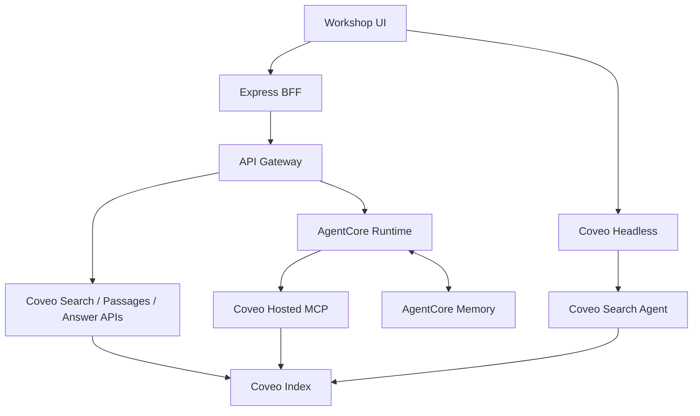

# Coveo + AWS Workshop

This two-hour workshop shows three practical ways to build grounded AI search and conversational experiences with Coveo.

## Objective

Understand when to use direct Coveo APIs, when to use AWS AgentCore with Coveo Hosted MCP, and when a native Coveo Search Agent is the simplest path for grounded conversational search with follow-up questions.

## What You Will Build

  <h3>Lab 1: Coveo Direct APIs</h3>
  
<strong>Pattern:</strong> Direct Coveo API integration

  
Use Search, Passage Retrieval, and Answer APIs directly from the workshop UI.

  
Duration: 20 minutes

  <h3>Lab 2: AgentCore + Coveo Hosted MCP Chatbot</h3>
  
<strong>Pattern:</strong> AWS AgentCore Runtime + Coveo Hosted MCP

  
Use an AWS-hosted agent runtime that calls Coveo Hosted MCP tools and maintains memory-enabled chatbot sessions.

  
Duration: 25 minutes

  <h3>Lab 3: Native Coveo Search Agent with Headless</h3>
  
<strong>Pattern:</strong> Coveo Headless + Coveo Search Agent

  
Experience native Coveo conversational answers and follow-ups without building an AWS agent or custom memory layer.

  
Duration: 25 minutes

## Recommended Schedule

| Segment | Duration |
|---|---:|
| Introduction and setup | 15 min |
| Lab 1: Coveo Direct APIs | 20 min |
| Lab 2: AgentCore + Hosted MCP Chatbot | 25 min |
| Lab 3: Native Coveo Search Agent | 25 min |
| Discussion and Q&A | 15 min |

## Architecture At A Glance

```mermaid
graph TB
    UI[Workshop UI]
    BFF[Express BFF]
    API[API Gateway]
    DIRECT[Coveo Search / Passages / Answer APIs]
    AGENTCORE[AgentCore Runtime]
    MCP[Coveo Hosted MCP]
    MEMORY[AgentCore Memory]
    HEADLESS[Coveo Headless]
    SEARCHAGENT[Coveo Search Agent]
    INDEX[Coveo Index]

    UI --> BFF
    BFF --> API
    API --> DIRECT
    API --> AGENTCORE
    AGENTCORE --> MCP
    AGENTCORE <--> MEMORY
    MCP --> INDEX
    DIRECT --> INDEX

    UI --> HEADLESS
    HEADLESS --> SEARCHAGENT
    SEARCHAGENT --> INDEX
```

## Important Positioning

- **Lab 1** shows the raw Coveo building blocks.
- **Lab 2** shows when AWS AgentCore is useful: agent orchestration, Hosted MCP tools, and memory-enabled sessions.
- **Lab 3** shows the simplest native conversational search path: Coveo Search Agent with Headless follow-ups and citations.

The older Bedrock Agent passage-tool lab and the standalone memory deep dive are retained in `mkdocs-workshop/retired/`, outside the published documentation tree.

## Prerequisites

- AWS Console access in `us-east-1`
- Workshop UI login credentials
- Pre-indexed financial content in Coveo
- Coveo Search Agent configured by the instructor before Lab 3

!!! warning "Model Throughput"
    AgentCore responses depend on the configured foundation model. If the model is temporarily throttled during the live event, wait 30-60 seconds and retry.

## Start

  <a href="lab1/" class="md-button md-button--primary" style="font-size: 1.1rem; padding: 1rem 2rem;">
    Start Lab 1
  </a>

