# Coveo + AWS Bedrock Workshop

  

    A hands-on builder's workshop exploring AI-powered search and conversational experiences
  

## 🎯 Objective

Master three integration patterns between Coveo and AWS Bedrock to build intelligent search and conversational AI solutions. This 90-minute hands-on workshop covers direct API integration, Bedrock Agent orchestration, and AgentCore with Model Context Protocol (MCP).

## 🏗️ What You Will Build

  <h3>🔍 Lab 1: Direct Integration with Coveo API</h3>
  
<strong>Pattern:</strong> Coveo Direct API

  
Learn to integrate Coveo Search, Passage Retrieval, and Answer APIs directly into your application for intelligent search experiences.

  
⏱️ Duration: 20 minutes

  <h3>🤖 Lab 2: Bedrock Agent with Coveo Tool</h3>
  
<strong>Pattern:</strong> Bedrock Agent

  
Configure AWS Bedrock Agent to use Coveo Passage Retrieval as a tool for grounded conversational AI responses.

  
⏱️ Duration: 20 minutes

  <h3>⚡ Lab 3: AgentCore with Coveo MCP Server</h3>
  
<strong>Pattern:</strong> AgentCore Runtime + MCP

  
Deploy AWS Bedrock AgentCore with Model Context Protocol (MCP) for advanced agent orchestration with Coveo tools.

  
⏱️ Duration: 20 minutes

  <h3>💬 Lab 4: Multi-Turn Conversations & Memory</h3>
  
<strong>Patterns:</strong> All Three Backends

  
Test conversational AI with session memory and cross-session recall using the chatbot interface across all integration patterns.

  
⏱️ Duration: 20 minutes

## ✅ Prerequisites

**Required Access**:

!!! info "AWS Account Credentials"
    Your instructor will provide AWS account credentials and access instructions at the beginning of the workshop.

!!! info "Search UI Account Credentials"
    Your instructor will provide Search UI credentials and access instructions at the beginning of the workshop.

- AWS Console access (Verify Access to AWS. NOTE: Switch to `us-east-1` region)
- Workshop UI Access (Verify Access to the search UI with the provided credentials)

**Knowledge Base**: Pre-indexed financial content from 11 authoritative sources.

??? info "View All Indexed Sources"
    - **Wikipedia** - General knowledge and financial concepts
    - **Investor.gov** - Investment guidance and securities information
    - **IRS** - Tax information and regulations
    - **NCUA** - National Credit Union Administration resources
    - **FinCEN** - Financial Crimes Enforcement Network guidance
    - **CFPB** - Consumer Financial Protection Bureau resources
    - **FDIC** - Federal Deposit Insurance Corporation information
    - **FRB** - Federal Reserve Board policies and guidance
    - **OCC** - Office of the Comptroller of the Currency regulations
    - **MyMoney.gov** - Financial literacy and education resources
    - **FTC** - Federal Trade Commission consumer protection guidance

All exercises are console-based - no command-line tools required.

## 🏗️ Deployed Infrastructure

Your AWS account includes pre-deployed components:

```mermaid
graph TD
    UI["🖥️ Search UI<br/>(App Runner)"]
    
    API["🔐 API Gateway<br/>(HTTP API)"]
    AUTH["🔐 Cognito<br/>(Authentication)"]
    
    L1["⚡ Search Proxy<br/>(Lambda)"]
    L2["⚡ Passages Proxy<br/>(Lambda)"]
    L3["⚡ Answer Proxy<br/>(Lambda)"]
    L4["⚡ Agent Chat<br/>(Lambda)"]
    L5["⚡ AgentCore Chat<br/>(Lambda)"]
    
    BA["🤖 Bedrock Agent<br/>(Action Groups)"]
    ACR["🤖 AgentCore Runtime<br/>(Orchestrator)"]
    MCP["🤖 Coveo MCP Server<br/>(Tool Runtime)"]
    MEM["🤖 Agent Memory<br/>(Cross-Session)"]
    
    COVEO["🌐 Coveo Platform<br/>(Search/Passages/Answer)"]
    
    UI -.->|Login| AUTH
    UI -->|HTTPS + JWT| API
    API -.->|Verify Token| AUTH
    
    API -->|/search| L1
    API -->|/passages| L2
    API -->|/answer| L3
    API -->|/agent| L4
    API -->|/agentcore| L5
    
    L1 & L2 & L3 -->|Direct API| COVEO
    
    L4 -->|Invoke| BA
    L5 -->|Invoke| ACR
    
    BA -->|Tool Calls| COVEO
    ACR -->|MCP Protocol| MCP
    MCP -->|API Calls| COVEO
    
    BA -.->|Memory| MEM
    ACR -.->|Memory| MEM
    
    style UI fill:#e1f5fe,stroke:#01579b,stroke-width:3px,color:#000
    style API fill:#f3e5f5,stroke:#4a148c,stroke-width:3px,color:#000
    style AUTH fill:#f3e5f5,stroke:#4a148c,stroke-width:2px,color:#000
    style L1 fill:#fff3e0,stroke:#e65100,stroke-width:2px,color:#000
    style L2 fill:#fff3e0,stroke:#e65100,stroke-width:2px,color:#000
    style L3 fill:#fff3e0,stroke:#e65100,stroke-width:2px,color:#000
    style L4 fill:#fff3e0,stroke:#e65100,stroke-width:2px,color:#000
    style L5 fill:#fff3e0,stroke:#e65100,stroke-width:2px,color:#000
    style BA fill:#fce4ec,stroke:#880e4f,stroke-width:3px,color:#000
    style ACR fill:#fce4ec,stroke:#880e4f,stroke-width:3px,color:#000
    style MCP fill:#fce4ec,stroke:#880e4f,stroke-width:3px,color:#000
    style MEM fill:#fce4ec,stroke:#880e4f,stroke-width:2px,color:#000
    style COVEO fill:#e8f5e8,stroke:#1b5e20,stroke-width:3px,color:#000
```

**Key Components**:

- **Search UI**: Interactive interface for testing all integration patterns
- **API Gateway + Cognito**: Secure API access with JWT authentication
- **Lambda Functions**: Serverless proxies for each backend mode
- **Bedrock Agent**: AI orchestration with Coveo passage API tool integration
- **AgentCore Runtime**: Advanced agent platform with MCP protocol
- **Coveo Platform**: Enterprise search with AI-powered relevance

**Workshop UI Features**:

| Feature | Search Interface | Chatbot Interface |
|---------|------------------|-------------------|
| **Core** | Backend selection toggle • Search bar • Results with citations | Multi-turn conversations • Session memory |
| **Display** | AI-generated answers • Passage excerpts • Source filtering | Cross-session memory • Source attribution |

## 🚀 Progressive Learning Path

| Lab | Duration | Focus |
|-----|----------|-------|
| **Lab 1** | 20 min | Direct Integration with Coveo API |
| **Lab 2** | 20 min | Integrate Bedrock Agent with Coveo Passage Retrieval API Tool |
| **Lab 3** | 20 min | Integrate Bedrock AgentCore with Coveo MCP Server |
| **Lab 4** | 20 min | Test Multi-Turn Conversations with Agents |

**Learning Objectives**:

| Technical Skills | Business Understanding |
|------------------|------------------------|
| 🔍 Master three Coveo-Bedrock integration patterns | ✅ Identify when to use each pattern |
| 🤖 Configure agents with custom tools and memory | ✅ Evaluate benefits and trade-offs |
| ⚡ Deploy AgentCore runtimes with MCP servers | ✅ Design case deflection strategies |
| 💬 Implement cross-session conversational memory | ✅ Assess ROI for intelligent search |
| 📊 Observe agent behavior through AWS tooling | ✅ Apply production-ready patterns |

---

## 🎉 Let's Get Started!

  <a href="lab1/" class="md-button md-button--primary" style="font-size: 1.1rem; padding: 1rem 2rem;">
    Start Lab 1: Coveo Discovery →
  </a>

!!! tip "Workshop Support"
    If you encounter issues, ask your instructor for assistance.
