# Lab 1: Architecture Deep Dive

This page provides detailed architectural information for the Direct Coveo Integration pattern used in Lab 1.

## 🏗️ System Architecture

### High-Level Overview

```mermaid
%%{init: {'theme':'base', 'themeVariables': { 'primaryColor':'#e8f5e9','primaryTextColor':'#000','primaryBorderColor':'#4caf50','lineColor':'#4caf50','secondaryColor':'#e3f2fd','tertiaryColor':'#fff3e0'}}}%%
graph TB
    subgraph Frontend["🖥️ Frontend Layer"]
        UI[React Search UI<br/>App Runner<br/>Port 3003]
    end
    
    subgraph API["🔐 API Layer"]
        AG[API Gateway<br/>HTTP API]
        AUTH[Cognito<br/>Authentication]
    end
    
    subgraph Processing["⚡ Processing Layer"]
        SP[Search Proxy<br/>Lambda]
        PP[Passages Proxy<br/>Lambda]
        AP[Answer Proxy<br/>Lambda]
        QS[Query Suggest<br/>Lambda]
        HP[HTML Proxy<br/>Lambda]
    end
    
    subgraph External["🌐 External Services"]
        COVEO[Coveo Platform<br/>Search + Passages + Answer APIs]
    end
    
    UI -->|HTTPS| AG
    AG -->|JWT| AUTH
    AG -->|Route| SP
    AG -->|Route| PP
    AG -->|Route| AP
    AG -->|Route| QS
    AG -->|Route| HP
    
    SP -->|API Call| COVEO
    PP -->|API Call| COVEO
    AP -->|API Call| COVEO
    QS -->|API Call| COVEO
    HP -->|API Call| COVEO
    
    style UI fill:#e1f5fe,stroke:#01579b,stroke-width:3px
    style AG fill:#f3e5f5,stroke:#4a148c,stroke-width:3px
    style AUTH fill:#fff3e0,stroke:#e65100,stroke-width:2px
    style SP fill:#e8f5e9,stroke:#1b5e20,stroke-width:2px
    style PP fill:#e8f5e9,stroke:#1b5e20,stroke-width:2px
    style AP fill:#e8f5e9,stroke:#1b5e20,stroke-width:2px
    style QS fill:#e8f5e9,stroke:#1b5e20,stroke-width:2px
    style HP fill:#e8f5e9,stroke:#1b5e20,stroke-width:2px
    style COVEO fill:#fff9c4,stroke:#f57f17,stroke-width:3px
```



### Component Details

#### Frontend Layer

- **React Search UI**: Single-page application hosted on AWS App Runner
- **Authentication**: Cognito-based user authentication with JWT tokens
- **Responsive Design**: Works on desktop and mobile devices
- **Real-time Updates**: Dynamic result rendering without page refresh

#### API Gateway Layer

- **HTTP API**: RESTful endpoints for all search operations
- **CORS Configuration**: Enables cross-origin requests from UI
- **JWT Authorizer**: Validates Cognito tokens
- **Request Routing**: Directs requests to appropriate Lambda functions

#### Lambda Functions

Each Lambda function handles a specific Coveo API integration:

| Function | Purpose | Coveo API | Response Format |
|----------|---------|-----------|-----------------|
| `search_proxy` | Traditional search results | Search API | Ranked results with metadata |
| `passages_proxy` | Semantic text retrieval | Passages API | Relevant text excerpts |
| `answering_proxy` | AI-generated responses | Answer API | Natural language answers |
| `query_suggest_proxy` | Search suggestions | Query Suggest API | Autocomplete suggestions |
| `html_proxy` | Content preview | HTML API | Formatted content preview |

---

## Overall Request Flow

This diagram shows the end-to-end flow for Pattern 1 (Direct API Integration):


---

## 🔄 Request Flow Sequences

### Answer Request Flow


**Key Steps**:

1. User enters question
2. Answer Proxy calls Coveo Answer API
3. Coveo generates AI response with sources
4. Citations formatted and returned
5. UI displays answer with clickable sources

---

### Passages Request Flow


**Key Steps**:

1. User enters query
2. Passages Proxy calls Coveo Passages API
3. Coveo performs semantic search
4. Relevant text excerpts extracted
5. UI displays passages with highlighting

---
### Search Request Flow


**Key Steps**:

1. User enters query in search bar
2. UI validates and sends to API Gateway
3. API Gateway authenticates JWT token
4. Search Proxy Lambda builds Coveo API request
5. Coveo processes query with ML ranking
6. Results returned with facets and metadata
7. UI renders results in three sections

---

## 🔧 Technical Implementation

### Lambda Function Structure

Each proxy Lambda follows a consistent pattern:

```python
import json
import requests
import os

def lambda_handler(event, context):
    """
    Proxy Lambda function for Coveo API integration
    """
    # 1. Extract request parameters
    body = json.loads(event['body'])
    query = body.get('query', '')
    
    # 2. Build Coveo API request
    coveo_request = {
        'q': query,
        'organizationId': os.environ['COVEO_ORG_ID'],
        'searchHub': 'workshop',
        'numberOfResults': 20,
        'fieldsToInclude': ['title', 'uri', 'excerpt']
    }
    
    # 3. Call Coveo API
    headers = {
        'Authorization': f'Bearer {os.environ["COVEO_API_KEY"]}',
        'Content-Type': 'application/json'
    }
    
    response = requests.post(
        'https://platform.cloud.coveo.com/rest/search/v2/',
        json=coveo_request,
        headers=headers
    )
    
    # 4. Format and return response
    return {
        'statusCode': 200,
        'headers': {
            'Content-Type': 'application/json',
            'Access-Control-Allow-Origin': '*'
        },
        'body': json.dumps(response.json())
    }
```

### Environment Configuration

Each Lambda function uses these environment variables:

| Variable | Purpose | Example Value |
|----------|---------|---------------|
| `COVEO_ORG_ID` | Coveo organization identifier | `workshoporg123` |
| `COVEO_API_KEY` | API authentication token | `xx-xxxxxxxx-xxxx-xxxx` |
| `COVEO_SEARCH_HUB` | Analytics tracking identifier | `workshop` |
| `COVEO_PIPELINE` | Query processing pipeline | `default` |

### Error Handling

All Lambda functions implement consistent error handling:

```python
try:
    # Coveo API call
    response = requests.post(coveo_url, json=request_body, headers=headers)
    response.raise_for_status()
    
    return {
        'statusCode': 200,
        'body': json.dumps(response.json())
    }
    
except requests.exceptions.RequestException as e:
    return {
        'statusCode': 500,
        'body': json.dumps({
            'error': 'Coveo API error',
            'message': str(e)
        })
    }
except Exception as e:
    return {
        'statusCode': 500,
        'body': json.dumps({
            'error': 'Internal server error',
            'message': str(e)
        })
    }
```

---

## 📊 Performance Characteristics

### Response Times (Typical)

| Operation | Average Latency | 95th Percentile |
|-----------|----------------|-----------------|
| Search | 150ms | 300ms |
| Answer | 800ms | 1500ms |
| Passages | 200ms | 400ms |
| Query Suggest | 100ms | 200ms |

### Scalability

- **Lambda Concurrency**: Auto-scales to handle traffic spikes
- **API Gateway**: Handles thousands of requests per second
- **Coveo Platform**: Enterprise-grade scalability and availability
- **Serverless Design**: Scales as the load increases, minimal costs
- **Seperation of Concern**: Front end decoupled from backend

### Cost Optimization

- **Lambda**: Pay per request and execution time (~$0.20 per million requests)
- **API Gateway**: Pay per API call (~$1.00 per million requests)
- **App Runner**: Pay for running time and requests (~$0.064 per vCPU-hour)
- **Coveo**: Usage-based pricing for API calls

---

## 🔒 Security Implementation

### Authentication & Authorization


**Security Layers**:

1. **Cognito User Pools**: Secure user authentication
2. **JWT Tokens**: Stateless session management
3. **API Gateway Authorization**: Request validation and routing
4. **Lambda IAM Roles**: Least privilege access

### Data Protection

- **HTTPS Everywhere**: All communications encrypted in transit
- **API Key Management**: Secure storage in Lambda environment variables
- **CORS Configuration**: Controlled cross-origin access
- **No PII Storage**: User data not persisted

### Monitoring & Logging

- **CloudWatch Logs**: All Lambda function logs
- **X-Ray Tracing**: Request flow visualization
- **CloudWatch Metrics**: Performance and error monitoring
- **Coveo Analytics**: Search usage and performance tracking

---

## 🎯 Benefits of This Architecture

### Advantages

<div style="display: grid; grid-template-columns: repeat(auto-fit, minmax(250px, 1fr)); gap: 1rem; margin: 1.5rem 0;">
  <div style="padding: 1rem; background: #e8f5e9; border-radius: 8px;">
    <strong>⚡ Performance</strong><br/>
    <small>Direct API calls minimize latency</small>
  </div>
  <div style="padding: 1rem; background: #e3f2fd; border-radius: 8px;">
    <strong>🎯 Simplicity</strong><br/>
    <small>Straightforward request/response pattern</small>
  </div>
  <div style="padding: 1rem; background: #fff3e0; border-radius: 8px;">
    <strong>📈 Scalability</strong><br/>
    <small>Serverless components auto-scale</small>
  </div>
  <div style="padding: 1rem; background: #f3e5f5; border-radius: 8px;">
    <strong>💰 Cost-Effective</strong><br/>
    <small>Pay only for actual usage</small>
  </div>
  <div style="padding: 1rem; background: #fce4ec; border-radius: 8px;">
    <strong>🔧 Maintainable</strong><br/>
    <small>Clear separation of concerns</small>
  </div>
</div>

### Trade-offs

| Aspect | Benefit | Limitation |
|--------|---------|------------|
| **Conversational** | Fast responses | No multi-turn context |
| **Memory** | Stateless (simple) | Each request independent |
| **Orchestration** | Direct control | Manual integration required |
| **Complexity** | Low | Limited to single API calls |

---

## 📚 Additional Resources

### Coveo Documentation

- [Coveo Search API](https://docs.coveo.com/en/13/api-reference/search-api)
- [Coveo Passages API](https://docs.coveo.com/en/oaie5277/)
- [Coveo Answer API](https://docs.coveo.com/en/p3ob0090//)

### AWS Services Documentation

- [AWS Lambda](https://docs.aws.amazon.com/lambda/)
- [Amazon API Gateway](https://docs.aws.amazon.com/apigateway/)
- [Amazon Cognito](https://docs.aws.amazon.com/cognito/)
- [AWS App Runner](https://docs.aws.amazon.com/apprunner/)

---