# Lab 1: Environment Check + Coveo Discovery

**Duration**: 20 minutes  
**Objective**: Confirm access, explore Coveo platform capabilities, and understand direct API integration benefits.

<div class="backend-badge coveo">Coveo Direct API</div>

## 🎯 Lab Goals

By the end of this lab, you will:

- ✅ Verify access to all workshop systems
- ✅ Understand the Coveo platform architecture
- ✅ Test search, passage retrieval, and answer APIs
- ✅ Explore source attribution and relevance features
- ✅ Identify when to use direct Coveo integration

## 🏗️ Architecture Overview

In this lab, you'll explore the **Direct API Integration** pattern:

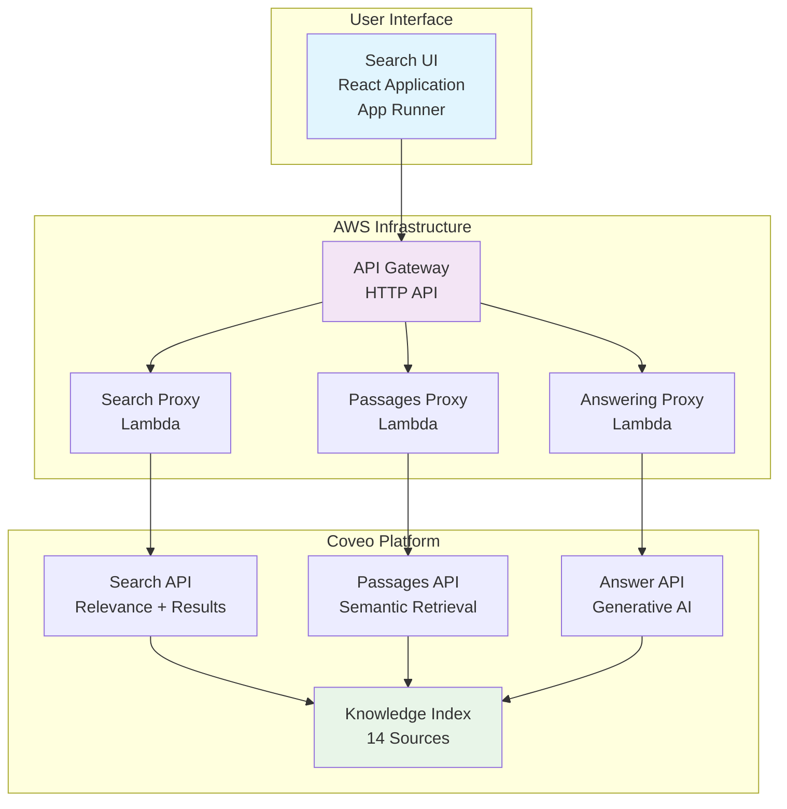

## 🔄 Pattern 1 Sequence Diagram

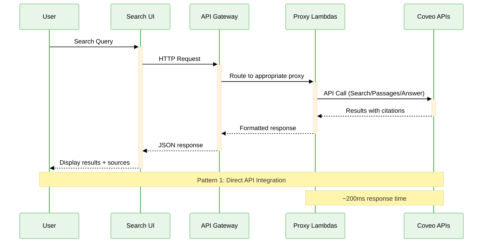

## 📋 Lab Exercises

### Exercise 1.1: Coveo Platform Overview (5 minutes)

**Type**: Instructor-led demonstration

Your instructor will demonstrate the Coveo platform setup. Follow along and take note of:

#### Coveo Console Components

<div style="display: grid; grid-template-columns: repeat(auto-fit, minmax(250px, 1fr)); gap: 1rem; margin: 1.5rem 0;">
  <div style="padding: 1rem; background: #e8f5e9; border-radius: 8px; border-left: 4px solid #4caf50;">
    <strong>📚 Sources</strong><br/>
    <small>14 authoritative knowledge sources</small>
  </div>
  <div style="padding: 1rem; background: #e3f2fd; border-radius: 8px; border-left: 4px solid #2196f3;">
    <strong>🔍 Index</strong><br/>
    <small>Processed and enriched content</small>
  </div>
  <div style="padding: 1rem; background: #fff3e0; border-radius: 8px; border-left: 4px solid #ff9800;">
    <strong>🎯 Query Pipelines</strong><br/>
    <small>Search logic and ML models</small>
  </div>
  <div style="padding: 1rem; background: #f3e5f5; border-radius: 8px; border-left: 4px solid #9c27b0;">
    <strong>📊 Analytics</strong><br/>
    <small>Usage patterns and performance</small>
  </div>
</div>

??? info "Coveo Sources in this Workshop (Indexed Content)"
    - **Wikipedia** - General knowledge
    - **Investor.gov** - Investment guidance
    - **IRS** - Tax information
    - **NCUA** - Credit unions
    - **FinCEN** - Financial crimes
    - **CFPB** - Consumer protection
    - **FDIC** - Deposit insurance
    - **FRB** - Federal Reserve
    - **OCC** - Banking regulation
    - **MyMoney.gov** - Financial literacy
    - **FTC** - Trade commission

**Coveo Console - Sources Overview**

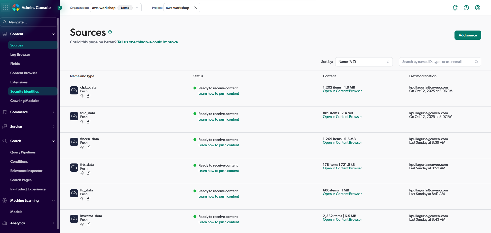

**Coveo Console - Query Pipeline Configuration**

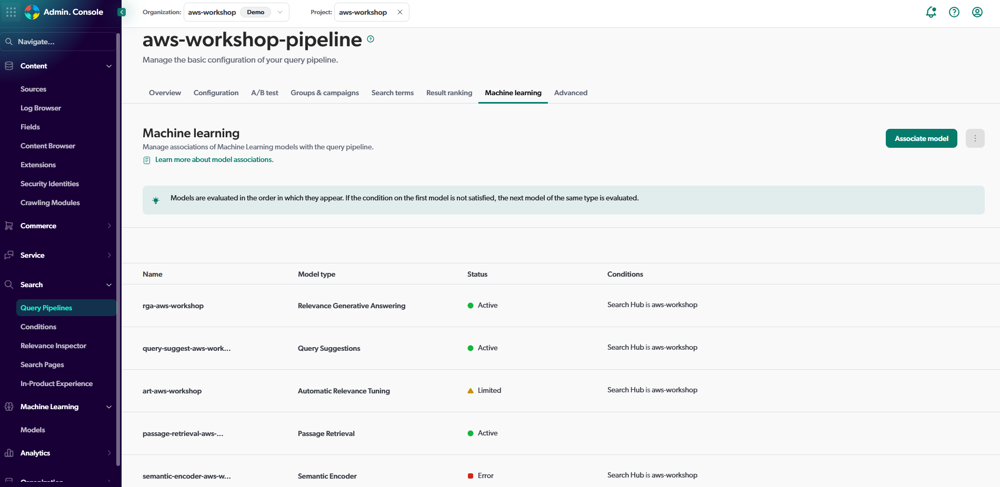

---

### Exercise 1.2: Access the Workshop UI (3 minutes)

**Type**: Hands-on

1. **Open the App Runner URL** provided by your instructor
2. **Login** using the provided username and password for the UI (not AWS credentials!)

**Workshop UI - Login Page**

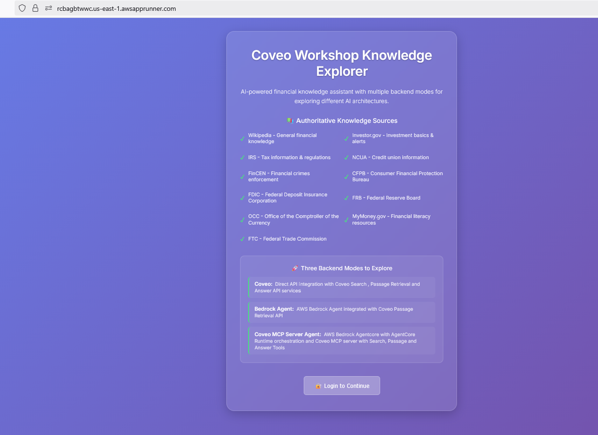

3. **Explore the interface**:
    - Backend mode selector (top right)
    - Search bar (center)
    - Chatbot toggle (bottom right)
    - Results sections (answer, passages, search)

**Workshop UI - Main Interface with Backend Selector**

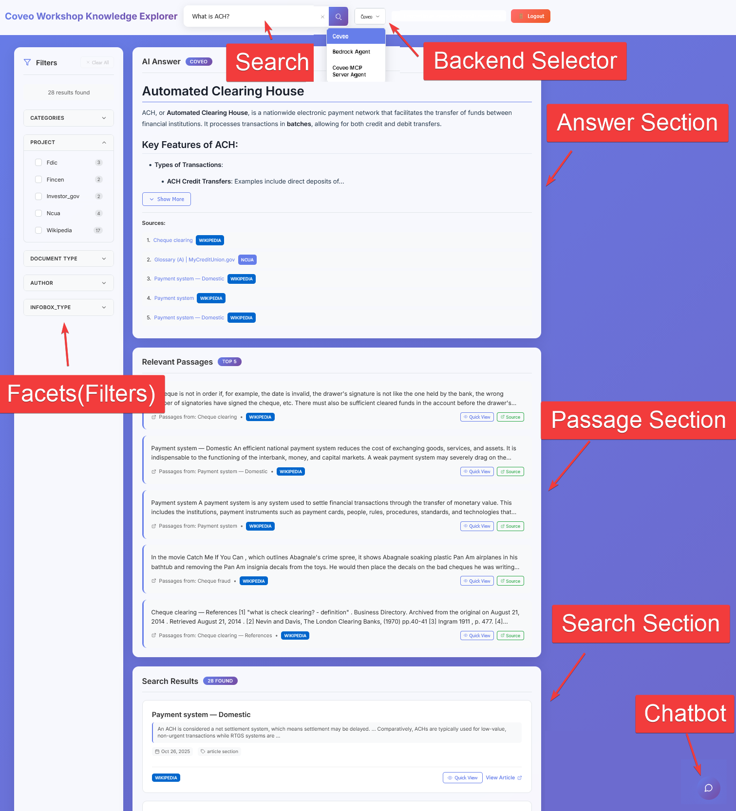

!!! tip "UI Navigation"
    The UI has three main sections:
    - **Answer**: AI-generated response with source citation
    - **Passages**: Relevant text excerpts for context
    - **Search Results**: Traditional search results


---

### Exercise 1.3: Test Direct Coveo Integration (10 minutes)

**Type**: Hands-on

**Workshop UI - Architecture with Coveo Backend Mode Selected**

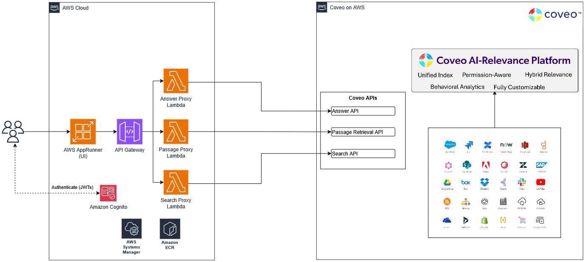

### Objective

Test the Coveo Direct API integration with sample queries and explore all result sections.

### Step-by-Step Instructions

#### Step 1: Verify Backend Mode

1. **Look at the backend selector** (top right)
2. **Ensure "Coveo" is selected**
3. **Note the three options**: Coveo, Bedrock Agent, Coveo MCP Server Agent

**Workshop UI - Backend Mode Selector with Coveo Selected**

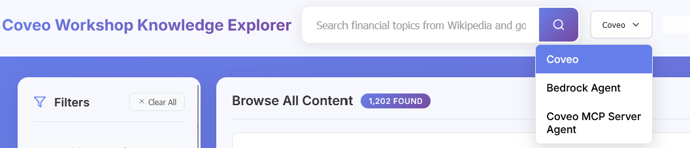

#### Step 2: Run Your First Query

1. **Click in the search bar**
2. **Type or paste this sample query**:

**Query 1:**
```
adjustable rate mortgage index margin
```

3. **Press Enter** or click the search button

4. **Wait for results** (should appear in 1-2 seconds)


#### Step 3: Explore Answer Section

Scroll down to see the **AI Answer** section:

**Answer Section - AI-Generated Response**

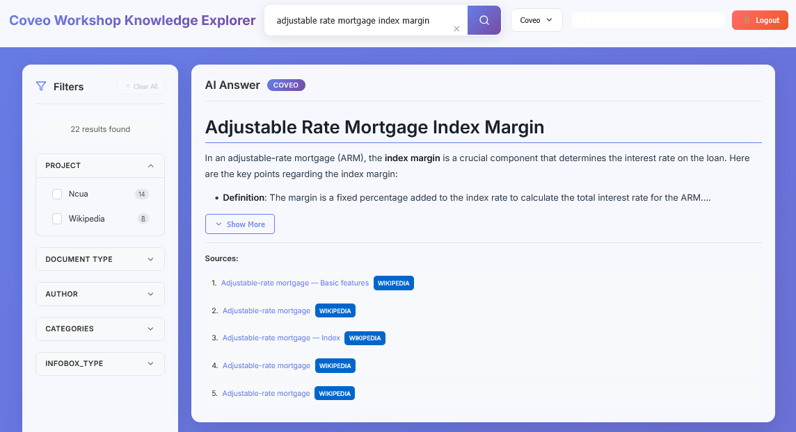

**What to observe**:

<div style="background: #e3f2fd; padding: 1.5rem; border-radius: 8px; margin: 1rem 0;">
  <h4>💡 Answer Section</h4>
  <ul>
    <li>✅ Natural language explanation of your query</li>
    <li>✅ Comprehensive coverage of the topic</li>
    <li>✅ Source citations at the bottom</li>
    <li>✅ Clickable URLs to original sources</li>
  </ul>
</div>

**Click on a source citation**:
- Verify it opens the authoritative source
- Note the URL domain (gov, official sites)

#### Step 4: Explore Passages Section

Scroll down to see the **Relevant Passages** section:

**Passages Section - Relevant Text Excerpts**

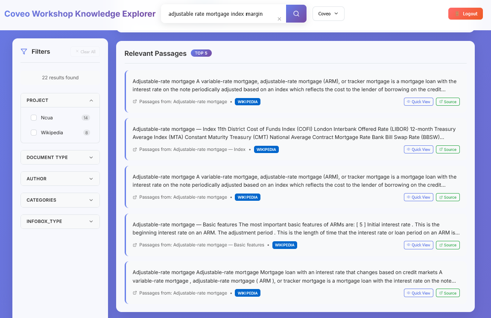

**What to observe**:

<div style="background: #e8f5e9; padding: 1.5rem; border-radius: 8px; margin: 1rem 0;">
  <h4>📝 Passages Section</h4>
  <ul>
    <li>✅ 3-5 relevant text excerpts</li>
    <li>✅ Quick View shows the indexed content</li>
    <li>✅ Source identification for each passage</li>
    <li>✅ Contextual snippets with surrounding text</li>
  </ul>
</div>


#### Step 4: Explore Search Results Section

**What to observe**:

<div style="background: #f5f5f5; padding: 1.5rem; border-radius: 8px; margin: 1rem 0;">
  <h4>📊 Search Results</h4>
  <ul>
    <li>✅ AI Answer by Coveo displayed</li>
    <li>✅ Top 5 Passages relevant to the query dispalyed</li>
    <li>✅ 10-20 search results displayed</li>
    <li>✅ Query terms highlighted in snippets</li>
    <li>✅ Source names visible (CFPB, IRS, etc.)</li>
    <li>✅ Clickable titles and URLs</li>
  </ul>
</div>

**Try clicking on a result**:
- Opens the original source in a new tab
- Verify it's an authoritative government or financial site


#### Step 6: Test Additional Queries

Test the following queries one at a time, search and and observe the results


**Query 2:**
```
annual percentage rate and credit card margin
```

**Query 3:**
```
credit reports and scores dispute steps
```

**Query 4:**
```
retirement nest egg protection fraud prevention tip
```

**Query 5:**
```
capital gain and dividend reinvestment strategy
```

#### Step 7: Explore Facet Filtering

1. **Look at the left sidebar** (Facets)

2. **Note the available facets**:
    - Project (source)
    - Document Type

3. **Click on a facet value** (e.g., "CFPB" under Project)

**Facets Sidebar - Filter Options**

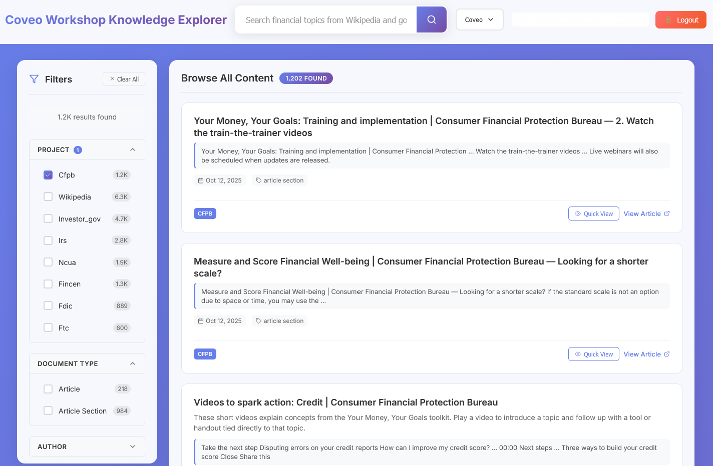

4. **Observe**: Results filtered to show only CFPB content
5. **Click "Clear Filters"** to reset

### Validation

- [ ] Search returns results quickly (<2 seconds)
- [ ] All three sections display (Answer, Passages, Search)
- [ ] Source citations are clickable and valid
- [ ] Facet filtering works correctly
- [ ] Query terms are highlighted in results

---

## 🔍 Key Observations

### Coveo Platform Strengths

<div style="display: grid; grid-template-columns: repeat(auto-fit, minmax(300px, 1fr)); gap: 1rem; margin: 1.5rem 0;">
  <div style="padding: 1.5rem; background: #e8f5e9; border-radius: 8px;">
    <h4 style="margin-top: 0;">📚 Authoritative Sources</h4>
    <p>Content from 14 official government and financial institutions</p>
  </div>
  <div style="padding: 1.5rem; background: #e3f2fd; border-radius: 8px;">
    <h4 style="margin-top: 0;">🤖 AI-Powered Relevance</h4>
    <p>Machine learning models optimize result ranking</p>
  </div>
  <div style="padding: 1.5rem; background: #fff3e0; border-radius: 8px;">
    <h4 style="margin-top: 0;">🎯 Semantic Understanding</h4>
    <p>Finds relevant content even with different terminology</p>
  </div>
  <div style="padding: 1.5rem; background: #f3e5f5; border-radius: 8px;">
    <h4 style="margin-top: 0;">🔗 Source Attribution</h4>
    <p>Every answer includes verifiable citations</p>
  </div>
  <div style="padding: 1.5rem; background: #fce4ec; border-radius: 8px;">
    <h4 style="margin-top: 0;">📊 Multi-modal Results</h4>
    <p>Search results, AI answers, and contextual passages</p>
  </div>
</div>

### Direct Integration Benefits

1. **Low Latency**: Direct API calls minimize response time (~200ms)
2. **Full Control**: Complete access to all API parameters
3. **Customization**: Tailor search logic to specific use cases
4. **Cost Efficiency**: Pay only for API usage
5. **Simple Architecture**: Minimal infrastructure requirements

---

## 💡 When to Use Direct Integration

### Ideal Use Cases for Coveo Customers

**Best for**: High-volume, low-latency search requirements where you need direct control over Coveo's search, passage retrieval, and answer APIs.

<div class="lab-card">
  <h4>🏢 Knowledge Portals & Intranets</h4>
  <p><strong>Scenario</strong>: Employee or customer self-service portals requiring fast, accurate search across your Coveo index</p>
  <p><strong>Why Direct API</strong>: Sub-second response times, full control over query parameters, faceted navigation</p>
  <p><strong>Coveo Features Used</strong>: Search API, Query Pipelines, ML Ranking, Facets</p>
  <p><strong>Example</strong>: Internal HR policy search, product documentation, knowledge base</p>
</div>

<div class="lab-card">
  <h4>🔬 Research & Discovery Applications</h4>
  <p><strong>Scenario</strong>: Professional research tools requiring advanced filtering and precise relevance</p>
  <p><strong>Why Direct API</strong>: Access to all Coveo ML features, custom ranking, advanced query syntax</p>
  <p><strong>Coveo Features Used</strong>: Semantic search, Query expressions, Field-based filtering</p>
  <p><strong>Example</strong>: Legal research, medical literature search, competitive intelligence</p>
</div>

<div class="lab-card">
  <h4>📚 Content Discovery & E-commerce</h4>
  <p><strong>Scenario</strong>: Help users find relevant content/products quickly with faceted navigation</p>
  <p><strong>Why Direct API</strong>: Fast facet computation, personalized results, A/B testing support</p>
  <p><strong>Coveo Features Used</strong>: Dynamic facets, Recommendations, Query suggestions</p>
  <p><strong>Example</strong>: E-commerce product search, news aggregation, content portals</p>
</div>

<div class="lab-card">
  <h4>❓ FAQ & Support Automation</h4>
  <p><strong>Scenario</strong>: Automated responses to common questions with authoritative source citations</p>
  <p><strong>Why Direct API</strong>: Answer API provides grounded responses, passage retrieval for context</p>
  <p><strong>Coveo Features Used</strong>: Answer API, Passage Retrieval, Source attribution</p>
  <p><strong>Example</strong>: Customer support FAQs, policy questions, troubleshooting guides</p>
</div>

### When NOT to Use Direct Integration

❌ **Multi-turn conversations**: Use Bedrock Agent (Lab 2) or AgentCore (Lab 3) for conversational AI  
❌ **Complex tool orchestration**: Use AgentCore with MCP (Lab 3) for multi-tool workflows  
❌ **Cross-session memory**: Use Bedrock Agent or AgentCore with external memory  
❌ **Agent reasoning**: Use Bedrock Agent or AgentCore for AI-driven decision making

---

## 🎉 Lab 1 Complete!

You've successfully:

- ✅ Verified access to the workshop environment
- ✅ Explored Coveo's AI-powered search capabilities
- ✅ Tested direct API integration with multiple query types
- ✅ Understood when direct integration is the optimal choice

### Key Takeaways

1. **Coveo provides enterprise-grade search** with AI-powered relevance and source attribution
2. **Direct API integration** offers simplicity and performance for straightforward use cases
3. **Authoritative sources** ensure response accuracy and compliance
4. **Multiple result formats** (search, answers, passages) serve different user needs

---

## 🚀 Next Steps

Ready to add conversational AI capabilities to your search experience?

<div style="text-align: center; margin: 3rem 0;">
  <a href="../lab2/" class="md-button md-button--primary" style="font-size: 1.1rem; padding: 1rem 2rem;">
    Proceed to Lab 2: Bedrock Agent Integration →
  </a>
</div>

In Lab 2, you'll learn how to integrate Coveo with AWS Bedrock Agent for natural language conversations and multi-turn interactions.
