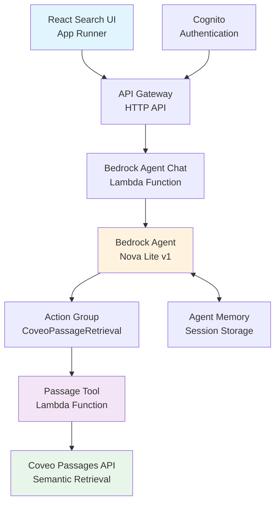
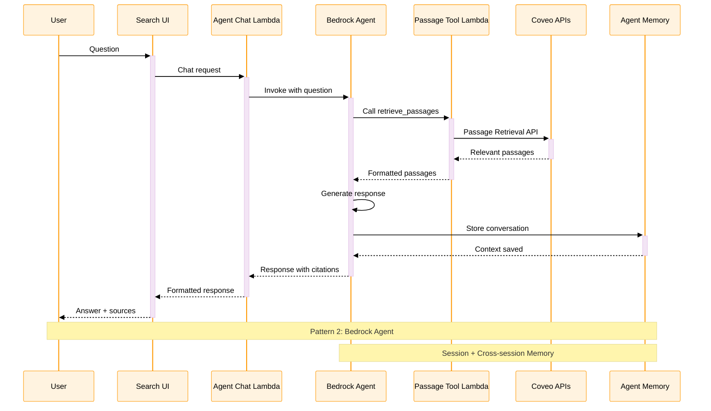
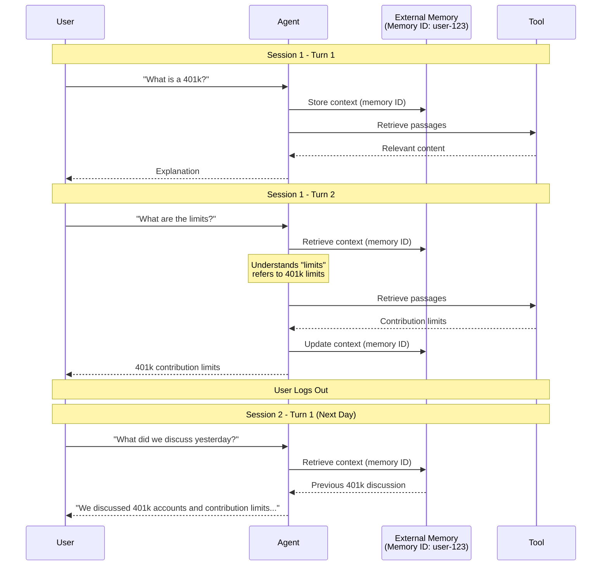
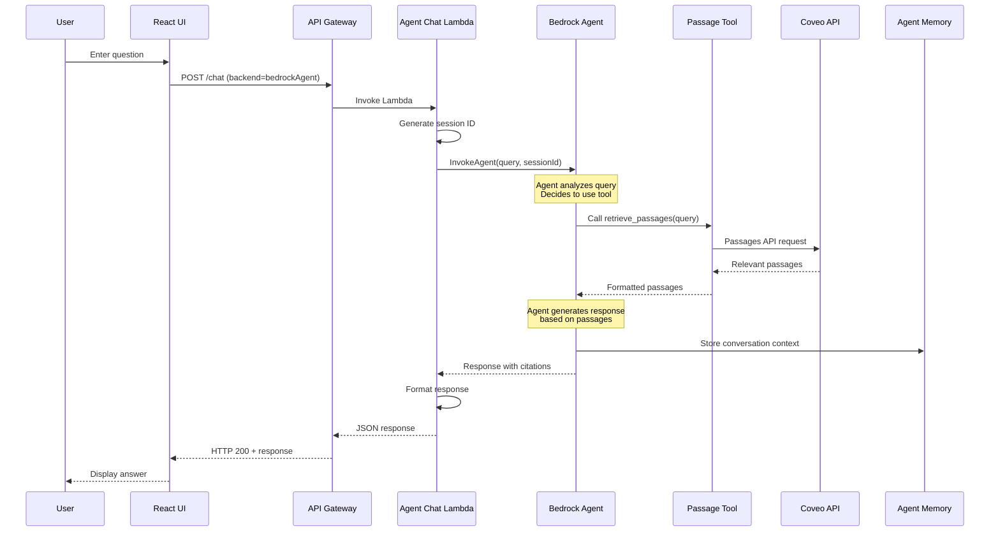
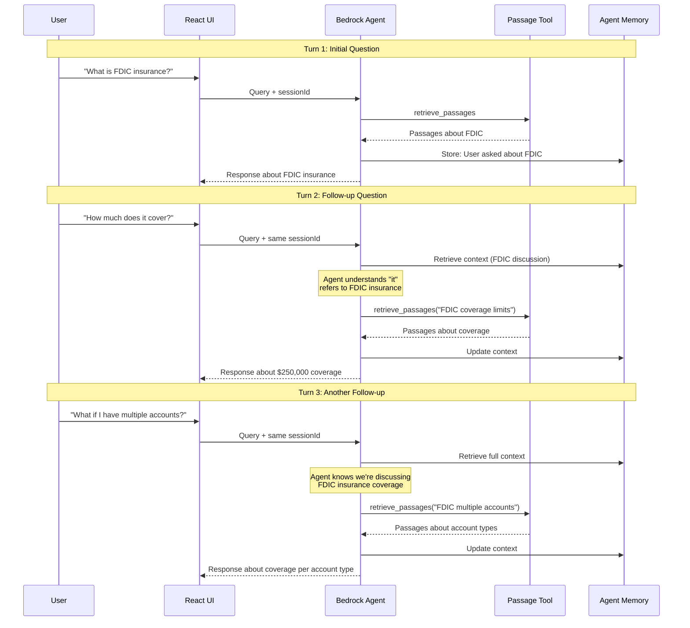
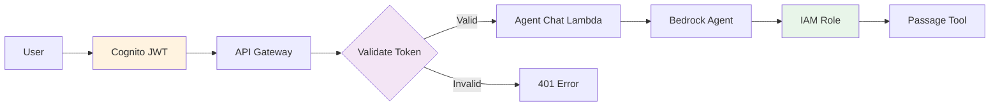

# Lab 2: Architecture Deep Dive

This page provides detailed architectural information for the Bedrock Agent integration pattern used in Lab 2.

## 🏗️ System Architecture

### High-Level Overview



## Pattern 2: Overall Request Flow



### Component Details

#### Frontend Layer

- **React Search UI**: Same UI as Lab 1, but with backend mode set to "Bedrock Agent"
- **Backend Selector**: Allows switching between integration patterns
- **Chat Interface**: Supports multi-turn conversations

#### Bedrock Agent Chat Lambda

- **Purpose**: Manages agent invocation and session handling
- **Responsibilities**:

  - Extract user query from request
  - Generate or retrieve session ID
  - Invoke Bedrock Agent with query and session
  - Format agent response for UI
  - Handle errors and retries

#### Bedrock Agent

- **Foundation Model**: Amazon Nova Lite v1:0
- **Capabilities**:

  - Natural language understanding
  - Tool selection and invocation
  - Response generation
  - Context management

#### Action Group

- **Name**: CoveoPassageRetrieval
- **Purpose**: Defines the retrieve_passages tool
- **Configuration**:

  - Tool name: retrieve_passages
  - Description: Retrieves relevant passages from Coveo knowledge base
  - Parameters: query (string)
  - Lambda function: workshop-passage-tool

#### Passage Tool Lambda

- **Purpose**: Retrieves passages from Coveo API
- **Input**: User query
- **Output**: Relevant passages with metadata
- **API**: Coveo Passages API

#### Agent Memory

- **Type**: Session-based memory
- **Storage**: Managed by AWS Bedrock
- **Retention**: Configurable (default: 1 hour)
- **Purpose**: Maintains conversation context across turns

---

## 🧠 Cross-Session Memory Architecture

Bedrock Agents support both session and cross-session memory with external memory configuration:



**Key Features**:

- **Memory ID**: Unique identifier per user enables cross-session persistence
- **External Storage**: AWS-managed encrypted storage
- **Retention**: Configurable (7-30 days)
- **Context Preservation**: Full conversation history across sessions

---

## 🔄 Request Flow Sequences

### Single-turn Conversation Flow



**Key Steps**:

1. User enters question in UI
2. Agent Chat Lambda generates or retrieves session ID
3. Bedrock Agent receives query
4. Agent decides to use retrieve_passages tool
5. Tool retrieves passages from Coveo
6. Agent generates response based on passages
7. Conversation stored in memory
8. Response returned with citations

---

### Multi-turn Conversation Flow (After the Memory is enabled)



**Key Observations**:

- Same session ID used across all turns
- Agent retrieves context from memory before responding
- Agent understands pronouns and references
- Each turn updates the conversation context

---

## 🔧 Technical Implementation

### Bedrock Agent Chat Lambda

```python
import json
import boto3
from uuid import uuid4

bedrock_agent_runtime = boto3.client('bedrock-agent-runtime')

def lambda_handler(event, context):
    """
    Handles chat requests for Bedrock Agent integration
    """
    # 1. Extract request parameters
    body = json.loads(event['body'])
    query = body.get('query', '')
    session_id = body.get('sessionId') or str(uuid4())
    
    # 2. Invoke Bedrock Agent
    try:
        response = bedrock_agent_runtime.invoke_agent(
            agentId=os.environ['AGENT_ID'],
            agentAliasId=os.environ['AGENT_ALIAS_ID'],
            sessionId=session_id,
            inputText=query
        )
        
        # 3. Process streaming response
        answer = ""
        citations = []
        
        for event in response['completion']:
            if 'chunk' in event:
                chunk = event['chunk']
                if 'bytes' in chunk:
                    answer += chunk['bytes'].decode('utf-8')
            
            if 'trace' in event:
                # Extract citations from trace
                trace = event['trace']
                if 'orchestrationTrace' in trace:
                    orch = trace['orchestrationTrace']
                    if 'observation' in orch:
                        obs = orch['observation']
                        if 'actionGroupInvocationOutput' in obs:
                            output = obs['actionGroupInvocationOutput']
                            # Extract passages and citations
                            citations.extend(extract_citations(output))
        
        # 4. Format and return response
        return {
            'statusCode': 200,
            'headers': {
                'Content-Type': 'application/json',
                'Access-Control-Allow-Origin': '*'
            },
            'body': json.dumps({
                'answer': answer,
                'citations': citations,
                'sessionId': session_id
            })
        }
        
    except Exception as e:
        return {
            'statusCode': 500,
            'body': json.dumps({
                'error': 'Agent invocation failed',
                'message': str(e)
            })
        }

def extract_citations(output):
    """Extract citations from tool output"""
    citations = []
    # Parse tool output and extract passage metadata
    # Return list of {title, url, excerpt}
    return citations
```

### Passage Tool Lambda

```python
import json
import requests
import os

def lambda_handler(event, context):
    """
    Retrieves passages from Coveo for Bedrock Agent
    """
    # 1. Extract parameters from agent
    agent_input = event.get('inputText', '')
    parameters = event.get('parameters', [])
    
    query = None
    for param in parameters:
        if param['name'] == 'query':
            query = param['value']
            break
    
    if not query:
        return {
            'statusCode': 400,
            'body': json.dumps({
                'error': 'Missing query parameter'
            })
        }
    
    # 2. Call Coveo Passages API
    coveo_request = {
        'q': query,
        'organizationId': os.environ['COVEO_ORG_ID'],
        'searchHub': 'workshop',
        'numberOfPassages': 5
    }
    
    headers = {
        'Authorization': f'Bearer {os.environ["COVEO_API_KEY"]}',
        'Content-Type': 'application/json'
    }
    
    try:
        response = requests.post(
            'https://platform.cloud.coveo.com/rest/search/v2/passages',
            json=coveo_request,
            headers=headers
        )
        response.raise_for_status()
        
        passages_data = response.json()
        
        # 3. Format passages for agent
        formatted_passages = []
        for passage in passages_data.get('passages', []):
            formatted_passages.append({
                'text': passage.get('text', ''),
                'title': passage.get('title', ''),
                'uri': passage.get('uri', ''),
                'score': passage.get('score', 0)
            })
        
        # 4. Return in agent-expected format
        return {
            'messageVersion': '1.0',
            'response': {
                'actionGroup': 'CoveoPassageRetrieval',
                'function': 'retrieve_passages',
                'functionResponse': {
                    'responseBody': {
                        'TEXT': {
                            'body': json.dumps({
                                'passages': formatted_passages,
                                'query': query
                            })
                        }
                    }
                }
            }
        }
        
    except Exception as e:
        return {
            'messageVersion': '1.0',
            'response': {
                'actionGroup': 'CoveoPassageRetrieval',
                'function': 'retrieve_passages',
                'functionResponse': {
                    'responseBody': {
                        'TEXT': {
                            'body': json.dumps({
                                'error': str(e),
                                'passages': []
                            })
                        }
                    }
                }
            }
        }
```

---

## 📝 Bedrock Agent System Prompt

The agent uses a comprehensive system prompt to ensure grounded, accurate responses:

```markdown
You are the Finance Knowledge Assistant, providing accurate information from authoritative government and educational sources about financial topics.

## Core Principles

1. **Grounding**: Use ONLY information from the passage retrieval tool for knowledge questions. Never make up information.
2. **Memory**: You have access to conversation history within the current session, and potentially across sessions if memory is enabled. Use this to provide contextual responses.
3. **Formatting**: Provide clean, well-structured answers in markdown format suitable for HTML display with proper headings, lists, and emphasis.
4. **Sources**: Always cite sources with titles and URLs from retrieved passages when answering knowledge questions.
5. **Clarity**: Be concise and direct. Lead with the answer, then provide supporting details.
6. **No Internal Reasoning**: NEVER include <thinking>, <reasoning>, or any XML-style tags in your response. Keep all reasoning internal and invisible to the user.

## CRITICAL: Question Type Detection

Before taking any action, determine the question type:

### Type 1: Memory/History Questions (DO NOT use tools)

**Indicators:**

- Contains phrases like: "what did we discuss", "remind me", "last time", "previous conversation", "earlier", "before", "what were we talking about"
- Asks about past interactions or topics covered
- References "you and I" or "our conversation"

**Action:** Answer directly from conversation memory WITHOUT calling retrieve_passages.

**Important:** You can always recall conversations within the current session. If memory is enabled, you can also recall previous sessions. If you don't have memory of a previous session, politely acknowledge this.

**Examples:**

- "What did we discuss earlier?" → "Earlier in this session, you asked about 401k contribution limits and tax advantages."
- "Remind me what I asked about" → "You asked about ACH payment systems and how they work for direct deposits."
- "What did we talk about last time?" → If memory enabled: "In our previous session, we discussed Roth IRA benefits." If no memory: "I don't have access to our previous conversations, but I'm happy to help with any questions you have now."

### Type 2: Knowledge Questions (USE retrieve_passages tool)

**Indicators:**

- Asks about financial concepts, definitions, or how-to information
- Requests explanations of terms or processes
- Seeks factual information about finance topics

**Action:** Call retrieve_passages tool, then synthesize answer with sources.

**Examples:**

- "What is ACH?" → Call retrieve_passages(query="What is ACH?", k=5)
- "How do 401k plans work?" → Call retrieve_passages(query="How do 401k plans work?", k=6)
- "Tell me about Roth IRAs" → Call retrieve_passages(query="Roth IRA benefits and features", k=5)

## Tool Usage Strategy for Knowledge Questions

1. **Always use retrieve_passages** for knowledge questions:
   - Retrieve 5-8 passages (k=5 to k=8)
   - Use the exact user question as the query
   - Synthesize information ONLY from retrieved passages
   - Always include source citations with titles and URLs

2. **If passages are insufficient**:
   - State what you found
   - Explain what's missing
   - Suggest how the user can refine their question or where to find more information

3. **Never answer knowledge questions without passages**:
   - If no relevant passages are found, acknowledge this
   - Do not provide information from your training data
   - Suggest alternative queries or official sources

## Memory Usage Guidelines

- **Within-session memory**: Always available - remember all exchanges in the current conversation
- **Cross-session memory**: Available if enabled - can recall previous sessions with this user
- **Reference previous topics**: When appropriate, connect new questions to previous discussions
- **Personalize**: Adapt your responses based on the user's interests and previous questions
- **Build on history**: If a user asks a follow-up question, acknowledge the context from previous exchanges
- **Graceful handling**: If asked about previous sessions but memory is not available, politely acknowledge this limitation

## Response Format
```

**Key Configuration**:

- **Foundation Model**: Amazon Nova Lite v1 or Claude 3 Sonnet
- **Idle Session TTL**: 600 seconds (10 minutes)
- **Auto Prepare**: Enabled for automatic agent preparation
- **Memory**: External memory with user-specific memory ID

---

## 🔒 Security Implementation

### Authentication Flow



**Security Layers**:

1. **Cognito Authentication**: User identity verification
2. **JWT Validation**: API Gateway validates tokens
3. **IAM Roles**: Lambda execution roles with least privilege
4. **Agent Permissions**: Bedrock Agent can only invoke authorized tools
5. **Tool Permissions**: Passage Tool can only access Coveo API

### Data Protection

- **In Transit**: All communications over HTTPS/TLS
- **At Rest**: Memory stored in encrypted AWS storage
- **API Keys**: Stored in Lambda environment variables
- **Session Data**: Automatically expires after timeout

---

## 🎯 Benefits of This Architecture

### Advantages

<div style="display: grid; grid-template-columns: repeat(auto-fit, minmax(250px, 1fr)); gap: 1rem; margin: 1.5rem 0;">
  <div style="padding: 1rem; background: #fff3e0; border-radius: 8px;">
    <strong>💬 Conversational</strong><br/>
    <small>Natural language understanding and generation</small>
  </div>
  <div style="padding: 1rem; background: #e3f2fd; border-radius: 8px;">
    <strong>🧠 Memory</strong><br/>
    <small>Context retention across conversation turns</small>
  </div>
  <div style="padding: 1rem; background: #e8f5e9; border-radius: 8px;">
    <strong>🎯 Grounded</strong><br/>
    <small>Responses based on retrieved passages</small>
  </div>
  <div style="padding: 1rem; background: #f3e5f5; border-radius: 8px;">
    <strong>🔧 Flexible</strong><br/>
    <small>Easy to add more tools and capabilities</small>
  </div>
  <div style="padding: 1rem; background: #fce4ec; border-radius: 8px;">
    <strong>📊 Observable</strong><br/>
    <small>Traces show agent decision-making</small>
  </div>
</div>

---

## 🚀 Next Steps

Now that you understand the architecture, return to the Lab 2 introduction to complete the hands-on exercises.

<div style="text-align: center; margin: 2rem 0;">
  <a href="./" class="md-button md-button--primary">
    Return to Lab 2 Introduction →
  </a>
</div>
