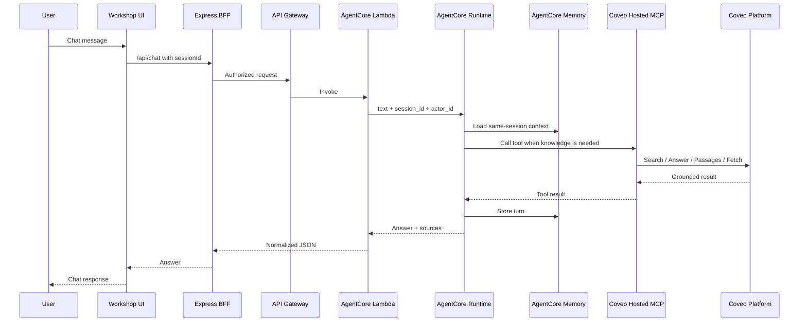

# Lab 2 Architecture

Lab 2 uses AWS AgentCore for orchestration and Coveo Hosted MCP for grounded tools.

## Request Flow

```mermaid
sequenceDiagram
    participant User
    participant UI as Workshop UI
    participant BFF as Express BFF
    participant API as API Gateway
    participant Lambda as AgentCore Lambda
    participant Runtime as AgentCore Runtime
    participant Memory as AgentCore Memory
    participant MCP as Coveo Hosted MCP
    participant Coveo as Coveo Platform

    User->>UI: Chat message
    UI->>BFF: /api/chat with sessionId
    BFF->>API: Authorized request
    API->>Lambda: Invoke
    Lambda->>Runtime: text + session_id + actor_id
    Runtime->>Memory: Load same-session context
    Runtime->>MCP: Call tool when knowledge is needed
    MCP->>Coveo: Search / Answer / Passages / Fetch
    Coveo-->>MCP: Grounded result
    MCP-->>Runtime: Tool result
    Runtime->>Memory: Store turn
    Runtime-->>Lambda: Answer + sources
    Lambda-->>BFF: Normalized JSON
    BFF-->>UI: Answer
    UI-->>User: Chat response
```

## Memory Model

| Concept | Source | Purpose |
|---|---|---|
| `actor_id` | Cognito JWT `sub` | Stable user identity across login sessions |
| `session_id` | UI-generated UUID | Active conversation thread |
| Short-term memory | AgentCore Memory events | Same-session recall and browser-refresh continuity |
| Long-term memory | AgentCore memory strategies | Cross-session summaries after finalization or timeout |

## Important Behavior

- Same-session recall should work immediately when the same `session_id` is reused.
- Browser refresh keeps the same `session_id` in local storage.
- Logout clears local session IDs.
- End Chat finalizes the current session and creates a new `session_id`.
- Cross-session recall is available after AgentCore extracts long-term memories.

## Failure Handling

The workshop runtime must not fall back to anonymous memory. If the authenticated Cognito identity is missing, the backend returns a clear error instead of mixing attendees into one shared memory scope.
