# Lab 2: AgentCore + Coveo Hosted MCP Chatbot

**Pattern**: AWS Bedrock AgentCore Runtime + Coveo Hosted MCP

**Duration**: 25 minutes

**Objective**: Test a memory-enabled chatbot where AgentCore orchestrates Coveo Hosted MCP tools.

## Lab Goals

By the end of this lab, you will:

- Understand how the workshop UI invokes AgentCore through API Gateway.
- Understand how Coveo Hosted MCP exposes Search, Fetch, Answer, and Passage Retrieval tools.
- Test grounded chatbot answers with source attribution.
- Test same-session recall.
- Test browser-refresh continuity with the same session ID.
- End a session, start a new one, and test cross-session recall.

## Architecture

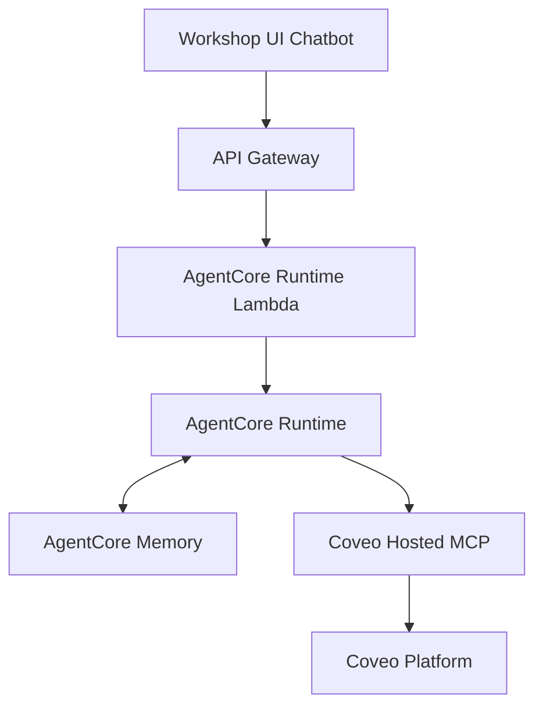
```mermaid
graph TB
    UI[Workshop UI Chatbot]
    API[API Gateway]
    LAMBDA[AgentCore Runtime Lambda]
    RUNTIME[AgentCore Runtime]
    MEMORY[AgentCore Memory]
    MCP[Coveo Hosted MCP]
    COVEO[Coveo Platform]

    UI --> API
    API --> LAMBDA
    LAMBDA --> RUNTIME
    RUNTIME <--> MEMORY
    RUNTIME --> MCP
    MCP --> COVEO
```

## Exercise 2.1: Review AgentCore Runtime

1. Log in to the AWS Console.
2. Navigate to **Amazon Bedrock AgentCore**.
  **Bedrock AgentCore Navigation**

  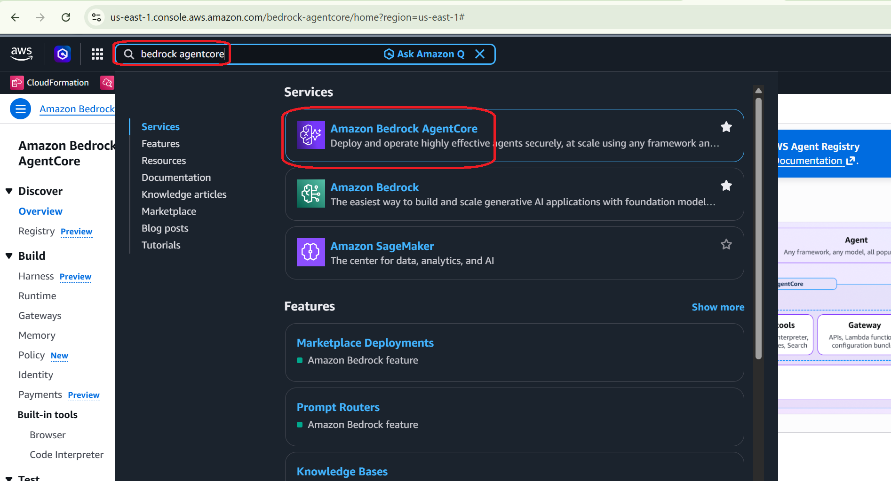

  Select Amazon Bedrock AgentCore to go to the Amazon Bedrock AgentCore service page.

3. Open **Agent Runtime**.

  **Runtime Navigation**

  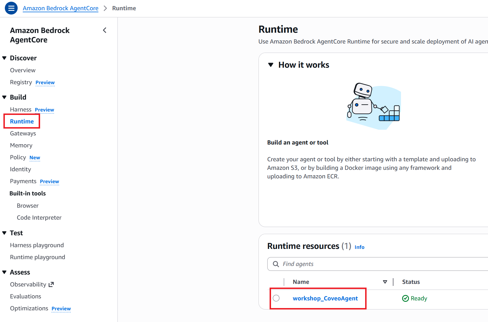

  Select **Runtime** to view the `workshop_CoveoAgent` runtime page.

4. Select the workshop runtime.

  **Runtime Selection**

  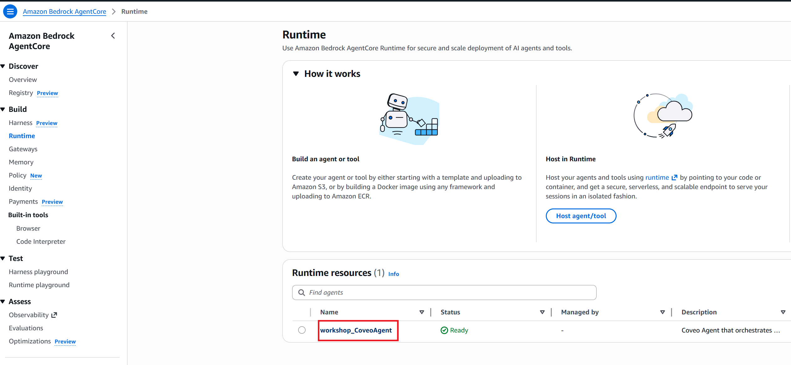

  Click `workshop_CoveoAgent` to open the runtime details page.

5. Confirm that the runtime is deployed and active.

  **Runtime Details**

  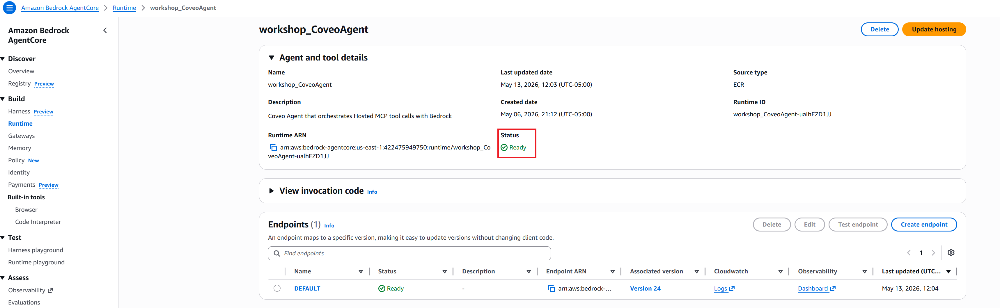

  Click `workshop_CoveoAgent` to view the runtime details page.

What to observe:

- The Status is 'Ready'.
- The runtime ARN.
- Memory is associated with the runtime so conversations can continue across turns and sessions.

6. Confirm that the memory is deployed and active.

  **Memory Details**

  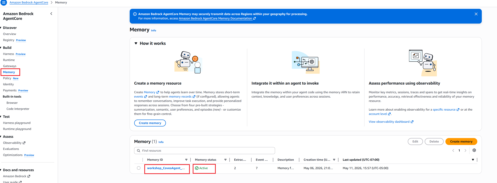

  Select **Memory** to view the `workshop_CoveoAgent_Memory-xxxxxxxxxx` page.
  Verify that the Memory status is **Active**.


## Exercise 2.2: Review Coveo Hosted MCP Configuration

Your instructor will review the Hosted MCP configuration in the Coveo Administration Console.

1. MCP Server Configuration in Coveo Platform Console.
  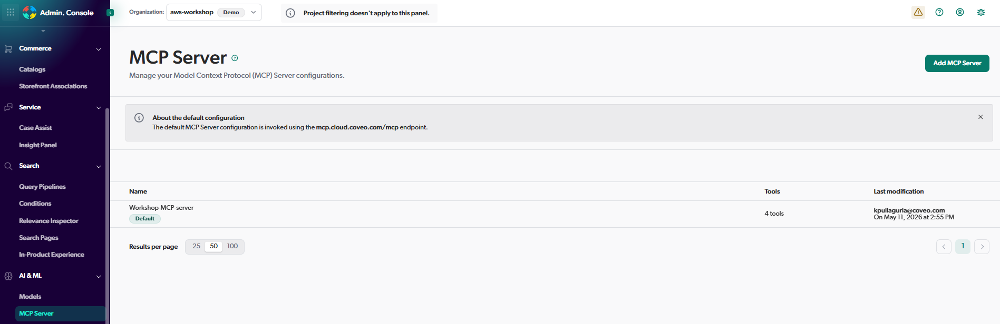

2. MCP Server Config and Endpoint in Coveo Platform Console.
  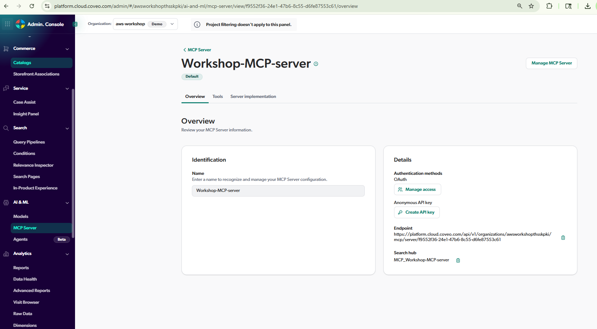

3. MCP Server Tools in Coveo Platform Console.
  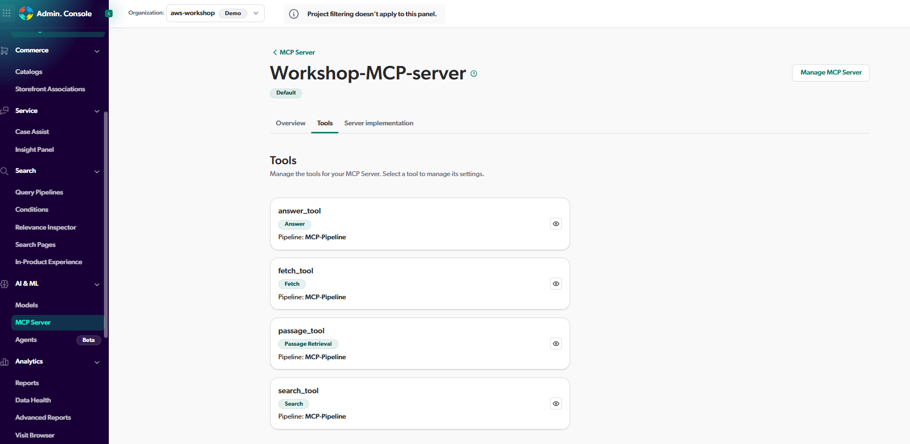

4. MCP Server Instructions in Coveo Platform Console.
  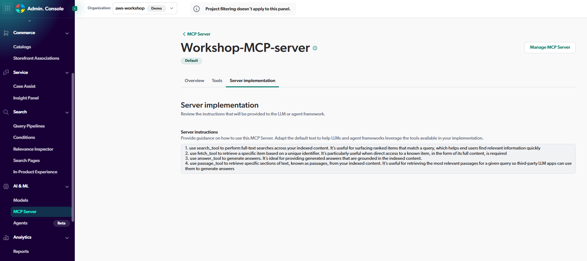


Expected workshop MCP server configuration:

| Setting | Value |
|---|---|
| Configuration name | `Workshop-MCP-server` |
| Search hub | `MCP_Workshop-MCP-server` |
| Query pipeline | `MCP-Pipeline` |
| Tooling | Search, Fetch, Answer, Passage Retrieval |

## How The Runtime Knows Which Hosted MCP Endpoint To Use

In this workshop, `workshop_CoveoAgent` does not hardcode the Coveo MCP URL.
It resolves the endpoint at runtime from AWS Systems Manager Parameter Store.

High-level flow:

1. Deployment scripts seed Hosted MCP values into SSM parameters (for example: endpoint URL, auth mode, API key, config name, search hub).
2. The AgentCore runtime container reads `/workshop/coveo/hosted-mcp-endpoint` (and related Hosted MCP parameters) from SSM.
3. The runtime initializes the MCP client with those values and then invokes Hosted MCP tools (`search`, `fetch`, `answer`, `passage`) during chat turns.

Why this matters:

- You can rotate or update MCP endpoint/auth settings in SSM without rebuilding the runtime image.
- The same runtime code can be reused across environments by changing only parameter values.

## How To Verify In Console

### In AWS Console

1. Open **Systems Manager** -> **Parameter Store**.
2. Search for parameters under your workshop prefix:
    - `/workshop/coveo/hosted-mcp-endpoint`    
3. You can use this direct link to check the hosted MCP endpoint configuration in SSM Parameter Store:
  - [Open /workshop/coveo/hosted-mcp-config-name in Parameter Store](https://us-east-1.console.aws.amazon.com/systems-manager/parameters/%252Fworkshop%252Fcoveo%252Fhosted-mcp-config-name/description?region=us-east-1&tab=Table)

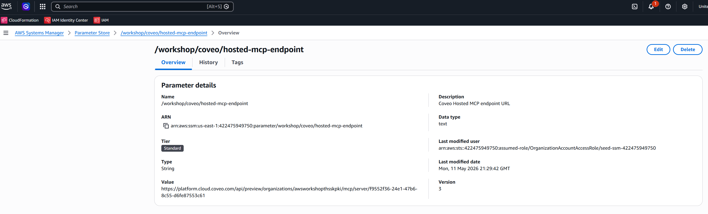

Confirm values match your Coveo Hosted MCP server configuration.

### Optional Log Verification

In CloudWatch logs for `workshop_CoveoAgent`, verify MCP tool call events appear for chat turns (for example, search/answer tool invocations).


## Exercise 2.3: Test The Chatbot

1. Open the workshop UI.
2. Select **Coveo Hosted MCP Agent** from the backend selector.
3. Open the chatbot.
4. Ask:

```text
What is ACH and when is it commonly used?
```

Expected:

- The answer is grounded in indexed content.
- Sources appear in the chatbot.
- The backend indicator shows the AgentCore session ID suffix.

## Exercise 2.4: Test Same-Session Recall

Ask:

```text
What did we discuss earlier?
```

Expected:

- The agent should answer from the current session context.
- It should not need to call Coveo tools for this memory/history question.

Then ask a contextual follow-up:

```text
Compare that with wire transfers for recurring payments.
```

Expected:

- The agent should understand that "that" refers to ACH.
- The answer should use Coveo tools because it is now a knowledge/comparison question.

## Exercise 2.5: Test Browser Refresh Continuity

1. Note the session ID suffix shown in the chatbot footer.
2. Refresh the browser.
3. Reopen the chatbot and confirm the same session ID suffix is shown.
4. Ask:

```text
What was my previous question?
```

Expected:

- The chatbot recalls the active session because the browser kept the same `sessionId`.

## Exercise 2.6: End Session And Test Cross-Session Recall

1. Click **End Chat & Save Memory**.
2. Confirm the chat resets and a new session ID is generated.
3. Ask:

```text
What did we discuss in the previous session?
```

Expected:

- The agent recalls the previous session after it has been finalized and summarized.

!!! note "Cross-session memory timing"
    AgentCore long-term memory extraction is asynchronous. If recall is not immediately available, wait briefly and retry. Same-session recall should work immediately.

## Lab Summary

You tested the AgentCore + Coveo Hosted MCP pattern:

- AgentCore provides the runtime and memory-enabled conversation.
- Coveo Hosted MCP provides grounded search, answer, passage, and fetch tools.
- Same-session recall depends on stable `sessionId`.
- Cross-session recall depends on stable Cognito identity and finalized/summarized sessions.

<div style="text-align: center; margin: 3rem 0;">
  <a href="../lab3/" class="md-button md-button--primary" style="font-size: 1.1rem; padding: 1rem 2rem;">
    Lab 3: Native Coveo Search Agent with Headless →
  </a>
</div>

In Lab 3, you'll use Coveo Native Search Agent to generate summary response to users question and followups without any third party integrations.
