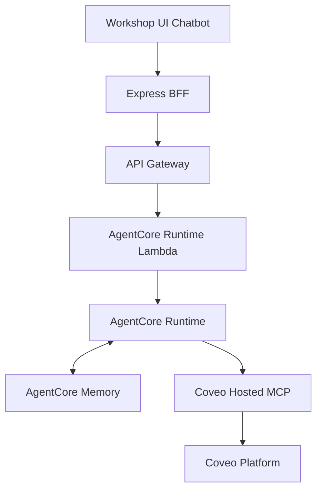

# Lab 2: AgentCore + Coveo Hosted MCP Chatbot

**Pattern**: AWS Bedrock AgentCore Runtime + Coveo Hosted MCP

**Duration**: 25 minutes

**Objective**: Test a memory-enabled chatbot where AgentCore orchestrates Coveo Hosted MCP tools.

## Lab Goals

By the end of this lab, you will:

- Understand how the workshop UI invokes AgentCore through API Gateway.
- Understand how Coveo Hosted MCP exposes Search, Fetch, Answer, and Passage Retrieval tools.
- Test grounded chatbot answers with source attribution.
- Test same-session recall.
- Test browser-refresh continuity with the same session ID.
- End a session, start a new one, and test cross-session recall.

## What This Lab Is Not

This lab does not use the retired Bedrock Agent passage-tool pattern. The live workshop focuses on AgentCore + Hosted MCP as the AWS agent pattern.

## Architecture


```mermaid
graph TB
    UI[Workshop UI Chatbot]
    BFF[Express BFF]
    API[API Gateway]
    LAMBDA[AgentCore Runtime Lambda]
    RUNTIME[AgentCore Runtime]
    MEMORY[AgentCore Memory]
    MCP[Coveo Hosted MCP]
    COVEO[Coveo Platform]

    UI --> BFF
    BFF --> API
    API --> LAMBDA
    LAMBDA --> RUNTIME
    RUNTIME <--> MEMORY
    RUNTIME --> MCP
    MCP --> COVEO
```

## Exercise 2.1: Review AgentCore Runtime

1. Log in to the AWS Console.
2. Navigate to **Amazon Bedrock AgentCore**.
3. Open **Agent Runtime**.
4. Select the workshop runtime.
5. Confirm that the runtime is deployed and active.

What to observe:

- The runtime hosts the workshop agent container.
- The runtime invokes Coveo Hosted MCP tools.
- Memory is associated with the runtime so conversations can continue across turns and sessions.

## Exercise 2.2: Review Coveo Hosted MCP Configuration

Your instructor will review the Hosted MCP configuration in the Coveo Administration Console.

Expected workshop configuration:

| Setting | Value |
|---|---|
| Configuration name | `Workshop-MCP-server` |
| Search hub | `MCP_Workshop-MCP-server` |
| Query pipeline | `MCP-Pipeline` |
| Tooling | Search, Fetch, Answer, Passage Retrieval |

## Exercise 2.3: Test The Chatbot

1. Open the workshop UI.
2. Select **Coveo Hosted MCP Agent** from the backend selector.
3. Open the chatbot.
4. Ask:

```text
What is ACH and when is it commonly used?
```

Expected:

- The answer is grounded in indexed content.
- Sources appear in the chatbot.
- The backend indicator shows the AgentCore session ID suffix.

## Exercise 2.4: Test Same-Session Recall

Ask:

```text
What did we discuss earlier?
```

Expected:

- The agent should answer from the current session context.
- It should not need to call Coveo tools for this memory/history question.

Then ask a contextual follow-up:

```text
Compare that with wire transfers for recurring payments.
```

Expected:

- The agent should understand that "that" refers to ACH.
- The answer should use Coveo tools because it is now a knowledge/comparison question.

## Exercise 2.5: Test Browser Refresh Continuity

1. Note the session ID suffix shown in the chatbot footer.
2. Refresh the browser.
3. Reopen the chatbot and confirm the same session ID suffix is shown.
4. Ask:

```text
What was my previous question?
```

Expected:

- The chatbot recalls the active session because the browser kept the same `sessionId`.

## Exercise 2.6: End Session And Test Cross-Session Recall

1. Click **End Chat & Save Memory**.
2. Confirm the chat resets and a new session ID is generated.
3. Ask:

```text
What did we discuss in the previous session?
```

Expected:

- The agent recalls the previous session after it has been finalized and summarized.

!!! note "Cross-session memory timing"
    AgentCore long-term memory extraction is asynchronous. If recall is not immediately available, wait briefly and retry. Same-session recall should work immediately.

## Lab Summary

You tested the AgentCore + Coveo Hosted MCP pattern:

- AgentCore provides the runtime and memory-enabled conversation.
- Coveo Hosted MCP provides grounded search, answer, passage, and fetch tools.
- Same-session recall depends on stable `sessionId`.
- Cross-session recall depends on stable Cognito identity and finalized/summarized sessions.

Continue to [Lab 3: Native Coveo Search Agent with Headless](../lab3/index.md).
