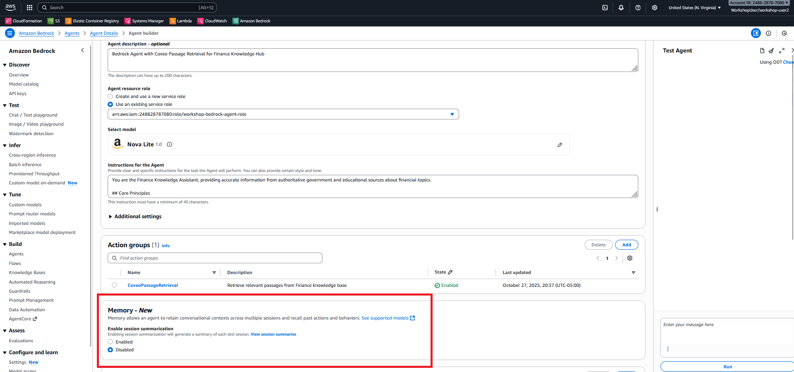

<h1 style="color: #ff9800; border-left: 6px solid #ff9800; padding-left: 1rem; background: linear-gradient(90deg, rgba(255, 152, 0, 0.1) 0%, transparent 100%); padding: 1rem; border-radius: 4px;">🤖 Lab 2: Bedrock Agent + Coveo Passage Retrieval API</h1>

**Pattern**: Bedrock Agent  
**Duration**: 20 minutes  
**Objective**: Integrate Coveo Passage Retrieval API with AWS Bedrock Agent for conversational AI with grounded responses.

!!! note "Throughput Notice"
    If Bedrock doesn't respond immediately, wait 30-60 seconds and retry. This is normal during peak workshop usage.

## 🎯 Lab Goals

By the end of this lab, you will:

- ✅ Understand Bedrock Agent architecture and Coveo Passage Retrieval API tool integration
- ✅ Enable conversation memory in AWS Console
- ✅ Verify system prompt configuration
- ✅ Test single-turn conversations with grounded responses using the Coveo Passage Retrieval API
- ✅ Observe agent decision-making and tool usage
- ✅ Identify when to use Bedrock Agent integration
- ✅ Configure Memory for multi-turn conversations (To be tested in Lab 4)

## 🏗️ Architecture Overview

In this lab, you'll explore the **Bedrock Agent Integration** pattern:


## 🔄 Pattern 2 Sequence Diagram


!!! info "Bedrock Agent is not yet enabled with memory"
    In this Lab you will learn how to ground your Bedrock Model reponse with Passages retrieved from Coveo Index using it as a tool. Further we dont pass any session id from the UI so it is intentionally designed to be single-turn conversation. You will enable Memory as part of this lab and will test that feature in Lab 4 as part of multi turn conversations in a chatbot. 


## 📋 Lab Exercises

### Exercise 2.1: Review Bedrock Agent Architecture (5 minutes)

**Type**: Instructor-led + Hands-on

**Bedrock Agent architecture**


#### Key Concepts

<div style="display: grid; grid-template-columns: repeat(auto-fit, minmax(250px, 1fr)); gap: 1rem; margin: 1.5rem 0;">
  <div style="padding: 1rem; background: #fff3e0; border-radius: 8px; border-left: 4px solid #ff9800;">
    <strong>🤖 Bedrock Agent</strong><br/>
    <small>Orchestrates AI interactions with tools</small>
  </div>
  <div style="padding: 1rem; background: #e3f2fd; border-radius: 8px; border-left: 4px solid #2196f3;">
    <strong>🔧 Action Group</strong><br/>
    <small>Defines available tools for the agent</small>
  </div>
  <div style="padding: 1rem; background: #e8f5e9; border-radius: 8px; border-left: 4px solid #4caf50;">
    <strong>🛠️ Tool (Lambda)</strong><br/>
    <small>Retrieves passages from Coveo</small>
  </div>
  <div style="padding: 1rem; background: #f3e5f5; border-radius: 8px; border-left: 4px solid #9c27b0;">
    <strong>🧠 Memory</strong><br/>
    <small>Stores conversation context (after the memory is enabled)</small>
  </div>
</div>

#### Access Bedrock Console

1. **Login to AWS Console**
2. **Navigate to Amazon Bedrock** service
3. **Click "Agents"** in the left navigation
4. **Find and select** `workshop-coveo-agent`
5. **Click Edit** to open the Agent Builder Page

**Bedrock Agent List**


6. **Review Agent Configuration** in the Agent Builder Page

**AWS Console - Bedrock Agent Details Page**


#### Review Agent Configuration

**Agent Details**:

- **Name**: `workshop-coveo-agent`
- **Description**: Bedrock Agent with Coveo Passage Retrieval for Finance Knowledge Hub
- **Foundation Model**: `amazon.nova-lite-v1:0`

**Action Group**:

- **Name**: `CoveoPassageRetrieval`
- **Description**: Retrieves relevant passages from Coveo knowledge base
- **Lambda Function**: `workshop-passage-tool`
- **Status**: Enabled


!!! info "Do not Change anything on this page"
    We just reviewed the Agent Setup with Tool Configuration. Do not make any changes on this page!

6. **Stay on this Page** to continue to the next Exercise 2.2

---

### Exercise 2.2: Verify System Prompt (5 minutes)

**Type**: Hands-on

#### Objective

Review the agent's system prompt to understand how it's instructed to use the passage retrieval tool.

#### Step-by-Step Instructions

##### Step 1: View Agent Instructions

1. **In the Bedrock Agent details page**, find **"Instructions for the Agent"** section
2. **Review the system prompt** for better redeability, you can expand the instructions prompt


**Bedrock Agent - Instructions Section**


**Key Instructions to Note**:
```
You are the Finance Knowledge Assistant, providing accurate information from authoritative government and educational sources about financial topics.

## Core Principles

1. **Grounding**: Use ONLY information from the passage retrieval tool for knowledge questions. Never make up information.
2. **Memory**: You have access to conversation history within the current session, and potentially across sessions if memory is enabled. Use this to provide contextual responses.
3. **Formatting**: Provide clean, well-structured answers in markdown format suitable for HTML display with proper headings, lists, and emphasis.
4. **Sources**: Always cite sources with titles and URLs from retrieved passages when answering knowledge questions.
5. **Clarity**: Be concise and direct. Lead with the answer, then provide supporting details.
6. **No Internal Reasoning**: NEVER include <thinking>, <reasoning>, or any XML-style tags in your response. Keep all reasoning internal and invisible to the user.

## CRITICAL: Question Type Detection

Before taking any action, determine the question type:

### Type 1: Memory/History Questions (DO NOT use tools)

**Indicators:**
- Contains phrases like: "what did we discuss", "remind me", "last time", "previous conversation", "earlier", "before", "what were we talking about"
- Asks about past interactions or topics covered
- References "you and I" or "our conversation"

**Action:** Answer directly from conversation memory WITHOUT calling retrieve_passages.

**Important:** You can always recall conversations within the current session. If memory is enabled, you can also recall previous sessions. If you don't have memory of a previous session, politely acknowledge this.

**Examples:**
- "What did we discuss earlier?" → "Earlier in this session, you asked about 401k contribution limits and tax advantages."
- "Remind me what I asked about" → "You asked about ACH payment systems and how they work for direct deposits."
- "What did we talk about last time?" → If memory enabled: "In our previous session, we discussed Roth IRA benefits." If no memory: "I don't have access to our previous conversations, but I'm happy to help with any questions you have now."

### Type 2: Knowledge Questions (USE retrieve_passages tool)

**Indicators:**
- Asks about financial concepts, definitions, or how-to information
- Requests explanations of terms or processes
- Seeks factual information about finance topics

**Action:** Call retrieve_passages tool, then synthesize answer with sources.
```

##### Step 2: Understand the Impact

This system prompt ensures:

<div style="display: grid; grid-template-columns: repeat(auto-fit, minmax(250px, 1fr)); gap: 1rem; margin: 1.5rem 0;">
  <div style="padding: 1rem; background: #e8f5e9; border-radius: 8px;">
    <strong>✅ Grounding</strong><br/>
    <small>All responses based on retrieved passages</small>
  </div>
  <div style="padding: 1rem; background: #e3f2fd; border-radius: 8px;">
    <strong>✅ Accuracy</strong><br/>
    <small>No hallucinations or made-up information</small>
  </div>
  <div style="padding: 1rem; background: #fff3e0; border-radius: 8px;">
    <strong>✅ Citations</strong><br/>
    <small>Every response includes sources</small>
  </div>
  <div style="padding: 1rem; background: #f3e5f5; border-radius: 8px;">
    <strong>✅ Consistency</strong><br/>
    <small>Predictable behavior across queries</small>
  </div>
</div>

### Key Takeaways

!!! success "What You Learned"
    - System prompts control agent behavior
    - Instructions ensure tool usage for grounding
    - Response format and tone are defined
    - Accuracy is prioritized over completeness

---

### Exercise 2.3: Test in Bedrock Console (3 minutes)

**Type**: Hands-on

#### Objective

Test the agent directly in the Bedrock Console to see tool invocation and traces.

#### Step-by-Step Instructions

##### Step 1: Open Test Interface

1. **In the Bedrock Agent details page**, click **"Test"** button (top right)
2. **Test panel opens** on the right side

**Bedrock Console - Test Panel**


##### Step 2: Run a Test Query

1. **Enter this query** in the test panel:

```
What is FDIC insurance and how much does it cover?
```

2. **Click "Run"** or press Enter

3. **Wait for response** (takes 2-5 seconds)

!!! info "Expected Console Behavior on First Run"
    **First Run**: You may see `[<redacted>__(query="...",k=5)]` instead of the full answer. This shows the agent's tool call to retrieve passages.
    
    **Why**: The Bedrock Console displays intermediate steps (tool invocation) before showing the final answer.
    
    **Solution**: Simply **re-run the same query** - the second run will display the complete answer with citations.
    
    **Note**: The workshop UI handles this correctly and shows the complete answer on the first try. This console behavior is specific to the AWS Bedrock test interface.

**Bedrock Console - Test Query Response**


##### Step 3: View Trace

1. **Click "Show trace"** link in the response
2. **Observe the execution flow**: Read both Trace Step 1 and Trace Step 2
   - Agent receives question
   - Agent decides to use retrieve_passages tool
   - Tool retrieves passages from Coveo
   - Agent generates response based on passages
   - Response includes citations

**Bedrock Console - Trace View Showing Tool Invocation**


**Key Observations**:
- ✅ Agent automatically calls retrieve_passages tool
- ✅ Tool returns relevant passages from Coveo
- ✅ Agent synthesizes response from passages
- ✅ Response includes source citations

---

### Exercise 2.4: Test in Workshop UI (2 minutes)

**Type**: Hands-on

#### Objective

Test the Bedrock Agent integration through the workshop UI.

#### Step-by-Step Instructions

##### Step 1: Switch Backend Mode

1. **Return to the Workshop UI**
2. **Click the backend selector** (top right)
3. **Select "Bedrock Agent"**

**Workshop UI - Bedrock Agent Backend Selected**


##### Step 2: Run Sample Queries

Test these queries and observe the responses:

**Query 1: Basic Question**
```
adjustable rate mortgage index margin
```

**Expected**: Conversational response with passage citations

---

**Query 2: Multi-part Question**
```
comparing college financing options FAFSA and 529
```
**Expected**: Comprehensive comparison with multiple sources

---

**Query 3: Procedural Question**
```
how to prevent fraud and identity theft
```
**Expected**: Step-by-step guidance with authoritative sources

---

### Exercise 2.5: Enable Memory Configuration (5 minutes)

**Type**: Hands-on

#### Objective

Enable conversation memory so the agent can maintain context across multiple turns.

#### Step-by-Step Instructions

##### Step 1: Navigate to Memory Settings

1. **In the Bedrock Agent builder page**, scroll down to find **"Memory"** section

**Bedrock Agent - Memory Section (Before Configuration)**




##### Step 2: Enable Memory

1. **Click "Enabled"** button
2. **Leave Default Settings"** for memory duration and maximum number of recent sessions
3. **Click Save** on the top

**Bedrock Agent - Memory Configuration Dialog**


##### Step 3: Prepare the Agent

After enabling memory, the agent needs to be prepared:

1. **Click "Prepare"** button at the top of the page after the button gets activated
2. **Wait for preparation** (takes 1-2 minutes)

**Bedrock Agent - Preparing Status**


!!! info "Agent Preparation"
    Whenever you make changes to an agent (memory, instructions, action groups), you must prepare it before the changes take effect.

##### Step 4: Verify Memory is Enabled

1. **Refresh the page**
2. **Scroll to Memory section**
3. **Verify**: Memory shows as "Enabled"
4. **You can now Close the Bedrock service page** : We will use the memory feature you just enabled in Lab 4.

---

## 🔍 Key Observations

### Bedrock Agent Strengths

<div style="display: grid; grid-template-columns: repeat(auto-fit, minmax(300px, 1fr)); gap: 1rem; margin: 1.5rem 0;">
  <div style="padding: 1.5rem; background: #fff3e0; border-radius: 8px;">
    <h4 style="margin-top: 0;">💬 Conversational</h4>
    <p>Natural language understanding and response generation</p>
  </div>
  <div style="padding: 1.5rem; background: #e3f2fd; border-radius: 8px;">
    <h4 style="margin-top: 0;">🧠 Memory</h4>
    <p>Maintains context across multiple conversation turns (will test this in Lab 4).</p>
  </div>
  <div style="padding: 1.5rem; background: #e8f5e9; border-radius: 8px;">
    <h4 style="margin-top: 0;">🎯 Grounded</h4>
    <p>Responses based on retrieved passages, not hallucinations</p>
  </div>
  <div style="padding: 1.5rem; background: #f3e5f5; border-radius: 8px;">
    <h4 style="margin-top: 0;">🔗 Source Attribution</h4>
    <p>Every response includes verifiable citations</p>
  </div>
</div>

---

## 💡 When to Use Bedrock Agent with Coveo

### Ideal Use Cases for Coveo Customers

**Best for**: Conversational AI applications requiring multi-turn context, grounded responses from your Coveo index, and cross-session memory.

<div class="lab-card">
  <h4>💬 Customer Support & Service Chat</h4>
  <p><strong>Scenario</strong>: Multi-turn support conversations where users ask follow-up questions about your indexed content</p>
  <p><strong>Why Bedrock Agent</strong>: Natural language understanding, session + cross-session memory, grounded in Coveo passages</p>
  <p><strong>Coveo Integration</strong>: Agent uses passage retrieval tool to query your Coveo index, ensuring accurate, source-backed answers</p>
  <p><strong>Example</strong>: "I need help with my 401k" → "What are the contribution limits?" → "How do I increase my contribution?"</p>
  <p><strong>Memory Benefit</strong>: Agent remembers the 401k context across all turns and even across sessions</p>
</div>

<div class="lab-card">
  <h4>🎓 Interactive Learning & Training</h4>
  <p><strong>Scenario</strong>: Educational assistant teaching concepts from your knowledge base with progressive depth</p>
  <p><strong>Why Bedrock Agent</strong>: Conversational flow, adapts to user understanding, maintains learning context</p>
  <p><strong>Coveo Integration</strong>: Retrieves educational content from your Coveo index, provides source citations for verification</p>
  <p><strong>Example</strong>: Teaching financial literacy using content from your indexed materials</p>
  <p><strong>Memory Benefit</strong>: Tracks what user has learned across sessions, personalizes content</p>
</div>

<div class="lab-card">
  <h4>🔍 Guided Research & Discovery</h4>
  <p><strong>Scenario</strong>: Help users explore complex topics in your Coveo index through conversational guidance</p>
  <p><strong>Why Bedrock Agent</strong>: Understands research intent, suggests follow-up questions, synthesizes information</p>
  <p><strong>Coveo Integration</strong>: Searches your Coveo index intelligently, retrieves relevant passages, provides comprehensive answers</p>
  <p><strong>Example</strong>: Exploring investment strategies, comparing financial products, understanding regulations</p>
  <p><strong>Memory Benefit</strong>: Remembers research topics and preferences across sessions</p>
</div>

<div class="lab-card">
  <h4>🏦 Financial Advisory & Planning</h4>
  <p><strong>Scenario</strong>: Ongoing financial guidance using authoritative content from your Coveo index</p>
  <p><strong>Why Bedrock Agent</strong>: Long-term relationship building, personalized advice, context-aware recommendations</p>
  <p><strong>Coveo Integration</strong>: Grounds all advice in your indexed financial content, ensures compliance</p>
  <p><strong>Example</strong>: Retirement planning conversations spanning multiple sessions over weeks</p>
  <p><strong>Memory Benefit</strong>: Remembers user's financial goals, risk tolerance, previous discussions</p>
</div>

### When to Choose Bedrock Agent Over Direct API (Lab 1)

✅ **Multi-turn conversations**: Users ask follow-up questions  
✅ **Context retention**: Need to remember previous turns  
✅ **Natural language**: Users ask questions conversationally  
✅ **Cross-session memory**: Need to remember across logins  
✅ **Grounded responses**: Answers must cite Coveo sources

### When to Choose AgentCore (Lab 3) Over Bedrock Agent

Consider AgentCore when you need:
- **Multiple tools**: Beyond just Coveo passage retrieval
- **MCP protocol**: Standardized tool integration
- **Enhanced observability**: Detailed logging and tracing
- **Complex orchestration**: Multi-step tool workflows

---

## ✅ Validation Checklist

Before proceeding to Lab 3, verify:

- [ ] Accessed Bedrock Agent in AWS Console
- [ ] Enabled memory configuration
- [ ] Agent status is "PREPARED"
- [ ] Reviewed system prompt instructions
- [ ] Tested agent in Bedrock Console
- [ ] Viewed trace showing tool invocation
- [ ] Tested in Workshop UI with Bedrock Agent backend
- [ ] Observed conversational responses with citations

---

## 🎉 Lab 2 Complete!

You've successfully:

- ✅ Configured Bedrock Agent with memory
- ✅ Verified system prompt for grounded responses
- ✅ Tested agent with passage retrieval tool
- ✅ Observed agent decision-making in traces
- ✅ Understood when Bedrock Agent is the optimal choice

### Key Takeaways

1. **Bedrock Agents provide conversational AI** with natural language understanding
2. **Memory enables multi-turn conversations** with context retention
3. **Tool integration grounds responses** in authoritative sources
4. **System prompts control agent behavior** and ensure accuracy
5. **Traces provide observability** into agent decision-making

---

## 🚀 Next Steps

Ready to explore advanced orchestration with AgentCore and MCP?

<div style="text-align: center; margin: 3rem 0;">
  <a href="../lab3/" class="md-button md-button--primary" style="font-size: 1.1rem; padding: 1rem 2rem;">
    Proceed to Lab 3: AgentCore + MCP Integration →
  </a>
</div>

In Lab 3, you'll learn about Model Context Protocol and advanced tool orchestration!
