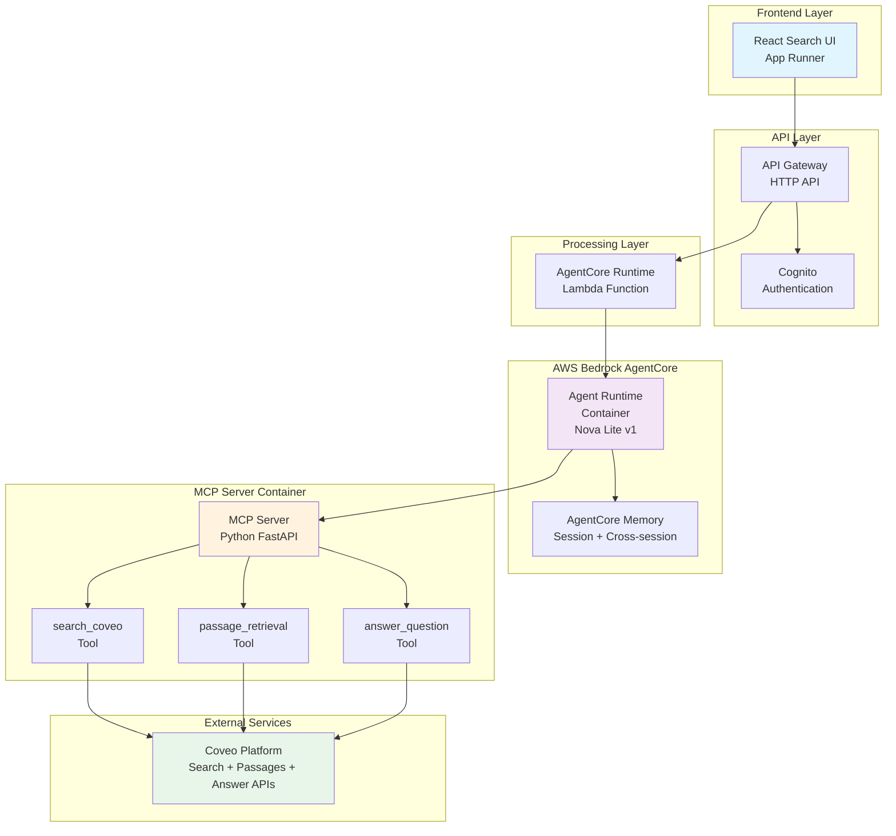
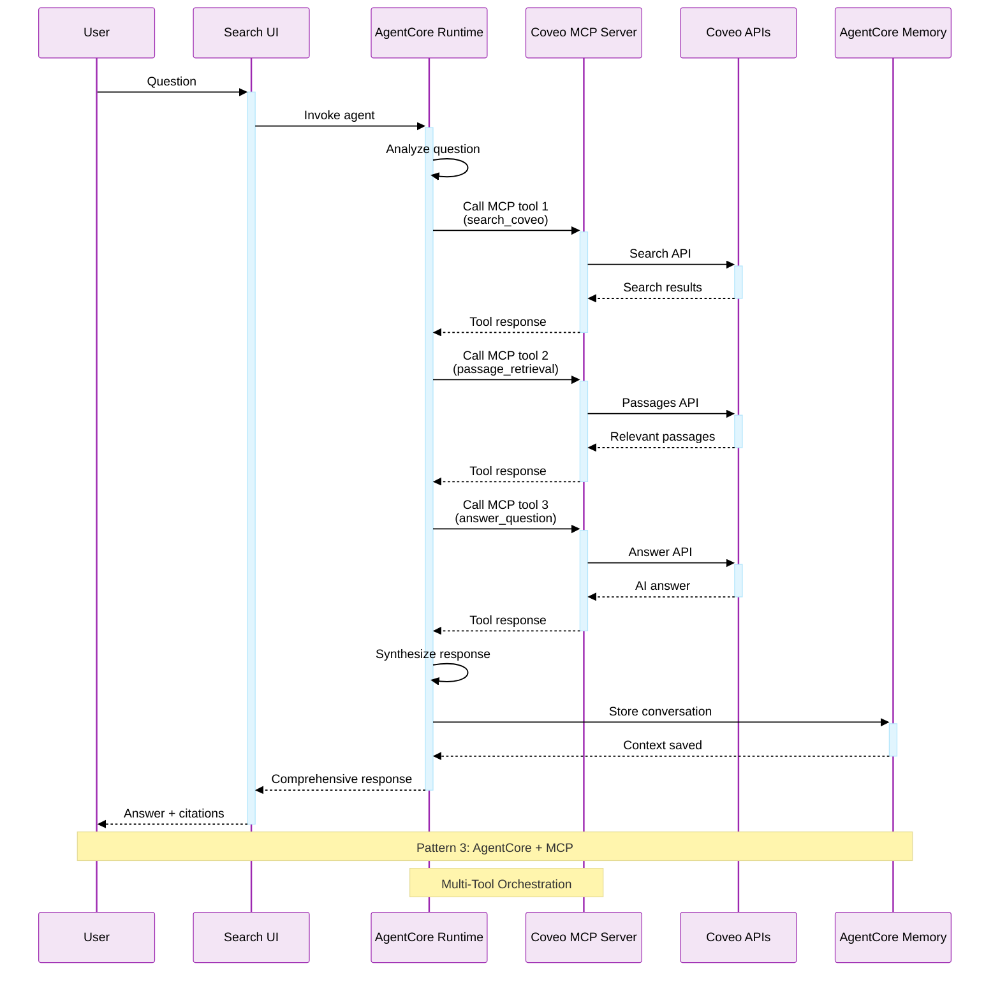
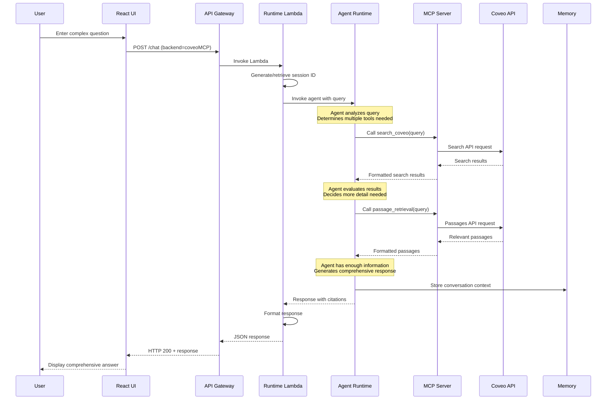
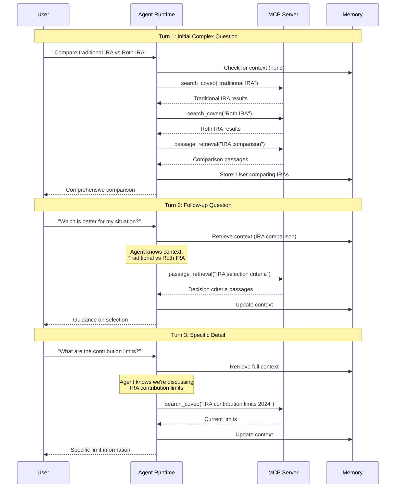
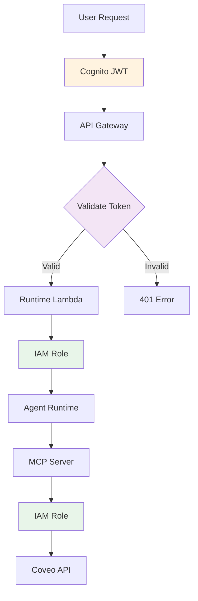

# Lab 3: Architecture Deep Dive

This page provides detailed architectural information for the AgentCore with MCP Server pattern used in Lab 3.

## 🏗️ System Architecture

### High-Level Overview



## Pattern 3: Overall Request Flow



### Component Details

#### AgentCore Runtime Lambda

- **Purpose**: Invokes AgentCore Agent Runtime
- **Responsibilities**:

    - Extract user query from request
    - Manage session IDs
    - Invoke Agent Runtime container
    - Stream responses back to UI
    - Handle errors and retries

#### Agent Runtime Container

- **Deployment**: Containerized on AWS Bedrock AgentCore
- **Foundation Model**: Amazon Nova Lite v1:0
- **Capabilities**:

    - Natural language understanding
    - Multi-tool orchestration
    - Response generation
    - Memory management

- **Configuration**:

    - System prompt
    - MCP server connection
    - Memory settings
    - Model parameters

#### MCP Server Container

- **Technology**: Python FastAPI application
- **Protocol**: Model Context Protocol (MCP)
- **Deployment**: Containerized on AWS Bedrock AgentCore
- **Tools Provided**:

    1. **search_coveo**: Search the knowledge base
    2. **passage_retrieval**: Get relevant text passages
    3. **answer_question**: Generate AI answers

- **Communication**: HTTP/JSON over MCP protocol

#### AgentCore Memory

- **Type**: Session + Cross-session memory
- **Storage**: Managed by AWS Bedrock
- **Capabilities**:

    - Within-session context retention
    - Cross-session memory (remember previous conversations)
    - Configurable retention period
    - Automatic cleanup

---

## 🔄 Request Flow Sequences

### Single Query with Multi-Tool Orchestration



**Key Steps**:

1. User enters complex question
2. Agent Runtime analyzes query complexity
3. Agent calls search_coveo for overview
4. Agent evaluates if more detail needed
5. Agent calls passage_retrieval for specifics
6. Agent synthesizes comprehensive response
7. Conversation stored in memory
8. Response returned with citations from multiple tools

---

### Multi-Turn Conversation with Tool Orchestration



---

## 🔧 Technical Implementation

### AgentCore Runtime Lambda

```python
import json
import boto3
from uuid import uuid4

bedrock_agentcore = boto3.client('bedrock-agent-runtime')

def lambda_handler(event, context):
    """
    Handles chat requests for AgentCore integration
    """
    # 1. Extract request parameters
    body = json.loads(event['body'])
    query = body.get('query', '')
    session_id = body.get('sessionId') or str(uuid4())
    memory_id = body.get('memoryId')  # For cross-session memory
    
    # 2. Invoke AgentCore Runtime
    try:
        response = bedrock_agentcore.invoke_agent(
            agentId=os.environ['AGENT_RUNTIME_ARN'],
            sessionId=session_id,
            memoryId=memory_id,
            inputText=query,
            enableTrace=True  # Enable detailed tracing
        )
        
        # 3. Process streaming response
        answer = ""
        citations = []
        tool_invocations = []
        
        for event in response['completion']:
            if 'chunk' in event:
                chunk = event['chunk']
                if 'bytes' in chunk:
                    answer += chunk['bytes'].decode('utf-8')
            
            if 'trace' in event:
                # Extract tool invocations and citations
                trace = event['trace']
                tool_invocations.append(extract_tool_info(trace))
                citations.extend(extract_citations(trace))
        
        # 4. Format and return response
        return {
            'statusCode': 200,
            'headers': {
                'Content-Type': 'application/json',
                'Access-Control-Allow-Origin': '*'
            },
            'body': json.dumps({
                'answer': answer,
                'citations': citations,
                'toolInvocations': tool_invocations,
                'sessionId': session_id,
                'memoryId': memory_id
            })
        }
        
    except Exception as e:
        return {
            'statusCode': 500,
            'body': json.dumps({
                'error': 'AgentCore invocation failed',
                'message': str(e)
            })
        }
```

### MCP Server Implementation

```python
from fastapi import FastAPI
from mcp import MCPServer, Tool
import requests
import os

app = FastAPI()
mcp_server = MCPServer()

# Tool 1: Search Coveo
@mcp_server.tool(
    name="search_coveo",
    description="Search the Coveo knowledge base for relevant information",
    parameters={
        "query": {
            "type": "string",
            "description": "The search query"
        }
    }
)
async def search_coveo(query: str):
    """Search Coveo knowledge base"""
    coveo_request = {
        'q': query,
        'organizationId': os.environ['COVEO_ORG_ID'],
        'searchHub': 'workshop',
        'numberOfResults': 10
    }
    
    headers = {
        'Authorization': f'Bearer {os.environ["COVEO_API_KEY"]}',
        'Content-Type': 'application/json'
    }
    
    response = requests.post(
        'https://platform.cloud.coveo.com/rest/search/v2/',
        json=coveo_request,
        headers=headers
    )
    
    results = response.json()
    return {
        'results': results.get('results', []),
        'totalCount': results.get('totalCount', 0)
    }

# Tool 2: Passage Retrieval
@mcp_server.tool(
    name="passage_retrieval",
    description="Retrieve relevant text passages from Coveo knowledge base",
    parameters={
        "query": {
            "type": "string",
            "description": "The query to find relevant passages"
        }
    }
)
async def passage_retrieval(query: str):
    """Retrieve passages from Coveo"""
    coveo_request = {
        'q': query,
        'organizationId': os.environ['COVEO_ORG_ID'],
        'searchHub': 'workshop',
        'numberOfPassages': 5
    }
    
    headers = {
        'Authorization': f'Bearer {os.environ["COVEO_API_KEY"]}',
        'Content-Type': 'application/json'
    }
    
    response = requests.post(
        'https://platform.cloud.coveo.com/rest/search/v2/passages',
        json=coveo_request,
        headers=headers
    )
    
    passages = response.json()
    return {
        'passages': passages.get('passages', [])
    }

# Tool 3: Answer Question
@mcp_server.tool(
    name="answer_question",
    description="Generate an AI answer using Coveo Answer API",
    parameters={
        "query": {
            "type": "string",
            "description": "The question to answer"
        }
    }
)
async def answer_question(query: str):
    """Generate answer using Coveo Answer API"""
    coveo_request = {
        'q': query,
        'organizationId': os.environ['COVEO_ORG_ID'],
        'searchHub': 'workshop',
        'answerConfigurationId': os.environ['COVEO_ANSWER_CONFIG_ID']
    }
    
    headers = {
        'Authorization': f'Bearer {os.environ["COVEO_API_KEY"]}',
        'Content-Type': 'application/json'
    }
    
    response = requests.post(
        'https://platform.cloud.coveo.com/rest/search/v2/answer',
        json=coveo_request,
        headers=headers
    )
    
    answer_data = response.json()
    return {
        'answer': answer_data.get('answer', ''),
        'citations': answer_data.get('citations', [])
    }

# MCP Server endpoints
@app.post("/mcp/tools/list")
async def list_tools():
    """List available tools"""
    return mcp_server.list_tools()

@app.post("/mcp/tools/call")
async def call_tool(request: dict):
    """Call a specific tool"""
    return await mcp_server.call_tool(
        request['tool_name'],
        request['parameters']
    )

if __name__ == "__main__":
    import uvicorn
    uvicorn.run(app, host="0.0.0.0", port=3000)
```

---

### Scalability

- **Agent Runtime**: Containerized, auto-scales
- **MCP Server**: Containerized, auto-scales
- **Concurrent Sessions**: 1000+ per runtime
- **Tool Concurrency**: Parallel tool invocations supported
- **Memory Storage**: Managed by AWS, scales automatically

---

## 🔒 Security Implementation

### Multi-Layer Security



**Security Layers**:

1. **User Authentication**: Cognito JWT tokens
2. **API Authorization**: API Gateway validates tokens
3. **Lambda Execution**: IAM roles with least privilege
4. **Container Security**: Isolated runtime environments
5. **MCP Communication**: Encrypted internal communication
6. **API Access**: Secure Coveo API key management

### Data Protection

- **In Transit**: All communications over HTTPS/TLS
- **At Rest**: Memory encrypted in AWS storage
- **Container Isolation**: Each runtime isolated
- **API Keys**: Stored in environment variables
- **Session Data**: Automatically expires

---

## 🎯 Benefits of This Architecture

### Advantages

<div style="display: grid; grid-template-columns: repeat(auto-fit, minmax(250px, 1fr)); gap: 1rem; margin: 1.5rem 0;">
  <div style="padding: 1rem; background: #f3e5f5; border-radius: 8px;">
    <strong>🔧 Multi-Tool</strong><br/>
    <small>Orchestrate multiple tools for comprehensive answers</small>
  </div>
  <div style="padding: 1rem; background: #e3f2fd; border-radius: 8px;">
    <strong>🔌 Standardized</strong><br/>
    <small>MCP protocol for consistent tool integration</small>
  </div>
  <div style="padding: 1rem; background: #fff3e0; border-radius: 8px;">
    <strong>📊 Observable</strong><br/>
    <small>Detailed logs and traces for debugging</small>
  </div>
  <div style="padding: 1rem; background: #e8f5e9; border-radius: 8px;">
    <strong>🚀 Scalable</strong><br/>
    <small>Containerized components auto-scale</small>
  </div>
  <div style="padding: 1rem; background: #fce4ec; border-radius: 8px;">
    <strong>🔄 Flexible</strong><br/>
    <small>Easy to add new tools and capabilities</small>
  </div>
</div>

### Trade-offs

| Aspect | Benefit | Limitation |
|--------|---------|------------|
| **Latency** | Acceptable (3-5s) | Slower than simpler patterns |
| **Complexity** | Powerful capabilities | More components to manage |
| **Cost** | Pay for value | Higher than direct API |
| **Flexibility** | Highly extensible | Requires container management |

---

## 🔄 Comparison with Other Patterns

| Aspect | Coveo Direct | Bedrock Agent | AgentCore MCP |
|--------|--------------|---------------|---------------|
| **Architecture** | Simple (3 components) | Moderate (6 components) | Complex (8+ components) |
| **Deployment** | Serverless | Managed service | Containerized |
| **Tools** | N/A | 1 tool (supports multiple) | 3+ tools |
| **Orchestration** | None | Basic | Advanced |
| **Protocol** | REST API | Agent-driven via action-group interface | MCP (standard) |
| **Observability** | Basic logs | Traces | Enhanced traces + logs |
| **Latency** | ~200ms | ~2-3s | ~3-5s |
| **Scalability** | High | High | Very High |
| **Flexibility** | Low | Medium | High |
| **Use Case** | FAQ | Support Chat | Consultation |

---

## 📚 Additional Resources

### Coveo Documentation

- [Search API](https://docs.coveo.com/en/13/api-reference/search-api)
- [Passages API](https://docs.coveo.com/en/3389/)
- [Answer API](https://docs.coveo.com/en/3413/)

### AWS Documentation

- [Bedrock AgentCore Overview](https://docs.aws.amazon.com/bedrock/latest/userguide/agentcore.html)
- [AgentCore Runtimes](https://docs.aws.amazon.com/bedrock/latest/userguide/agentcore-runtimes.html)
- [AgentCore Memory](https://docs.aws.amazon.com/bedrock/latest/userguide/agentcore-memory.html)

### MCP Protocol

- [Model Context Protocol Specification](https://modelcontextprotocol.io/)
- [MCP Best Practices](https://modelcontextprotocol.io/docs/best-practices)


---

## 🚀 Next Steps

Now that you understand the architecture, return to the Lab 3 introduction to complete the hands-on exercises.

<div style="text-align: center; margin: 2rem 0;">
  <a href="./" class="md-button md-button--primary">
    Return to Lab 3 Introduction →
  </a>
</div>
