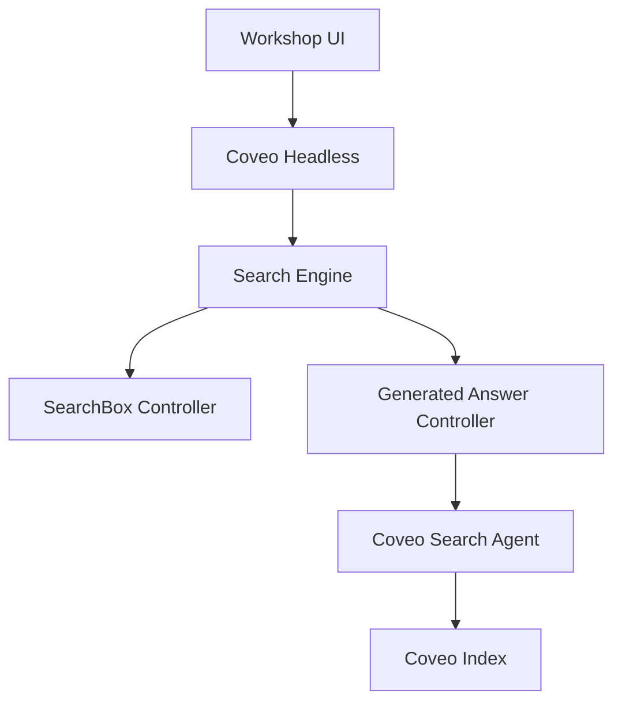
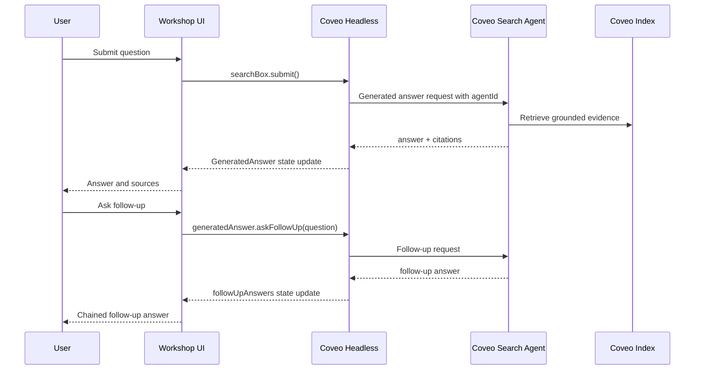

# Lab 3 Architecture

The native Coveo Search Agent path is intentionally simple.

```mermaid
graph TB
    UI[Workshop UI]
    HEADLESS[Coveo Headless]
    ENGINE[Search Engine]
    SEARCHBOX[SearchBox Controller]
    GENERATED[Generated Answer Controller]
    AGENT[Coveo Search Agent]
    INDEX[Coveo Index]

    UI --> HEADLESS
    HEADLESS --> ENGINE
    ENGINE --> SEARCHBOX
    ENGINE --> GENERATED
    GENERATED --> AGENT
    AGENT --> INDEX
```

## What Runs In The Browser

The workshop UI builds:

- `buildSearchEngine`
- `buildSearchBox`
- `buildGeneratedAnswer(engine, { agentId })`

The **Coveo Search Agent** card contains the full interaction in a single panel:

1. A search input and **Ask** button (the header search bar is hidden in this mode).
2. On submit, the `SearchBox` controller calls `submit()` which dispatches the query through the engine.
3. The `GeneratedAnswer` controller streams the answer, citations, and follow-up state back to the UI.
4. A follow-up input appears after the first answer loads, using `generatedAnswer.askFollowUp()`.

The UI subscribes to Headless controller state and renders:

- generated answer (streaming / complete)
- citations
- follow-up answer chain (previous turns are collapsible)
- loading/streaming state
- copy, like, dislike, and citation click controls

## What Does Not Run

This path does not use:

- API Gateway
- AgentCore Runtime
- Bedrock Agent
- Lambda chat proxy
- external memory configuration

## State Flow

```mermaid
sequenceDiagram
    participant User
    participant UI as Workshop UI
    participant Headless as Coveo Headless
    participant Agent as Coveo Search Agent
    participant Index as Coveo Index

    User->>UI: Submit question
    UI->>Headless: searchBox.submit()
    Headless->>Agent: Generated answer request with agentId
    Agent->>Index: Retrieve grounded evidence
    Agent-->>Headless: answer + citations
    Headless-->>UI: GeneratedAnswer state update
    UI-->>User: Answer and sources

    User->>UI: Ask follow-up
    UI->>Headless: generatedAnswer.askFollowUp(question)
    Headless->>Agent: Follow-up request
    Agent-->>Headless: follow-up answer
    Headless-->>UI: followUpAnswers state update
    UI-->>User: Chained follow-up answer
```
