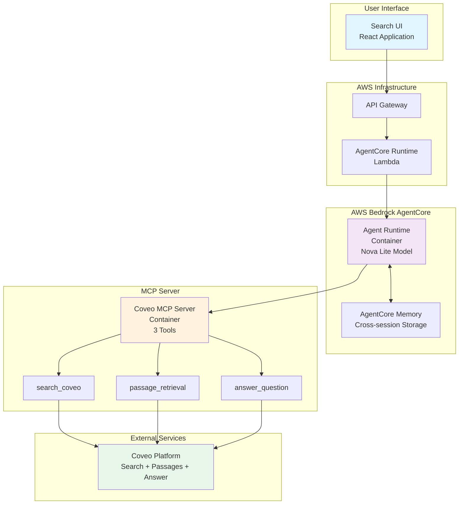
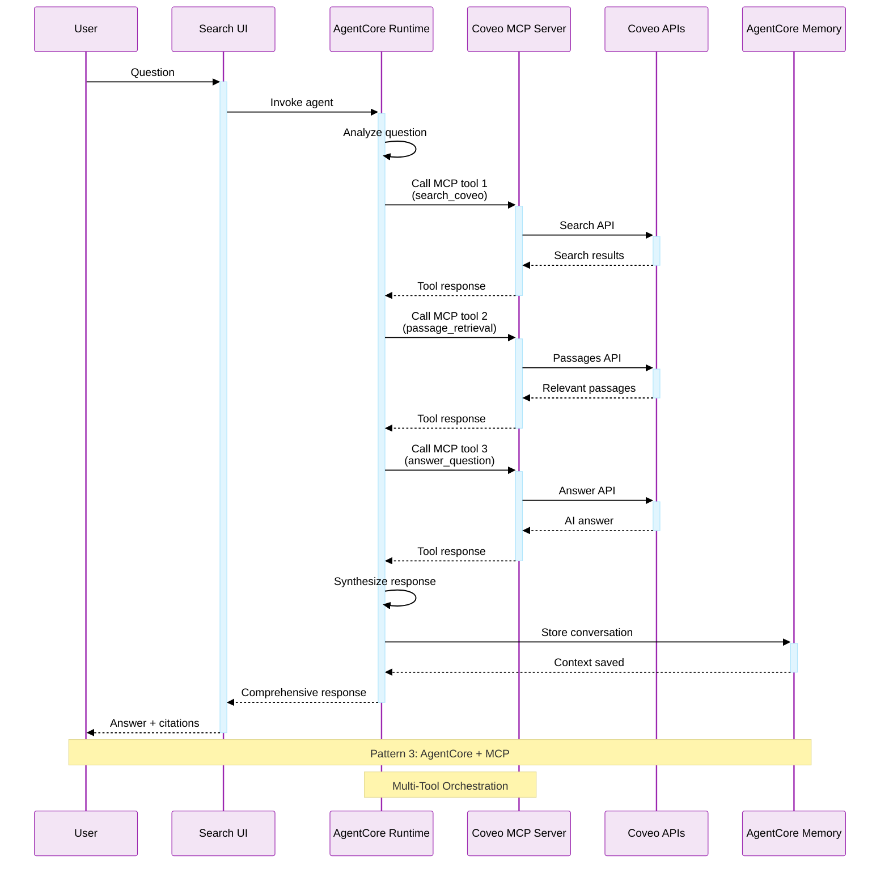
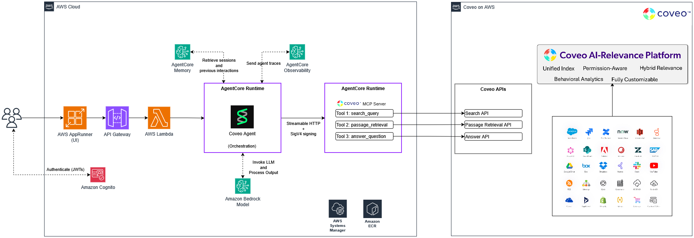
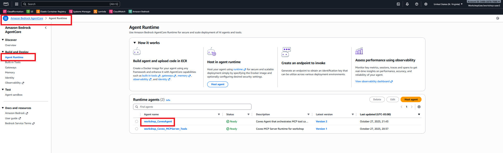
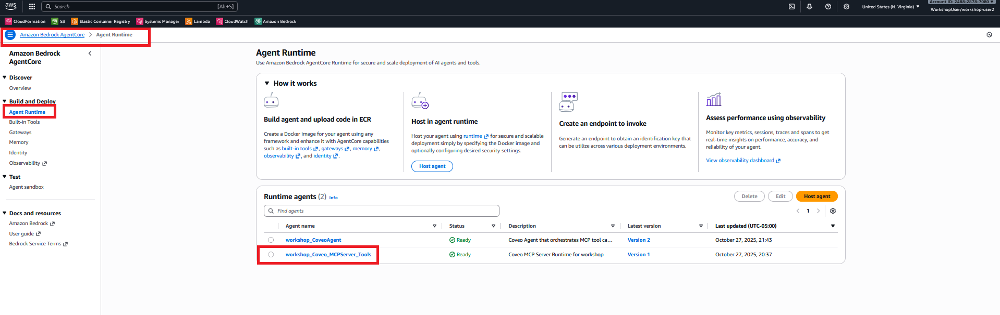
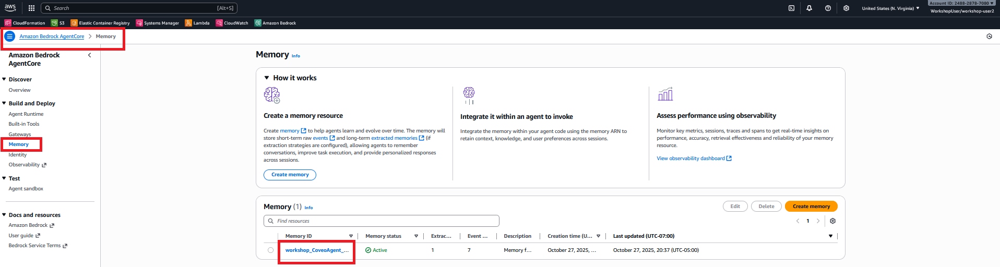
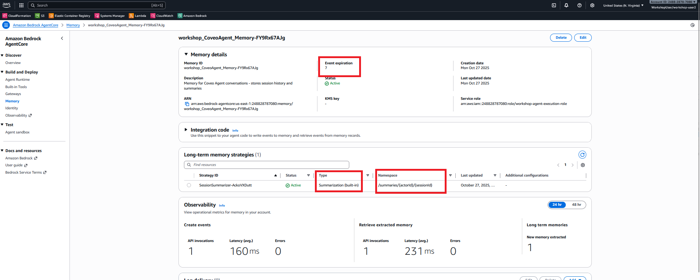
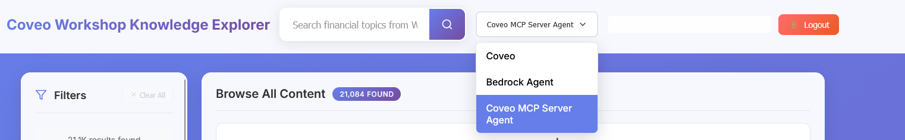
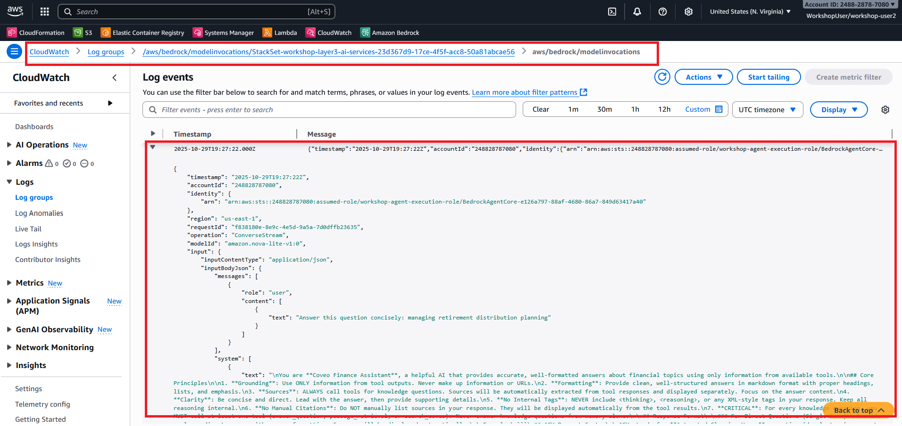
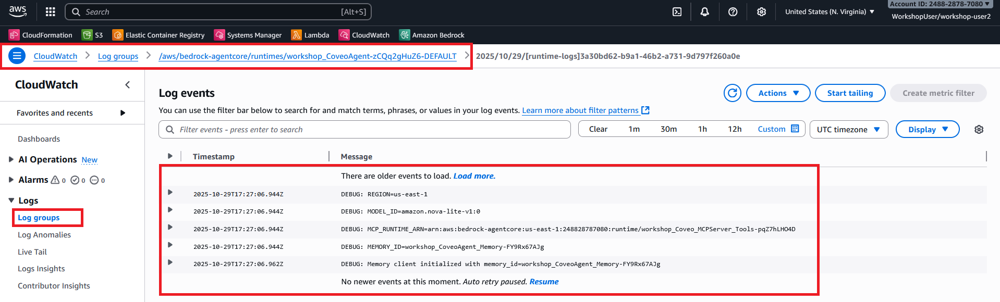

# Lab 3: AgentCore + MCP Server

**Duration**: 20 minutes  
**Objective**: Explore AWS Bedrock AgentCore with Coveo Model Context Protocol (MCP) Server for advanced tool orchestration.

## 🎯 Lab Goals

By the end of this lab, you will:

- ✅ Understand AgentCore Runtime and Coveo MCP Server architecture
- ✅ Explore AgentCore Console
- ✅ Test multi-tool orchestration with Coveo MCP Server
- ✅ View CloudWatch Logs for observability
- ✅ Compare MCP with previous integration patterns
- ✅ Identify when to use AgentCore with Coveo MCP

## 🏗️ Architecture Overview

In this lab, you'll explore the **AgentCore with MCP** pattern:



## 🔄 Pattern 3 Sequence Diagram



## 📋 Lab Exercises

### Exercise 3.1: AgentCore Architecture Overview (5 minutes)

**Type**: Instructor-led + Hands on

**Agentcore architecture with Coveo MCP**



**Key Concepts**

<div style="display: grid; grid-template-columns: repeat(auto-fit, minmax(250px, 1fr)); gap: 1rem; margin: 1.5rem 0;">
  <div style="padding: 1rem; background: #f3e5f5; border-radius: 8px; border-left: 4px solid #9c27b0;">
    <strong>🚀 Agent Runtime</strong><br/>
    <small>Containerized agent orchestrator</small>
  </div>
  <div style="padding: 1rem; background: #fff3e0; border-radius: 8px; border-left: 4px solid #ff9800;">
    <strong>🔌 MCP Server</strong><br/>
    <small>Model Context Protocol server with tools</small>
  </div>
  <div style="padding: 1rem; background: #e3f2fd; border-radius: 8px; border-left: 4px solid #2196f3;">
    <strong>🛠️ Multiple Tools</strong><br/>
    <small>Search, passages, and answer tools</small>
  </div>
  <div style="padding: 1rem; background: #e8f5e9; border-radius: 8px; border-left: 4px solid #4caf50;">
    <strong>🧠 Advanced Memory</strong><br/>
    <small>Cross-session memory support</small>
  </div>
</div>

**Why Two Runtimes in AgentCore?**

AgentCore uses a **separation of concerns** architecture with two distinct runtime components:

---

#### 🎯 Agent Runtime (Orchestrator)

- **Purpose**: Decision-making and conversation management
- **Contains**: Foundation model (Nova Lite), memory system, conversation logic
- **Responsibilities**:
    - Analyze user questions and determine intent
    - Decide which tools to call and in what order
    - Manage conversation context and memory
    - Synthesize responses from multiple tool outputs
    - Handle session management and user interactions

#### 🔧 Coveo MCP Server Runtime

- **Purpose**: Tool execution and external service integration
- **Contains**: Coveo API integrations, tool implementations
- **Responsibilities**:
    - Execute specific Coveo API calls (search, passages, answer)
    - Handle API authentication and error handling
    - Format and validate tool parameters
    - Return structured responses to the Agent Runtime

---

**Benefits of This Architecture:**

| Benefit | Description | Example |
|---------|-------------|---------|
| **🔄 Scalability** | Each runtime can scale independently | MCP server handles high API load while agent manages conversations |
| **🛡️ Security** | Isolate sensitive operations | Coveo API keys only in MCP server, not in agent |
| **🔧 Maintainability** | Update tools without affecting agent logic | Add new Coveo features without changing conversation flow |
| **📊 Observability** | Separate logging and monitoring | Track tool performance vs. conversation quality separately |
| **🚀 Reusability** | MCP server can serve multiple agents | Same Coveo tools used by different agent personalities |

**Communication Flow:**
```
User Question → Agent Runtime → MCP Server → Coveo APIs
                     ↓              ↓           ↓
User Response ← Agent Runtime ← MCP Server ← API Response
```

The **Agent Runtime** acts as the "brain" making decisions, while the **MCP Server** acts as the "hands" executing specific tasks.

**What is Model Context Protocol (MCP)?**

**MCP** is a standardized protocol for AI agents to interact with tools and services:

- 🔌 **Standardized Interface**: Common protocol for tool integration
- 🔧 **Tool Discovery**: Agents can discover available tools
- 📊 **Enhanced Observability**: Better logging and tracing
- 🚀 **Scalability**: Easy to add new tools

**AgentCore vs Bedrock Agent**

| Aspect | Bedrock Agent (Lab 2) | AgentCore (Lab 3) |
|--------|----------------------|-------------------|
| **Deployment** | Managed service | Containerized runtime |
| **Protocol** | Proprietary | MCP (standardized) |
| **Tools** | 1 tool (supports multiple) | Multiple tools |
| **Orchestration** | Agent-driven via action groups | Agent-driven via MCP |
| **Observability** | Good | Excellent |
| **Flexibility** | Limited | High |

---

### Exercise 3.2: Explore AgentCore Console (10 minutes)

**Type**: Hands-on

**Step 1: Navigate to Bedrock AgentCore**

1. **Login to AWS Console**
2. **Navigate to Amazon Bedrock AgentCore**
3. **Click "Agent Runtime"** in the left navigation
4. **Click "workshop_CoveoAgent"** to view the orchestration runtime details

**AWS Console - Bedrock AgentCore Navigation**



**Key Information**:

| Field | Value | Purpose |
|-------|-------|---------|
| **Runtime Name** | workshop_CoveoAgent | Orchestrator Identifier |
| **Type** | Orchestration Agent | Protocol type |
| **Status** | Ready | Ready to use |
| **Runtime ID** | workshop_CoveoAgent-<....> | Used to Invoke Runtime |

**Step 2: Review Coveo MCP Server Runtime**

1. **Go back to the Agent Runtime page and Find** `workshop_Coveo_MCPServer_Tools`
2. **Click on it** to view details

**AgentCore Console - Coveo MCP Server Runtime Details**




**Key Information**:

| Field | Value | Purpose |
|-------|-------|---------|
| **Runtime Name** | workshop_Coveo_MCPServer_Tools | Identifier |
| **Type** | MCP Server | Protocol type |
| **Status** | Ready | Ready to use |
| **Runtime ID** | workshop_Coveo_MCPServer_Tools-<....> | Used to Invoke Runtime |

**Step 3: Review Memory Configuration**

1. **Go back to the BedrockAgentCore service page, and Find Memory**, click on **"Memory"**
2. **Click on the memory workshop_CoveoAgent_Memory-<....>** to view details

**AgentCore Console - Memory Configuration**



3. **Review the details** of the memory configuration

**AgentCore Console - Memory Details**




**Key Information**:

- Event Expiration: 7 Days
- Long-term memory strategy Type: Summarization (built-in)
- Namespace: /summaries/{actorId}/{sessionId}

---


### Exercise 3.3: Test in Workshop UI (5 minutes)

**Type**: Hands-on

#### Step 1: Switch Backend Mode

1. **Return to Workshop UI**
2. **Click backend selector** (top right)
3. **Select "Coveo MCP Server Agent"**

**Workshop UI - Coveo MCP Backend Selected**




#### Step 2: Run Sample Queries

Test these queries and observe the responses:

**Query 1: Basic Question**
```
managing retirement distribution planning
```

**Expected**: Single Shot Answer response with answer tool selection ( we can verify the tool selection in AWS Cloud watch logs)

---

**Query 2: Multi-part Question**
```
comparing college financing options FAFSA and 529
```
**Expected**: Agent Orchestrator uses the answer tool, fails to get a single answer and falls back to Passage tool to retrive the relevant passage and sumamrizes and present the answer.

---

**Query 3: Procedural Question**
```
capital gain and dividend reinvestment strategy
```
**Expected**: Agent Orchestrator uses the answer tool for this query

---

### Exercise 3.4: View CloudWatch Logs (5 minutes)

**Type**: Hands On

The instructor will demonstrate how to view CloudWatch Logs for observability.

#### Step 1: Navigate to CloudWatch

1. **Open CloudWatch** in a new tab
2. **Click "Logs"** → **"Log groups"**
3. **Find log groups**: expand the log to look at the Agent runtime tool selection and reasoning and how it responded back 
   - `/aws/bedrock/modelinvocations/StackSet-workshop-layer3-ai-services-<some random number>`

**CloudWatch - Log Groups List**




#### Step 2: View Agent Runtime Logs

1. **Go back to Log groups**
2. **Click on** `/aws/bedrock-agentcore/runtimes/workshop_CoveoAgent-<randomnumber>-DEFAULT
`
3. **Click on the latest log stream**
4. **Observe agent logs**:
   - Model Used
   - MCP Runtime ARN
   - Memory usage by the Coveo Agent
   - Unique memory_id

**CloudWatch - Agent Runtime Logs**



---

## 🔍 Key Observations

### AgentCore + MCP Strengths

<div style="display: grid; grid-template-columns: repeat(auto-fit, minmax(300px, 1fr)); gap: 1rem; margin: 1.5rem 0;">
  <div style="padding: 1.5rem; background: #f3e5f5; border-radius: 8px;">
    <h4 style="margin-top: 0;">🔧 Multi-Tool Orchestration</h4>
    <p>Agent can use multiple tools in sequence for comprehensive answers</p>
  </div>
  <div style="padding: 1.5rem; background: #e3f2fd; border-radius: 8px;">
    <h4 style="margin-top: 0;">📊 Enhanced Observability</h4>
    <p>Detailed logs show tool selection and execution</p>
  </div>
  <div style="padding: 1.5rem; background: #fff3e0; border-radius: 8px;">
    <h4 style="margin-top: 0;">🔌 Standardized Protocol</h4>
    <p>MCP provides consistent tool interface</p>
  </div>
  <div style="padding: 1.5rem; background: #e8f5e9; border-radius: 8px;">
    <h4 style="margin-top: 0;">🚀 Scalable Architecture</h4>
    <p>Easy to add new tools and capabilities</p>
  </div>
</div>

### Comparison with Previous Labs

| Aspect | Coveo Direct (Lab 1) | Bedrock Agent (Lab 2) | AgentCore MCP (Lab 3) |
|--------|---------------------|----------------------|----------------------|
| **Tools Available** | N/A | 1 tool (in this workshop) | 3 tools |
| **Tool Selection** | Manual | Automatic | Intelligent |
| **Multi-tool Use** | No | Yes (capable) | Yes |
| **Observability** | Basic | Good | Excellent |
| **Complexity** | Low | Medium | High |
| **Flexibility** | Limited | Moderate | High |
| **Response Quality** | Good | Better | Best |

---

## 💡 When to Use AgentCore + MCP

### Ideal Use Cases

<div class="lab-card">
  <h4>🔬 Complex Research</h4>
  <p>Multi-step research requiring different types of information</p>
  <p><strong>Example</strong>: "Compare investment options, analyze risks, and recommend a strategy"</p>
</div>

<div class="lab-card">
  <h4>💼 Consultation Services</h4>
  <p>Expert advice requiring multiple data sources and analysis</p>
  <p><strong>Example</strong>: Financial planning with tax implications and investment strategies</p>
</div>

<div class="lab-card">
  <h4>📊 Data Analysis</h4>
  <p>Combining search, retrieval, and analysis tools</p>
  <p><strong>Example</strong>: Market research with trend analysis and recommendations</p>
</div>

<div class="lab-card">
  <h4>🎓 Advanced Education</h4>
  <p>Teaching complex topics with multiple perspectives</p>
  <p><strong>Example</strong>: Explaining financial concepts with examples and comparisons</p>
</div>

---

## ✅ Validation Checklist

Before proceeding to Lab 4, verify:

- [ ] Viewed AgentCore Runtimes in AWS Console
- [ ] Reviewed MCP Server Runtime configuration
- [ ] Reviewed Agent Runtime configuration
- [ ] Tested in Workshop UI with Coveo MCP backend
- [ ] Viewed CloudWatch Logs for both runtimes
- [ ] Observed tool orchestration in logs
- [ ] Understand multi-tool capabilities
- [ ] Understand when to use AgentCore + MCP

---

## 🎉 Lab 3 Complete!

You've successfully:

- ✅ Explored AgentCore Runtime with Coveo MCP Server architecture
- ✅ Reviewed runtime configurations in AWS Console
- ✅ Viewed CloudWatch Logs for observability
- ✅ Tested multi-tool orchestration
- ✅ Understood when AgentCore + MCP is the optimal choice

### Key Takeaways

1. **AgentCore provides containerized agent runtime** with advanced capabilities
2. **Coveo MCP server can be used in Agentcore** to call Coveo APIs as tools
2. **MCP standardizes tool integration** for better interoperability
3. **Multiple tools enable comprehensive responses** through orchestration
4. **Enhanced observability** through detailed CloudWatch Logs
5. **Scalable architecture** makes it easy to add new capabilities

---

## 🚀 Next Steps

Ready to see all three backends in action with multi-turn conversations?

<div style="text-align: center; margin: 3rem 0;">
  <a href="../lab4/" class="md-button md-button--primary" style="font-size: 1.1rem; padding: 1rem 2rem;">
    Proceed to Lab 4: Chatbot Case Deflection →
  </a>
</div>

In Lab 4, you'll test multi-turn conversations and compare all three integration patterns!
