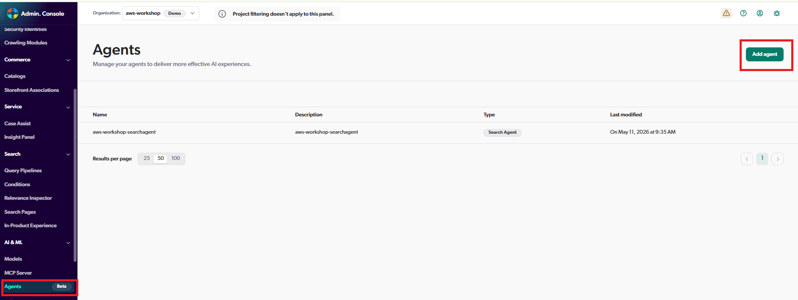
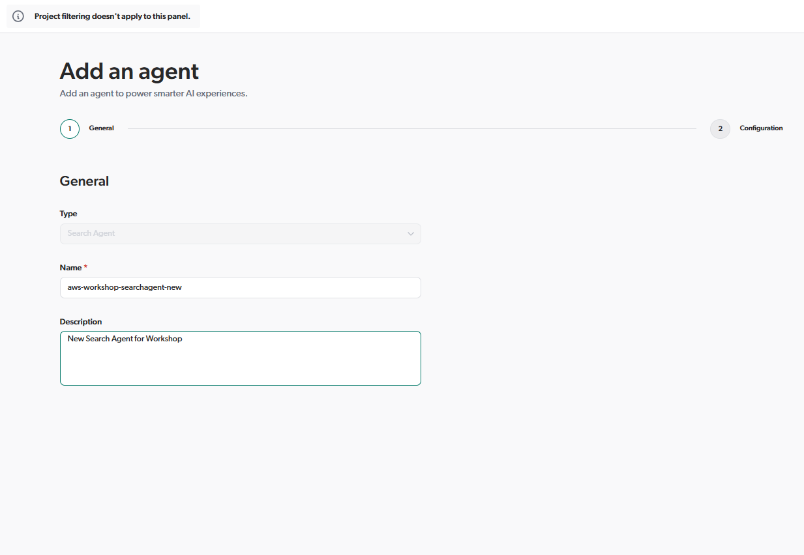
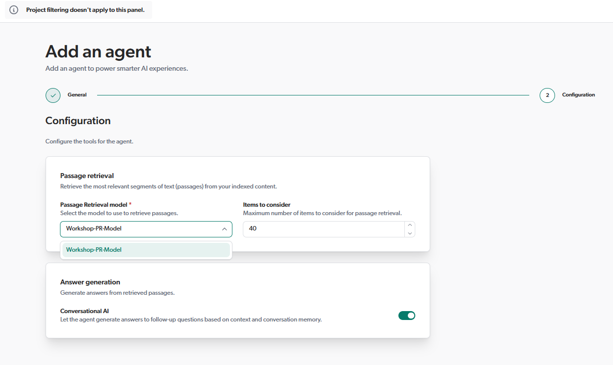
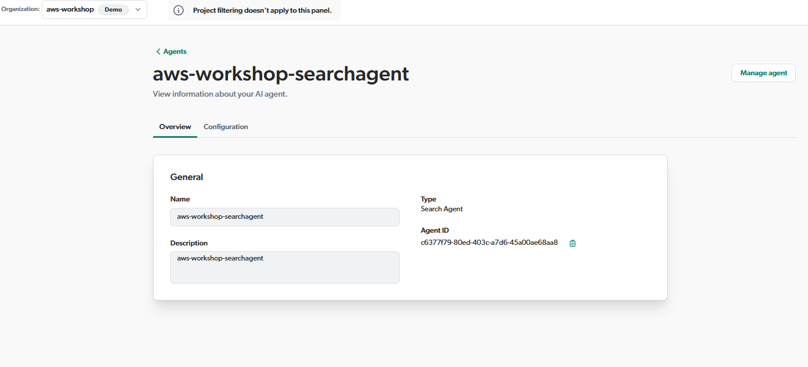
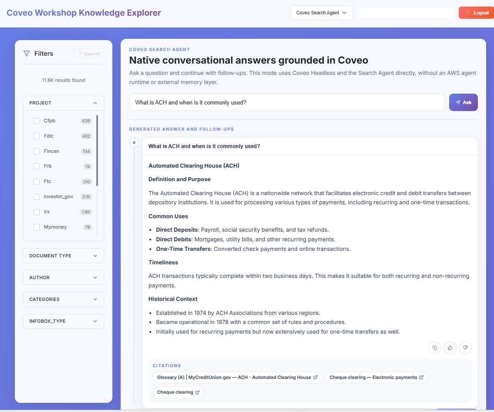
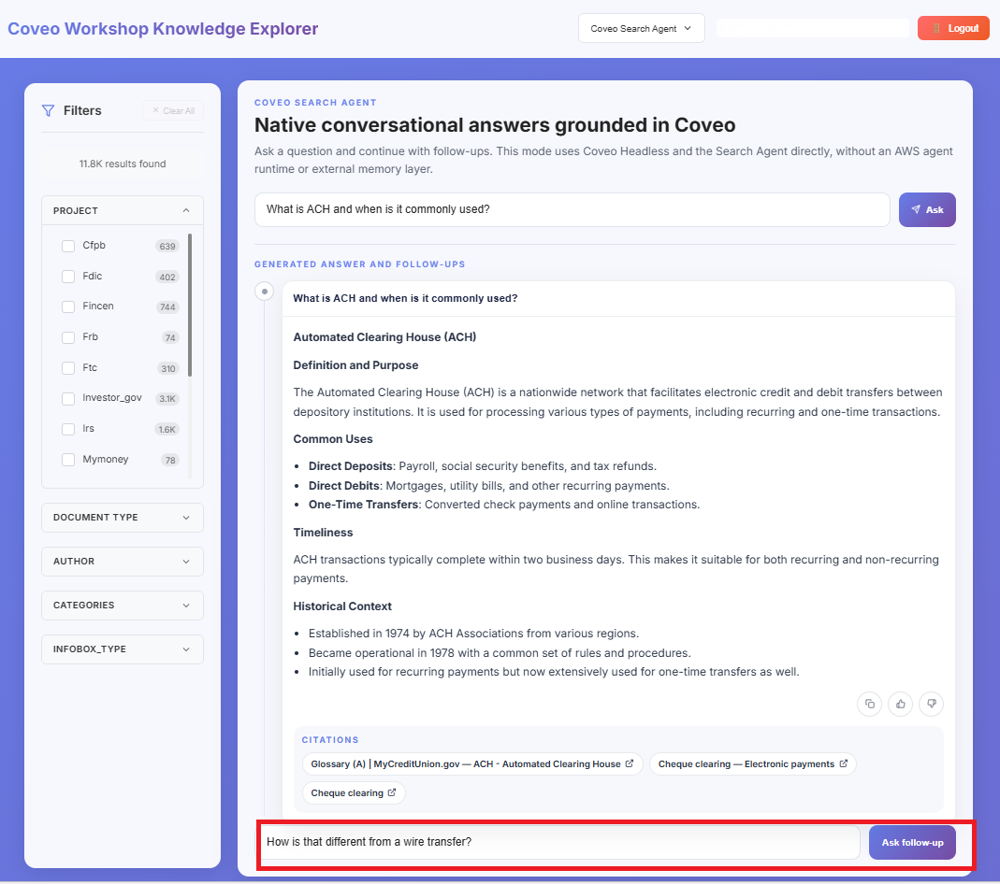
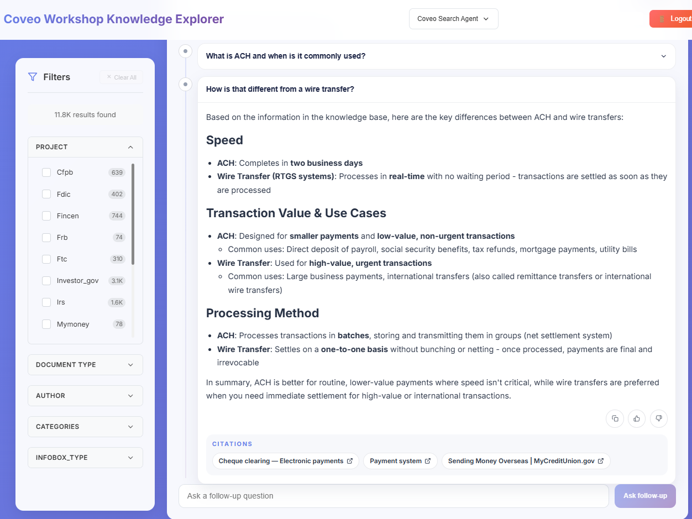
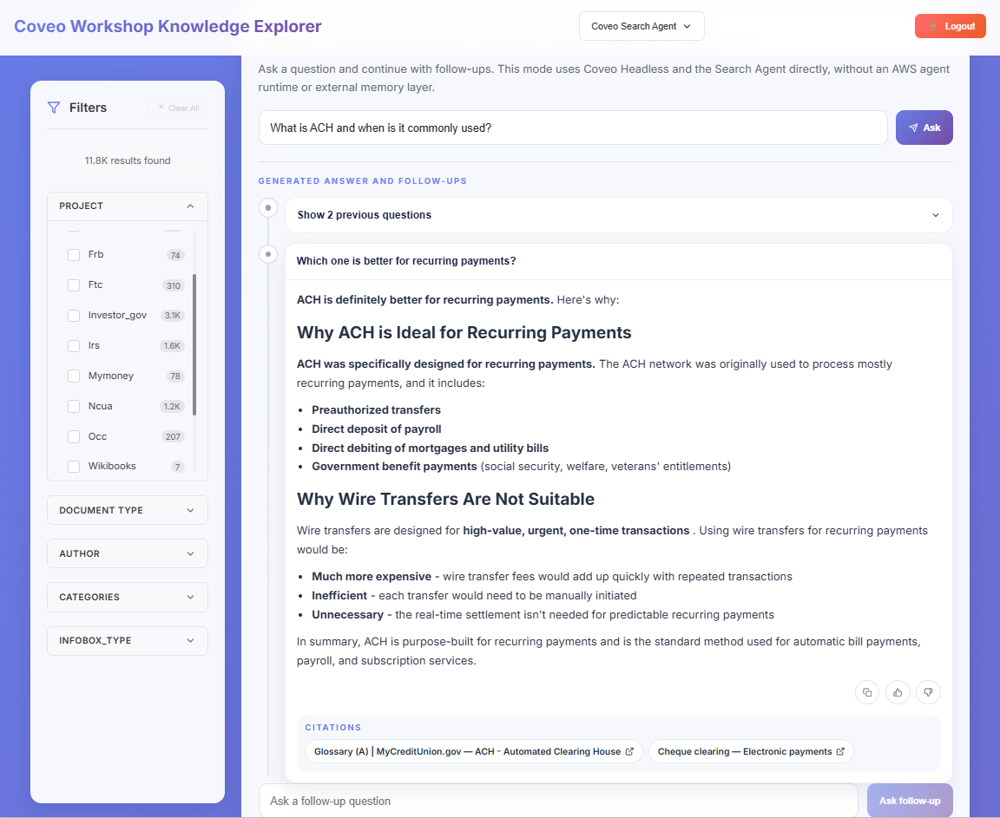

# Lab 3: Native Coveo Search Agent with Headless

**Pattern**: Coveo Headless + Coveo Search Agent

**Duration**: 25 minutes

**Objective**: Experience native Coveo conversational answers and follow-ups without building an AWS agent runtime.

## Lab Goals

By the end of this lab, you will:

- Understand how a Coveo Search Agent is configured in the Coveo Administration Console.
- Test Search Agent answers and follow-up questions in Coveo.
- Use the workshop UI's **Coveo Search Agent** mode.
- See generated answers, citations, copy, like/dislike, and chained follow-ups.
- Understand when native Coveo Search Agent is simpler than AWS agent orchestration.

## Why This Lab Matters

Lab 2 showed an AWS agent runtime that uses Coveo Hosted MCP tools. This lab shows the native Coveo path: Coveo owns the generated answer and follow-up state, and the UI consumes it with Headless.

There is no AWS AgentCore runtime, no Lambda chat proxy, and no external memory setup in this path.

## Exercise 3.1: Review Coveo Search Agent Configuration

Your instructor will open the Coveo Administration Console and review the Search Agent Configuration including:

- Search Agent ID
- query pipeline
- search hub
- answer behavior
- grounding/indexed content
- follow-up support

1. Search Agent Configuration in Coveo Platform Console.
  

2. Search Agent -Add a New agent in Coveo Platform Console.
  

3. Search Agent -Add a PR Model in Coveo Platform Console
  

4. Search Agent - Agent ID in Coveo Platform Console
  

!!! note "Search Agent Configuration Guide"
    For step-by-step guidance on configuring Coveo Search Agents, see the official documentation:
    [About Coveo Search Agents](https://docs.coveo.com/en/q2pe0294/leverage-machine-learning/about-coveo-search-agents)


## Exercise 3.2: Test In The Workshop UI

1. Open the workshop UI.
2. Select **Coveo Search Agent** from the backend selector.
3. Notice that the header search bar disappears. The **Coveo Search Agent** card is the only entry point in this mode.
4. Type your question in the search field inside the Coveo Search Agent card and click **Ask**:

```text
What is ACH and when is it commonly used?
```

  


Expected:

- A generated answer appears inside the same card, below the search row.
- Citations appear under the answer.
- Copy, like, and dislike controls appear.

## Exercise 3.3: Ask Follow-Up Questions

After the first answer loads, a **Ask a follow-up question** input appears at the bottom of the card. Type:

```text
How is that different from a wire transfer?
```

  


  


Then ask:

```text
Which one is better for recurring payments?
```

  


Expected:

- Each answer appears in the same card below the previous one.
- Previous question/answer pairs are collapsed as you add more turns.
- The latest turn stays expanded.
- The answer remains grounded in Coveo-indexed content.

## Exercise 3.4: Compare With Lab 2

| Capability | AgentCore + Hosted MCP | Native Coveo Search Agent |
|---|---|---|
| AWS runtime | Required | Not required |
| External memory | Available through AgentCore | Not required for Search Agent follow-ups |
| Tool orchestration | Agent chooses Hosted MCP tools | Coveo handles answer/follow-up state |
| Best fit | custom agent workflows, non-Coveo tools, memory-heavy journeys | native grounded conversational search |

## Lab Summary

You used Coveo Headless to consume a native Coveo Search Agent. This is the simplest path when the goal is grounded conversational search with citations and follow-up questions.

