<h1 style="color: #667eea; border-left: 6px solid #667eea; padding-left: 1rem; background: linear-gradient(90deg, rgba(102, 126, 234, 0.1) 0%, transparent 100%); padding: 1rem; border-radius: 4px;">💬 Lab 4: Chatbot Case Deflection</h1>

**Patterns**: All Three Backends (Coveo Direct API, Bedrock Agent, AgentCore Runtime + MCP)  
**Duration**: 20 minutes  
**Objective**: Test multi-turn conversations across all three backends and explore conversational AI for case deflection.

## 🎯 Lab Goals

By the end of this lab, you will:

- ✅ Test multi-turn conversations across all three backends
- ✅ Compare single-turn vs multi-turn capabilities
- ✅ Explore session memory and cross-session memory
- ✅ Understand case deflection use cases
- ✅ Identify which backend fits different scenarios

## 🏗️ Architecture Overview

In this lab, you'll test the **Chatbot Interface** with all three backends:

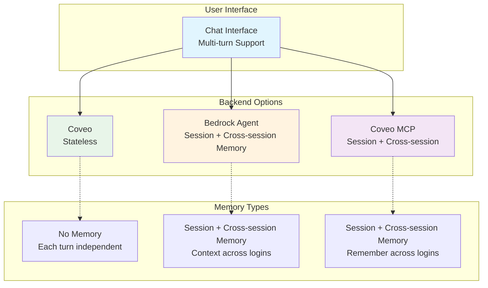
```mermaid
graph TB
    subgraph "User Interface"
        UI[Chat Interface<br/>Multi-turn Support]
    end
    
    subgraph "Backend Options"
        B1[Coveo<br/>Stateless]
        B2[Bedrock Agent<br/>Session + Cross-session Memory]
        B3[Coveo MCP<br/>Session + Cross-session]
    end
    
    subgraph "Memory Types"
        M1[No Memory<br/>Each turn independent]
        M2[Session + Cross-session Memory<br/>Context across logins]
        M3[Session + Cross-session Memory<br/>Remember across logins]
    end
    
    UI --> B1
    UI --> B2
    UI --> B3
    
    B1 -.-> M1
    B2 -.-> M2
    B3 -.-> M3
    
    style UI fill:#e1f5fe
    style B1 fill:#e8f5e9
    style B2 fill:#fff3e0
    style B3 fill:#f3e5f5
```

## 🔄 Lab 4 Sequence Diagram (with Bedrock Agent or AgentCore Runtime backends)

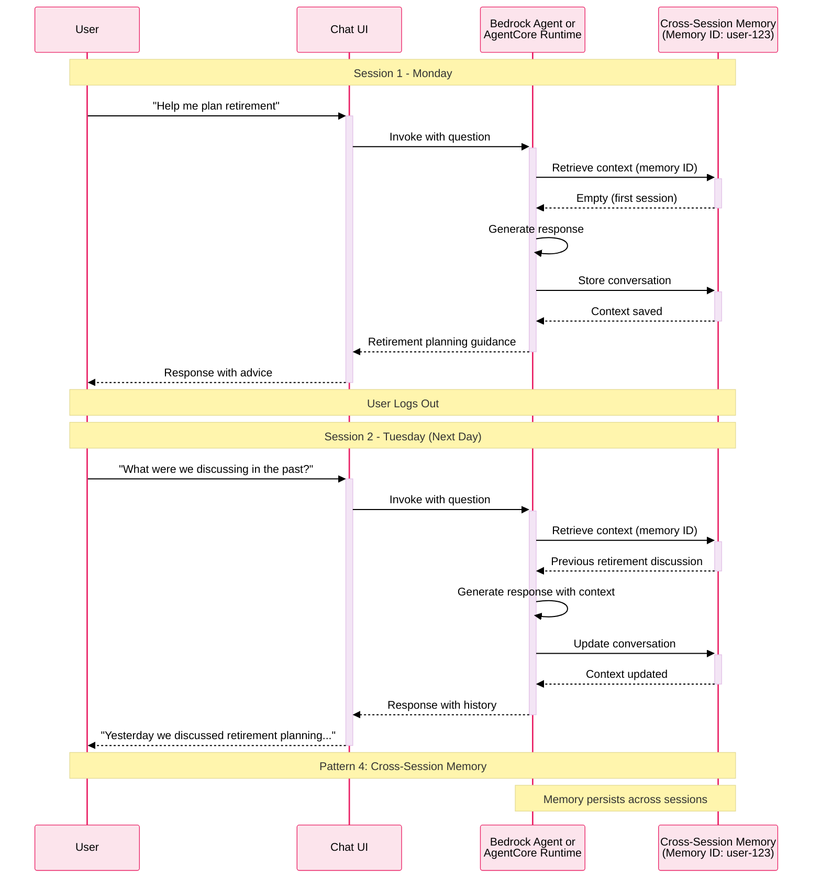
```mermaid
%%{init: {'theme':'base', 'themeVariables': { 'primaryColor':'#fce4ec','primaryTextColor':'#000','primaryBorderColor':'#e91e63','lineColor':'#e91e63','secondaryColor':'#f3e5f5','tertiaryColor':'#fff3e0'}}}%%
sequenceDiagram
    participant User
    participant UI as Chat UI
    participant Backend as Bedrock Agent or<br/>AgentCore Runtime
    participant Memory as Cross-Session Memory<br/>(Memory ID: user-123)
    
    Note over User,Memory: Session 1 - Monday
    User->>+UI: "Help me plan retirement"
    UI->>+Backend: Invoke with question
    Backend->>+Memory: Retrieve context (memory ID)
    Memory-->>-Backend: Empty (first session)
    Backend->>Backend: Generate response
    Backend->>+Memory: Store conversation
    Memory-->>-Backend: Context saved
    Backend-->>-UI: Retirement planning guidance
    UI-->>-User: Response with advice
    
    Note over User,Memory: User Logs Out
    
    Note over User,Memory: Session 2 - Tuesday (Next Day)
    User->>+UI: "What were we discussing in the past?"
    UI->>+Backend: Invoke with question
    Backend->>+Memory: Retrieve context (memory ID)
    Memory-->>-Backend: Previous retirement discussion
    Backend->>Backend: Generate response with context
    Backend->>+Memory: Update conversation
    Memory-->>-Backend: Context updated
    Backend-->>-UI: Response with history
    UI-->>-User: "Yesterday we discussed retirement planning..."
    
    Note over User,Memory: Pattern 4: Cross-Session Memory
    Note over Backend,Memory: Memory persists across sessions
```

## 📋 Lab Exercises

### Exercise 4.1: Test Single-Turn Conversations (5 minutes)

**Objective**: Test Coveo backend (stateless) to understand single-turn behavior.

**Step 1: Open Chat Interface**

1. **Go to Workshop UI**
2. **Click the Chat icon** (bottom right)

**Workshop UI - Chat Icon Location**

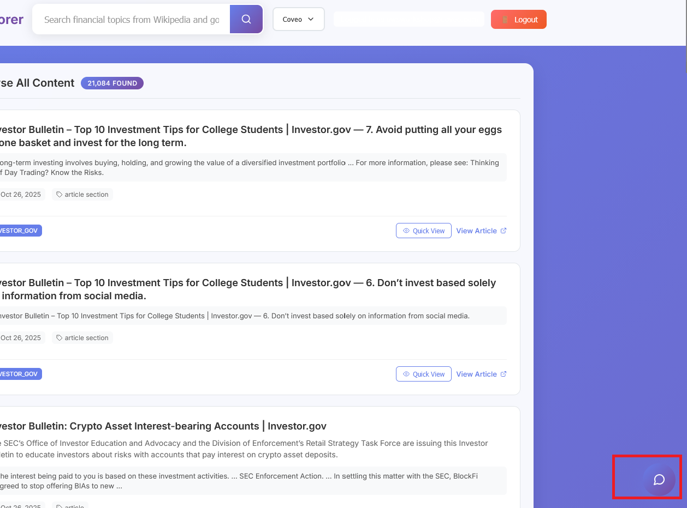

3. **Chat panel opens**

<div class="screenshot-placeholder">
Workshop UI - Chat Panel Open
</div>

**Step 2: Select Coveo Backend**

1. **Ensure backend is set to "Coveo"**
2. **Observe**: Chat interface with Coveo backend

**Chat interface with Coveo backend**

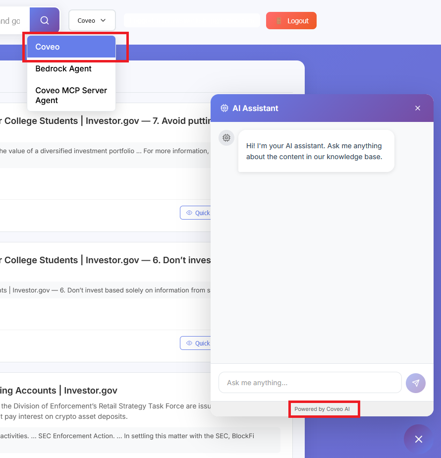

**Step 3: Test Single-Turn Behavior**

**Turn 1: Basic Question**
```
I found errors in my credit report, what’s first?
```

**Expected**: Conversational response with source citations

---

**Turn 2: Multi-part Question**
```
What were we discussing earlier
```
**Expected**: Previous context recollection (same session), but the chatbot doesn't recollect anything

---

**Observation**:

- ❌ No memory of previous question
- ❌ Each turn is independent
- ✅ Fast responses
- ✅ Good for FAQ-style questions

---

### Exercise 4.2: Test Multi-Turn with Bedrock Agent (7 minutes)

**Objective**: Test Bedrock Agent backend with session memory.

**Step 1: Refresh browser to start a new session and then Switch to Bedrock Agent**

**Change backend to "Bedrock Agent"** Open chat interface

**Chat interface with Bedrock Agent backend**

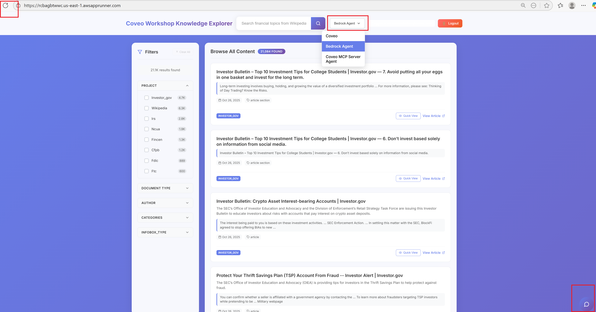


**Step 2: Make a note of the Bedrock Agent Session ID**

**Chat interface with Bedrock Agent backend session ID**

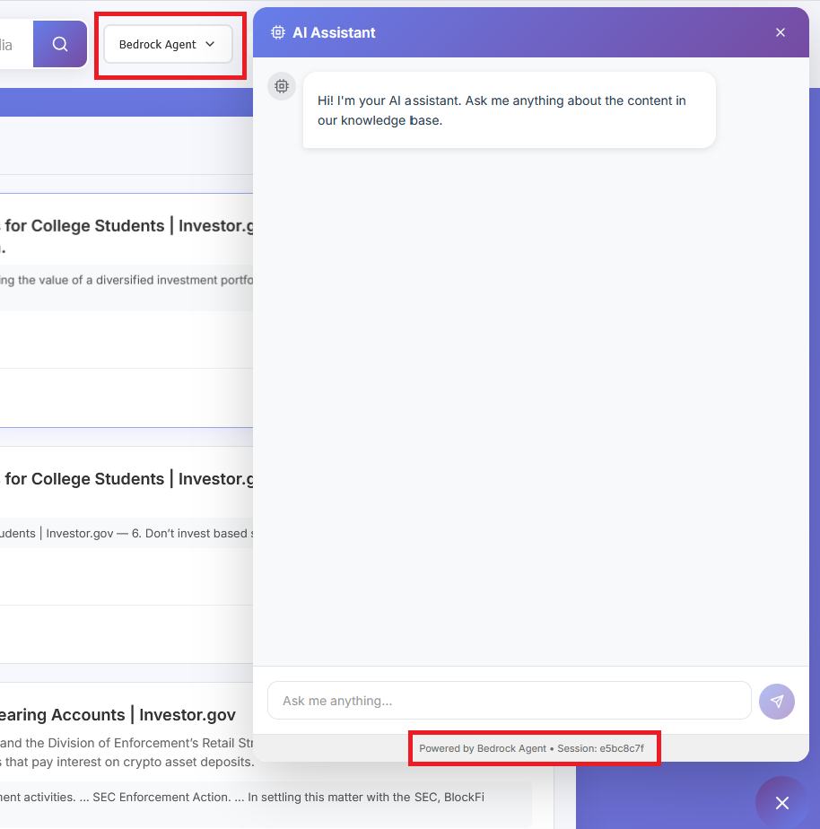


**Step 3: Test Credit Remediation Scenario**

**Turn 1: Basic Question**
```
I found errors in my credit report, what’s first?
```

**Expected**: Conversational response with source citations

---

**Turn 2: Multi-part Question**
```
What were we discussing earlier
```
**Expected**: Previous context recollection (same session)

---

**Chat recollection with Bedrock Agent same session**

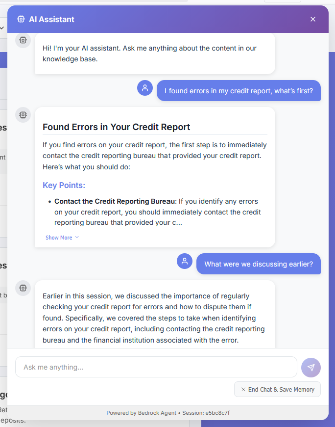


**Turn 3: followup Question**
```
Form a 60‑day SMART goal plan
```

**Expected**: Bedrock agent understood the prior context of credit report and provided contextual reponse and source citations.

---

**Refresh browser now to start a new session**

Notice the same session ID (compare with the one you noted earlier)

!!! info "Session ID local storage"
    - The solution is designed to store the session ID in local storage, and so upon refresh of the browser, the existing session ID is maintained
    - For cross-session memory (across logins), external memory with memory ID must be configured. You enabled external memory in Lab 2.


**Turn 4: followup Question**
```
What were we discussing earlier
```
**Expected**: Previous context recollection (same session)

---

**Browser Refresh Chat recollection with Bedrock Agent**

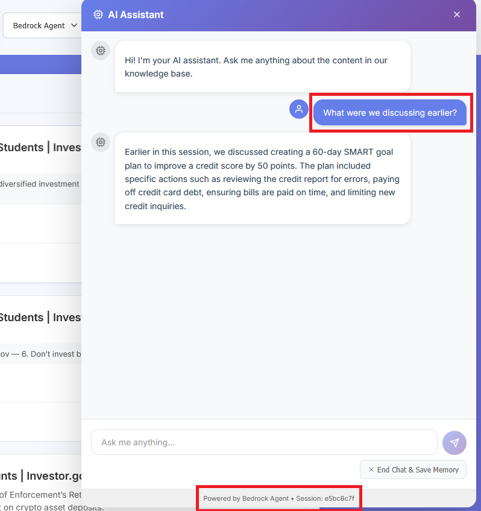


**Turn 5: followup Question**
```
Any dispute follow-up timing guidance?
```
**Expected**: Previous context recollection and presenting a response aligned to the credit report issues

---

**Context recollection with Bedrock Agent**

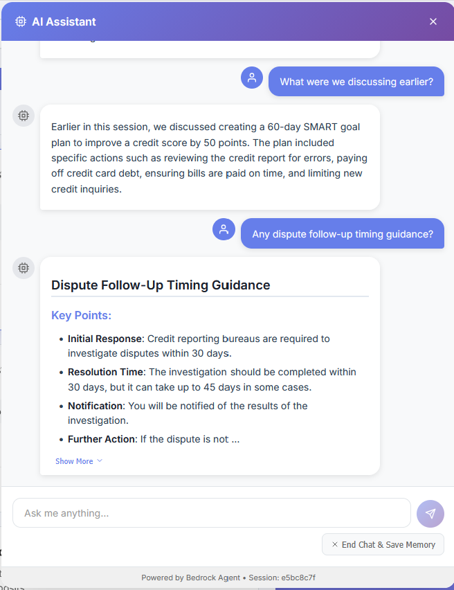


**Now Log out of the UI application and log back in**. Select Bedrock Agent as backend and open the chatbot and test

!!! info "Session ID changes now"
    For cross-sessions, the session ID changes

**Turn 6: followup Question**
```
What did we discuss in the past?
```
**Expected**: Previous context recollection with a summary of all prior conversations

**Multi Turn Conversation across session with Bedrock Agent**

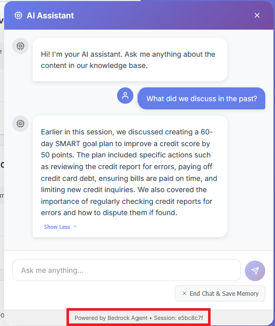

---

**Observation**:

- ✅ Remembers conversation context in a session and across sessions and across log-out and log-in
- ✅ Understands follow-up questions
- ✅ Maintains topic continuity
- ✅ Natural conversation flow

!!! info "Session Memory"
    Bedrock Agent maintains context within a session and cross-sessions (across logins) with external memory.

---

### Exercise 4.3: Multi-Turn Conversations with Agentcore MCP Agent (8 minutes)

**Objective**: Test Coveo MCP Server Agent backend with advanced memory and multi-tool orchestration.

**Step 1: Refresh browser and Switch to Coveo MCP Server Agent**

1. **Change backend to "Coveo MCP Server Agent"**
2. **Start a new conversation with the Chatbot**

**Multi Turn Conversation within a session in Agentcore MCP Agent**

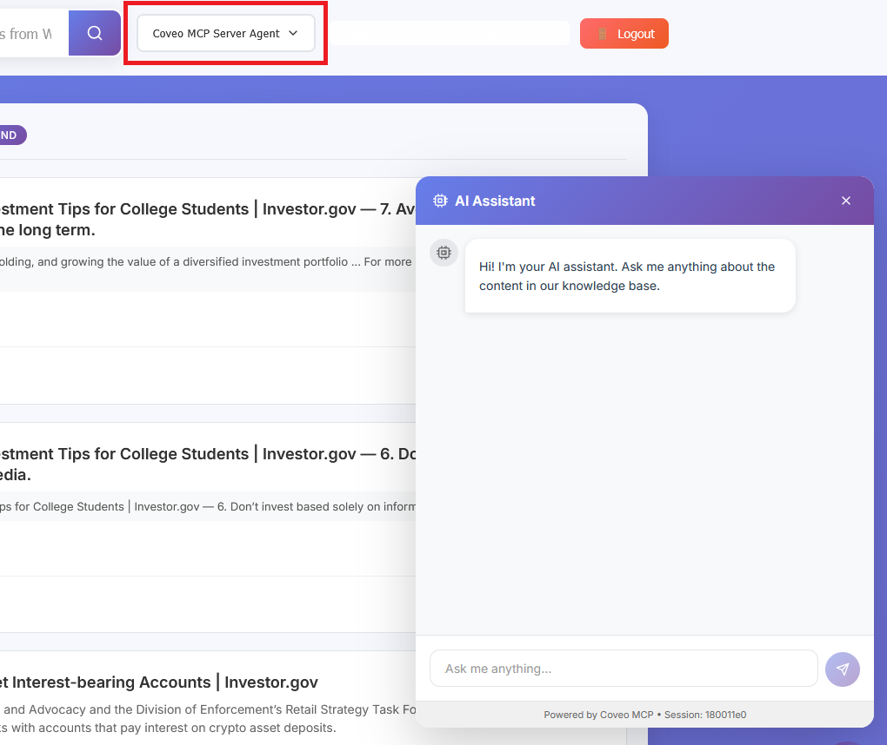


**Step 2: Test Retirement Protection Scenario**

**Turn 1: Basic Question**
```
dividend and capital gain impact on retirement
```

**Expected**: Conversational response with source citations

---

**Turn 2: Multi-part Question**
```
for low risk investment before retirement what do you recommend?
```

**Expected**: Previous context recollection and relevant response

---

**Multi Turn Conversation with Agentcore MCP Agent**

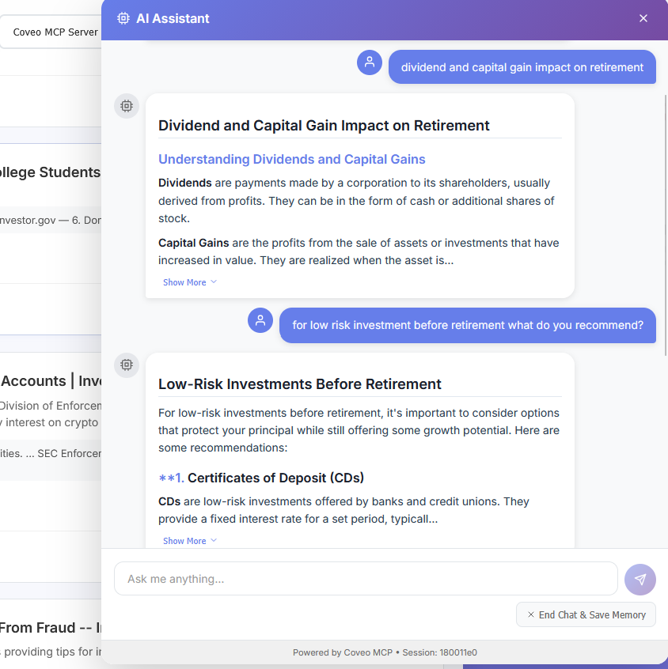


**Turn 3: Recollection**
```
Sorry I went to grab coffee!, What did we discuss earlier?
```

**Expected**: Previous context recollection and relevant response


**Chat recollection with Agentcore MCP Agent in same session**

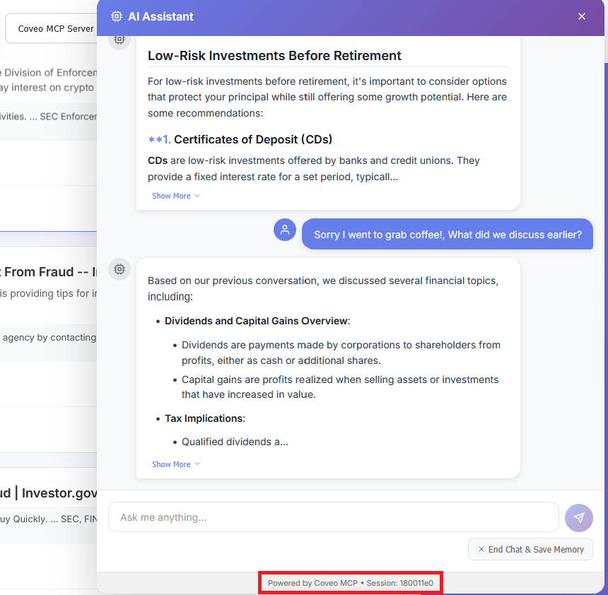


---

**Refresh browser now to start a new session**

Notice the same session ID (compare with the one you noted earlier)

!!! info "Session ID and Actor ID"
    - The solution is designed to store the session ID in local storage, and so upon refresh of the browser, the existing session ID is maintained (persist across browser refreshes)
    - Actor ID (unique value retrieved from JWT), is based on user identity and enables conversation persistence across different sessions. This enables cross-session memory with Agentcore MCP Agent 


**Turn 4: followup Question**
```
What were we discussing earlier
```
**Expected**: Previous context recollection (same session)

---

**Browser Refresh Chat recollection with Agentcore MCP Agent**

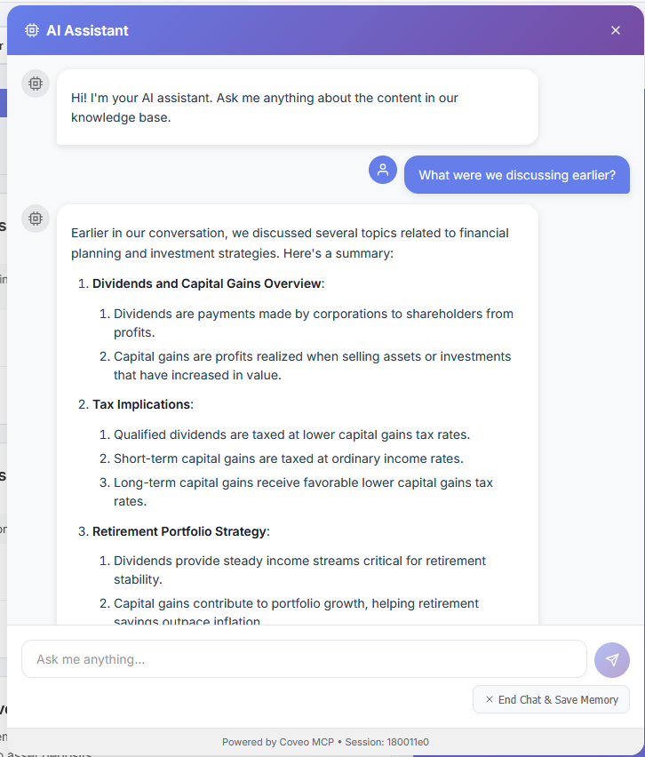


**Turn 5: followup Question**
```
for tax efficient growth what do you recommend?
```
**Expected**: Previous context recollection and presenting a response aligned to the retirement

---

**Context recollection with Agentcore MCP Agent**

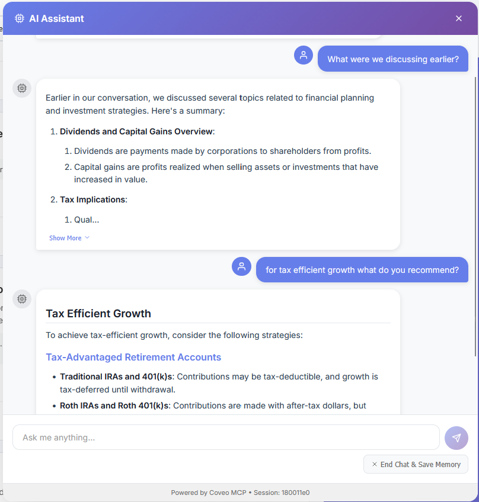


**Now to test fresh session, you can click End Chat & Save Memory**. Select Coveo MCP server Agent as backend and open the chatbot and test

!!! info "Session ID changes now"
    For cross-sessions, the session ID changes

**New session with Agentcore MCP Agent**

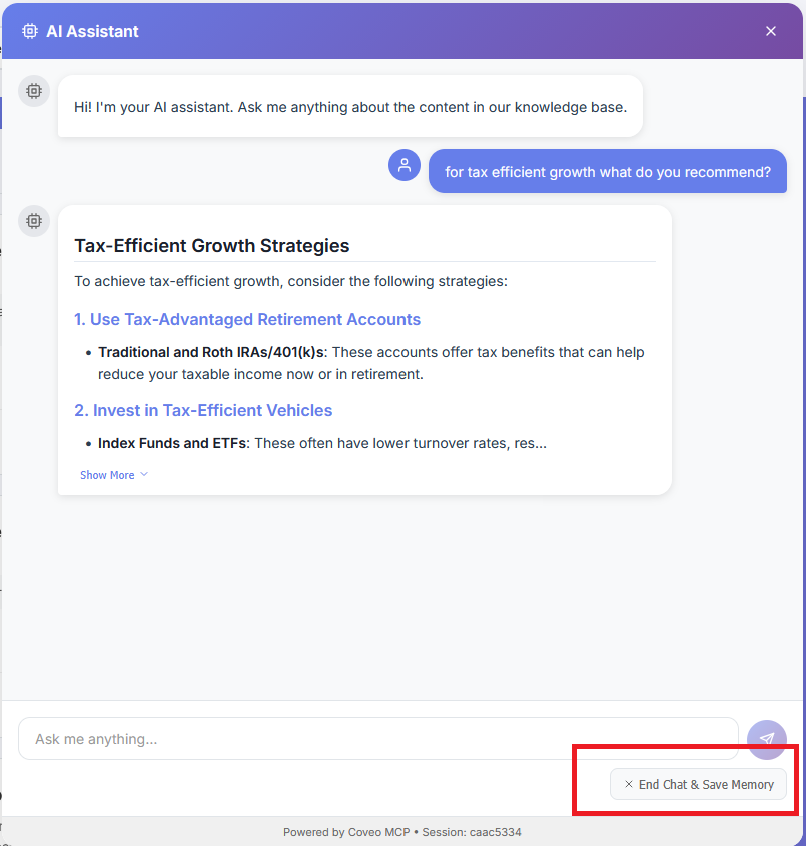


**Turn 6: followup Question**
```
What did we discuss in the past?
```
**Expected**: Previous context recollection with a summary of all prior conversations

**Multi Turn Conversation across sessions with Agentcore MCP Agent**

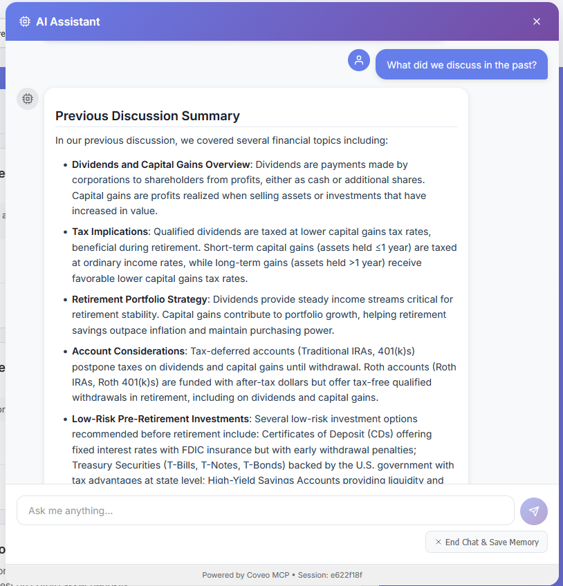

---

**Observation**:

- ✅ Remembers conversation context in a session and across sessions and across log-out and log-in
- ✅ Understands follow-up questions
- ✅ Maintains topic continuity
- ✅ Natural conversation flow

!!! info "Session Memory"
    Agentcore MCP Agent maintains context within a session and cross-sessions (across logins) by using AgentCore memory.

---

## 🔍 Key Observations

### Backend Comparison

<div style="display: grid; grid-template-columns: repeat(auto-fit, minmax(300px, 1fr)); gap: 1rem; margin: 2rem 0;">
  <div style="padding: 1.5rem; background: #e8f5e9; border-radius: 8px;">
    <h4 style="margin-top: 0;">Coveo Direct API</h4>
    <p><strong>Pattern</strong>: Direct API integration</p>
    <p><strong>Memory</strong>: None (stateless)</p>
    <p><strong>Best for</strong>: FAQ, quick lookups, high-volume search</p>
    <p><strong>Speed</strong>: Fastest (~200ms)</p>
    <p><strong>Context</strong>: None</p>
  </div>
  <div style="padding: 1.5rem; background: #fff3e0; border-radius: 8px;">
    <h4 style="margin-top: 0;">Bedrock Agent with Coveo</h4>
    <p><strong>Pattern</strong>: Agent with Coveo passage tool</p>
    <p><strong>Memory</strong>: Session + Cross-session (memory ID from Cognito)</p>
    <p><strong>Best for</strong>: Support conversations, ongoing relationships</p>
    <p><strong>Speed</strong>: Medium (~2-4s)</p>
    <p><strong>Context</strong>: Within and across sessions</p>
  </div>
  <div style="padding: 1.5rem; background: #f3e5f5; border-radius: 8px;">
    <h4 style="margin-top: 0;">AgentCore with Coveo MCP</h4>
    <p><strong>Pattern</strong>: AgentCore Runtime + MCP protocol</p>
    <p><strong>Memory</strong>: Session + Cross-session (actor ID from Cognito)</p>
    <p><strong>Best for</strong>: Complex consultations, multi-tool workflows</p>
    <p><strong>Speed</strong>: Slower (~3-6s)</p>
    <p><strong>Context</strong>: Within and across sessions</p>
  </div>
</div>

### Conversation Quality Comparison

| Aspect | Coveo Direct API | Bedrock Agent with Coveo | AgentCore with Coveo MCP |
|--------|------------------|--------------------------|--------------------------|
| **Follow-ups** | ❌ Don't work | ✅ Work well | ✅ Work excellently |
| **Pronouns** | ❌ Not understood | ✅ Understood | ✅ Understood |
| **Context** | ❌ Lost | ✅ Maintained | ✅ Enhanced |
| **Memory** | ❌ None | ✅ Session + Cross-session | ✅ Session + Cross-session |
| **Memory ID** | ❌ N/A | ✅ User-specific (Cognito) | ✅ User-specific (Cognito) |
| **Tool Usage** | Direct API calls | 1 tool (supports multiple) | Multiple tools |
| **Response Depth** | Good | Better | Best |

---

## 💡 Use Case Scenarios

### Scenario 1: FAQ Bot

**Best Backend**: Coveo (Direct)

**Use Case**: Customer has quick questions

**Example**:
- "What is FDIC insurance?"
- "What are your business hours?"
- "How do I reset my password?"

**Why Coveo**:
- Fast responses
- No memory needed
- Simple questions
- High volume

---

### Scenario 2: Support Conversation

**Best Backend**: Bedrock Agent

**Use Case**: Customer needs help with a problem

**Example**:
- "I'm having trouble with my account"
- "Can you help me understand this charge?"
- "I need to update my information"

**Why Bedrock Agent**:
- Multi-turn support
- Context retention
- Natural conversation
- Problem resolution

---

### Scenario 3: Financial Consultation

**Best Backend**: Coveo MCP

**Use Case**: Customer needs comprehensive advice

**Example**:
- "Help me plan for retirement"
- "Compare investment options for my situation"
- "Analyze my portfolio and recommend changes"

**Why Coveo MCP**:
- Multi-tool orchestration
- Cross-session memory
- Comprehensive analysis
- Long-term relationship

---

## ✅ Validation Checklist

Before completing the workshop, verify:

- [ ] Tested Coveo backend (single-turn)
- [ ] Tested Bedrock Agent backend (multi-turn)
- [ ] Tested Coveo MCP backend (advanced multi-turn)
- [ ] Observed memory differences
- [ ] Tested session memory
- [ ] Tested cross-session memory (Coveo MCP)
- [ ] Compared response quality across backends
- [ ] Understand which backend fits which use case

---

## 🎉 Lab 4 Complete!

You've successfully:

- ✅ Tested all three backend modes with chatbot
- ✅ Compared single-turn vs multi-turn conversations
- ✅ Explored session and cross-session memory
- ✅ Understood case deflection scenarios
- ✅ Identified optimal backend for different use cases

### Key Takeaways

1. **Coveo Direct** is best for simple, stateless FAQ scenarios
2. **Bedrock Agent** excels at conversational support with session memory
3. **Coveo MCP** provides the most comprehensive experience with cross-session memory
4. **Memory dramatically improves** user experience in multi-turn conversations
5. **Tool orchestration** enables more comprehensive responses
6. **Choose the right backend** based on use case complexity and requirements

---

## 🎓 Workshop Complete!

Congratulations! You've completed all 4 labs and experienced:

1. **Lab 1**: Direct Coveo API integration
2. **Lab 2**: Bedrock Agent with tool integration
3. **Lab 3**: AgentCore Runtime with MCP orchestration
4. **Lab 4**: Multi-turn conversational comparison

### What You've Learned

<div style="display: grid; grid-template-columns: repeat(auto-fit, minmax(250px, 1fr)); gap: 1rem; margin: 2rem 0;">
  <div style="padding: 1rem; background: #e3f2fd; border-radius: 8px;">
    <strong>🏗️ Three Architectures</strong><br/>
    <small>Direct API, Agent, and AgentCore patterns</small>
  </div>
  <div style="padding: 1rem; background: #fff3e0; border-radius: 8px;">
    <strong>🔧 Tool Integration</strong><br/>
    <small>Single and multi-tool orchestration</small>
  </div>
  <div style="padding: 1rem; background: #e8f5e9; border-radius: 8px;">
    <strong>🧠 Memory Management</strong><br/>
    <small>Session and cross-session memory</small>
  </div>
  <div style="padding: 1rem; background: #f3e5f5; border-radius: 8px;">
    <strong>💬 Conversational AI</strong><br/>
    <small>Multi-turn conversations and context</small>
  </div>
  <div style="padding: 1rem; background: #fce4ec; border-radius: 8px;">
    <strong>📊 Observability</strong><br/>
    <small>Logs, traces, and monitoring</small>
  </div>
  <div style="padding: 1rem; background: #fff9c4; border-radius: 8px;">
    <strong>🎯 Best Practices</strong><br/>
    <small>When to use each pattern</small>
  </div>
</div>

### Next Steps

- Review architecture diagrams
- Explore code in the repository
- Consider which pattern fits your use case
- Plan your implementation strategy

---

<div style="background: linear-gradient(135deg, #667eea 0%, #764ba2 100%); color: white; padding: 2rem; border-radius: 8px; text-align: center; margin: 2rem 0;">
  <h3 style="color: white; margin-top: 0;">Thank You for Participating!</h3>
  <p style="font-size: 1.1rem;">You've completed the Coveo + AWS Bedrock Workshop</p>
  <p>Questions? Ask your instructor or explore the additional resources.</p>
</div>
