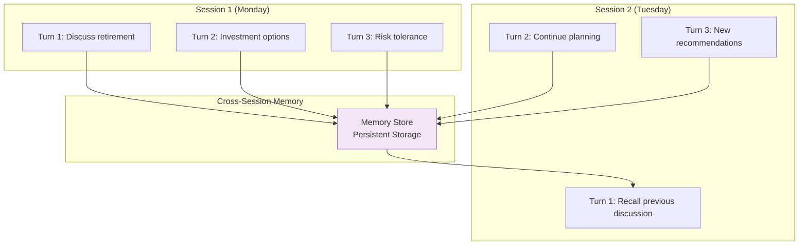
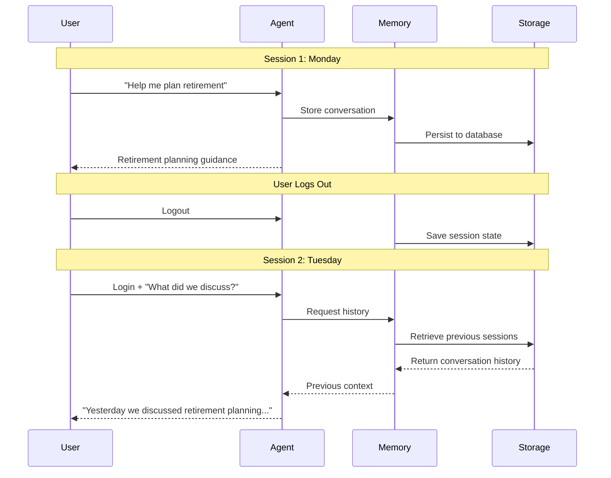

# Lab 4: Cross-Session Memory

This page provides detailed information about cross-session memory capabilities in both Bedrock Agent and AgentCore.

## 🧠 Understanding Cross-Session Memory

### What is Cross-Session Memory?

Cross-session memory allows an AI agent to remember conversations across different login sessions, enabling long-term relationships with users. Both Bedrock Agent (with external memory configuration) and AgentCore support this capability using unique memory IDs per user.



### Memory Types Comparison

| Memory Type | Duration | Scope | Availability |
|-------------|----------|-------|--------------|
| **No Memory** | None | N/A | Coveo Direct |
| **Session + Cross-Session Memory** | Multiple sessions | Across logins | Bedrock Agent (with external memory) |
| **Session + Cross-Session Memory** | Multiple sessions | Across logins | AgentCore (Coveo MCP) |

---

## 🔄 How Cross-Session Memory Works

### Memory Lifecycle



### Key Components

<div style="display: grid; grid-template-columns: repeat(auto-fit, minmax(250px, 1fr)); gap: 1rem; margin: 1.5rem 0;">
  <div style="padding: 1rem; background: #e3f2fd; border-radius: 8px;">
    <strong>🔑 Memory ID</strong><br/>
    <small>Unique identifier for user's memory</small>
  </div>
  <div style="padding: 1rem; background: #fff3e0; border-radius: 8px;">
    <strong>💾 Persistent Storage</strong><br/>
    <small>AWS-managed database for memory</small>
  </div>
  <div style="padding: 1rem; background: #e8f5e9; border-radius: 8px;">
    <strong>🔄 Session Linking</strong><br/>
    <small>Connects conversations across logins</small>
  </div>
  <div style="padding: 1rem; background: #f3e5f5; border-radius: 8px;">
    <strong>⏰ Retention Policy</strong><br/>
    <small>Configurable memory lifetime</small>
  </div>
</div>


---

## 🎯 Cross-Session Memory in Action

### Example: Financial Planning Relationship

**Session 1: Monday Morning**

**User**: "I'm planning for retirement in 15 years"

**Agent**: 

- Stores: User planning for retirement, 15-year timeline
- Responds with initial guidance
- Memory ID: user-123-memory

**User**: "What about tax implications?"

**Agent**:

- Retrieves: Retirement planning context
- Stores: User interested in tax implications
- Responds with tax-efficient strategies

**User logs out**

---

**Session 2: Tuesday Afternoon**

**User logs back in**

**User**: "What were we discussing yesterday?"

**Agent**:

- Retrieves memory using Memory ID: user-123-memory
- Recalls: Retirement planning, 15-year timeline, tax implications
- Responds: "Yesterday we discussed your retirement planning for 15 years from now, focusing on tax-efficient investment strategies..."

**User**: "I've decided to be more conservative"

**Agent**:

- Retrieves: Full context from Session 1
- Updates: User prefers conservative approach
- Responds with adjusted recommendations

---

**Session 3: Friday Morning**

**User logs back in**

**User**: "Can you summarize my retirement plan so far?"

**Agent**:

- Retrieves: All previous sessions
- Synthesizes: Complete conversation history
- Responds with comprehensive summary including:
  - 15-year retirement timeline
  - Tax-efficient strategies discussed
  - Conservative risk preference
  - Specific recommendations made

---

## 📊 Memory Configuration

### AgentCore Memory Settings

| Setting | Value | Description |
|---------|-------|-------------|
| **Memory Type** | Session + Cross-session | Both types enabled |
| **Max Tokens** | 4096 | Context window size |
| **Session Timeout** | 2 hours | Inactivity timeout |
| **Cross-session Retention** | 7 days | How long memories persist |
| **Memory ID** | User-specific | Unique per user |

### Memory Storage

**What Gets Stored**:

- User queries and questions
- Agent responses
- Conversation topics
- User preferences and decisions
- Important facts and context
- Timestamps and session metadata

**What Doesn't Get Stored**:

- Sensitive personal information (PII)
- Payment information
- Passwords or credentials
- Temporary session data

---

## 🔒 Memory Security and Privacy

### Data Protection

<div style="display: grid; grid-template-columns: repeat(auto-fit, minmax(250px, 1fr)); gap: 1rem; margin: 1.5rem 0;">
  <div style="padding: 1rem; background: #e8f5e9; border-radius: 8px;">
    <strong>🔐 Encryption</strong><br/>
    <small>All memory data encrypted at rest and in transit</small>
  </div>
  <div style="padding: 1rem; background: #e3f2fd; border-radius: 8px;">
    <strong>🔒 Isolation</strong><br/>
    <small>Each user's memory completely isolated</small>
  </div>
  <div style="padding: 1rem; background: #fff3e0; border-radius: 8px;">
    <strong>⏰ Expiration</strong><br/>
    <small>Automatic cleanup after retention period</small>
  </div>
  <div style="padding: 1rem; background: #f3e5f5; border-radius: 8px;">
    <strong>🛡️ Access Control</strong><br/>
    <small>IAM-based access restrictions</small>
  </div>
</div>

### Privacy Considerations

**User Control**:

- Users can request memory deletion
- Configurable retention periods
- Opt-out capabilities
- Transparent data usage

**Compliance**:

- GDPR-compliant data handling
- Right to be forgotten support
- Data portability options
- Audit trail maintenance

---

## 💡 Use Cases for Cross-Session Memory

### 1. Financial Advisory

**Scenario**: Long-term financial planning

**Benefits**:
- Remember client goals and preferences
- Track progress over time
- Maintain context across multiple sessions
- Build comprehensive financial profile

**Example**:
```
Session 1: Discuss retirement goals
Session 2: Review investment options
Session 3: Adjust strategy based on market changes
Session 4: Annual review and rebalancing
```

---

### 2. Customer Support

**Scenario**: Complex technical support issues

**Benefits**:
- Remember previous issues and solutions
- Track ongoing problems
- Avoid repeating information
- Provide personalized support

**Example**:
```
Session 1: Report account issue
Session 2: Follow up on resolution
Session 3: Verify fix and discuss prevention
Session 4: Check-in after implementation
```

---

### 3. Educational Tutoring

**Scenario**: Progressive learning over time

**Benefits**:
- Track learning progress
- Remember topics covered
- Adapt difficulty level
- Provide personalized curriculum

**Example**:
```
Session 1: Introduction to investing
Session 2: Deep dive into stocks
Session 3: Understanding bonds
Session 4: Portfolio construction
```

---

### 4. Personal Assistant

**Scenario**: Ongoing task and preference management

**Benefits**:
- Remember user preferences
- Track recurring tasks
- Maintain context for projects
- Provide proactive suggestions

**Example**:
```
Session 1: Set up monthly budget review
Session 2: Discuss spending patterns
Session 3: Adjust budget categories
Session 4: Review progress and goals
```

---

## 🔄 Memory Comparison

### Comparison

| Aspect | No Memory | Cross-Session Memory (Bedrock Agent) | Cross-Session Memory (AgentCore) |
|--------|-----------|-------------------------------------|----------------------------------|
| **Duration** | None | Multiple sessions | Multiple sessions |
| **Persistence** | None | Days/weeks (via memory ID) | Days/weeks |
| **Use Case** | FAQ | Support conversations | Complex consultations |
| **Complexity** | Simple | Medium | Advanced |
| **Cost** | Lowest | Medium | Higher |
| **Value** | Good | Very Good | Excellent |

### When to Use Each

**No Memory (Coveo Direct)**:

- Simple FAQ queries
- One-off searches
- High-volume, stateless requests
- Cost-sensitive applications

**Cross-Session Memory (Bedrock Agent or AgentCore)**:

- Long-term relationships
- Progressive interactions
- Personalized services
- High-value engagements
- Multi-session conversations

---

## 📈 Memory Performance

### Storage and Retrieval

| Operation | Latency | Description |
|-----------|---------|-------------|
| **Store Memory** | 50-100ms | Save conversation context |
| **Retrieve Memory** | 100-200ms | Load previous context |
| **Search Memory** | 200-400ms | Find specific information |
| **Update Memory** | 50-100ms | Modify existing context |

### Memory Capacity

| Metric | Limit | Notes |
|--------|-------|-------|
| **Max Tokens** | 4096 | Per memory instance |
| **Sessions** | Unlimited | Within retention period |
| **Retention** | 7-30 days | Configurable |
| **Users** | Unlimited | Separate memory per user |

---

## 🧪 Testing Cross-Session Memory

### Test Procedure

1. **Session 1: Establish Context**
   ```
   User: "I'm planning to retire in 15 years"
   Agent: [Provides guidance]
   User: "I prefer conservative investments"
   Agent: [Adjusts recommendations]
   ```

2. **Logout**
   ```
   User logs out of the application
   ```

3. **Session 2: Test Recall**
   ```
   User logs back in
   User: "What did we discuss last time?"
   Agent: [Should recall retirement planning and conservative preference]
   ```

4. **Session 2: Continue Conversation**
   ```
   User: "What about tax implications?"
   Agent: [Should maintain full context from Session 1]
   ```

### Validation Checklist

- [ ] Agent recalls previous session topics
- [ ] Agent remembers user preferences
- [ ] Agent maintains conversation continuity
- [ ] Agent can summarize across sessions
- [ ] Memory persists after logout/login
- [ ] New information updates memory correctly

---

## 💡 Best Practices

### For Optimal Memory Usage

1. **Clear Context Setting**:

   - Start conversations with clear context
   - Provide relevant background information
   - State preferences explicitly

2. **Regular Check-ins**:

   - Periodically verify agent's understanding
   - Ask for summaries to confirm memory
   - Correct any misunderstandings promptly

3. **Progressive Disclosure**:

   - Build context over multiple sessions
   - Don't overwhelm with information
   - Allow natural conversation flow

4. **Memory Hygiene**:

   - Update preferences when they change
   - Clarify important decisions
   - Confirm critical information

---

## 🎓 Key Takeaways

!!! success "What You Learned"
    - Cross-session memory enables long-term relationships
    - Memory persists across logout/login cycles
    - Both Bedrock Agent and AgentCore support cross-session memory with memory IDs
    - Memory is secure, encrypted, and user-isolated
    - Cross-session memory ideal for ongoing engagements
    - Memory configuration is flexible and customizable
    - Testing cross-session memory requires logout/login
    - Memory ID is the key to enabling cross-session persistence

---

## 🚀 Next Steps

Explore real-world use cases for conversational AI:

<div style="text-align: center; margin: 2rem 0;">
  <a href="use-cases/" class="md-button md-button--primary">
    Explore Use Cases →
  </a>
</div>
