# Lab 4: Cross-Session Memory

This page provides detailed information about cross-session memory capabilities in both Bedrock Agent and AgentCore.

## 🧠 Understanding Cross-Session Memory

### What is Cross-Session Memory?

Cross-session memory allows an AI agent to remember conversations across different login sessions, enabling long-term relationships with users. Both Bedrock Agent (with external memory configuration) and AgentCore support this capability using unique memory IDs per user.


### Memory Types Comparison

| Memory Type | Duration | Scope | Availability |
|-------------|----------|-------|--------------|
| **No Memory** | None | N/A | Coveo Direct |
| **Session + Cross-Session Memory** | Multiple sessions | Across logins | Bedrock Agent (with external memory) |
| **Session + Cross-Session Memory** | Multiple sessions | Across logins | AgentCore (Coveo MCP) |

---

## 🔑 Memory ID vs Actor ID: Technical Deep Dive

### What is Cognito JWT `sub` Claim?

**JWT (JSON Web Token)** is a secure way to transmit information between parties. When a user logs in through AWS Cognito, they receive a JWT token that contains various "claims" (pieces of information) about the user.

**The `sub` Claim**:

- **Full Name**: "Subject" identifier
- **Purpose**: Unique, permanent identifier for a user in Cognito
- **Format**: UUID (e.g., `"abc-123-def-456-ghi-789"`)
- **Stability**: Never changes for a user, even if they change email or username
- **Uniqueness**: Guaranteed unique across all users in the Cognito User Pool

**Example JWT Token Structure**:
```json
{
  "sub": "abc-123-def-456-ghi-789",           // ← Unique user ID (never changes)
  "email": "user@example.com",                 // Can change
  "cognito:username": "john.doe",              // Can change
  "email_verified": true,
  "iss": "https://cognito-idp.us-east-1.amazonaws.com/us-east-1_XXXXX",
  "aud": "2uf2g5mgnn6mr3rutuncsu8lut",        // Client ID
  "token_use": "id",
  "auth_time": 1704067200,
  "exp": 1704070800                            // Expiration time
}
```

**Why Use `sub` for Memory?**

| Reason | Explanation |
|--------|-------------|
| **Permanence** | Never changes, even if user updates email or username |
| **Uniqueness** | Guaranteed unique across all users |
| **Privacy** | Not personally identifiable (unlike email) |
| **Reliability** | Always present in Cognito JWT tokens |
| **Consistency** | Same value across all login sessions |

**Lifecycle Example**:

```
Day 1: User creates account
  → Cognito assigns: sub = "abc-123-def-456"
  → User email: "john@example.com"

Day 30: User changes email to "john.doe@company.com"
  → sub = "abc-123-def-456" (UNCHANGED)
  → All previous conversations still accessible

Day 60: User changes username
  → sub = "abc-123-def-456" (UNCHANGED)
  → All previous conversations still accessible

Day 90: User logs in from different device
  → sub = "abc-123-def-456" (SAME)
  → All conversations accessible on new device
```

### Understanding User Identity Across Sessions

Both Bedrock Agent and AgentCore use unique identifiers to track users across sessions, but they implement them differently:

| Aspect | Memory ID (Bedrock Agent) | Actor ID (AgentCore) |
|--------|---------------------------|----------------------|
| **Source** | Cognito JWT `sub` claim | Cognito JWT `sub` claim |
| **Processing** | ✅ SHA-256 hashed | ❌ Raw value |
| **Purpose** | User identification across sessions | User identification across sessions |
| **Scope** | Cross-session memory | Cross-session memory |
| **PII Protection** | Yes (hashed) | No (raw sub) |
| **Length** | 64 characters (hash) | Variable (UUID format) |
| **Storage Namespace** | `/memories/{memoryId}` | `/summaries/{actorId}/{sessionId}` |

### JWT `sub` Flow Through the System

```mermaid
sequenceDiagram
    participant User
    participant Cognito
    participant Frontend
    participant Backend
    participant Agent
    participant Memory
    
    User->>Cognito: Login (username/password)
    Cognito->>Cognito: Authenticate user
    Cognito->>Frontend: JWT Token (contains sub)
    Note over Frontend: Token stored in localStorage
    
    User->>Frontend: Send chat message
    Frontend->>Backend: API request + JWT Token
    Backend->>Backend: Decode JWT, extract sub
    
    alt Bedrock Agent
        Backend->>Backend: Hash sub → Memory ID
        Backend->>Agent: Invoke with Memory ID
        Agent->>Memory: Store/Retrieve using Memory ID
    else AgentCore Runtime
        Backend->>Backend: Use raw sub → Actor ID
        Backend->>Agent: Invoke with Actor ID
        Agent->>Memory: Store/Retrieve using Actor ID
    end
    
    Memory-->>Agent: Previous conversations
    Agent-->>Backend: Response with context
    Backend-->>Frontend: Formatted response
    Frontend-->>User: Answer with memory
```



### How Memory ID Works (Bedrock Agent)

**Extraction Priority**:

1. Explicit `memoryId` from request body (if provided)
2. **Cognito `sub` from JWT** (SHA-256 hashed) ← **Used in workshop**
3. Cognito `email` from JWT (SHA-256 hashed)
4. Fallback to "anonymous"

**Example**:
```python
# Backend Lambda (Bedrock Agent)
def get_memory_id_from_token(token):
    decoded = jwt.decode(token)
    cognito_sub = decoded.get('sub')  # e.g., "abc-123-def-456"
    
    # Hash for privacy and consistency
    memory_id = hashlib.sha256(cognito_sub.encode()).hexdigest()
    # Result: "a1b2c3d4e5f6..." (64 chars)
    
    return memory_id
```

**Why Hashing?**

- Normalizes length (always 64 characters)
- Protects PII (Cognito sub is not exposed)
- Consistent identifier across all sessions

### How Actor ID Works (AgentCore)

**Extraction Priority**:

1. **Cognito `sub` from JWT** (raw value) ← **Used in workshop**
2. `userId` or `user_id` from request body (if provided)
3. Fallback to "anonymous"

**Example**:
```python
# Backend Lambda (AgentCore)
def get_actor_id_from_token(token):
    decoded = jwt.decode(token)
    actor_id = decoded.get('sub')  # e.g., "abc-123-def-456"
    
    # No hashing - use raw value
    return actor_id
```

**Why No Hashing?**

- AgentCore expects raw identifiers
- Simpler implementation
- Direct mapping to Cognito user

### Session ID vs Memory ID/Actor ID

| Identifier | Purpose | Lifecycle | Storage |
|------------|---------|-----------|---------|
| **Session ID** | Tracks single conversation | Changes on "End Chat" or logout | `localStorage` (frontend) |
| **Memory ID** | Identifies user (Bedrock Agent) | Stable across all sessions | Derived from JWT (backend) |
| **Actor ID** | Identifies user (AgentCore) | Stable across all sessions | Derived from JWT (backend) |

### Session ID Creation Timeline

**Bedrock Agent**:

| Event | Session ID | Memory ID | Memory Access |
|-------|-----------|-----------|---------------|
| **First chat message** | Generated → `localStorage` | From JWT (`sub` hashed) | No previous memory |
| **Page refresh** | Same (from `localStorage`) | Same (from JWT) | Same session continues |
| **"End Chat" clicked** | NEW (generated) | Same (from JWT) | Can recall previous session |
| **User logs out** | Cleared from `localStorage` | N/A (not stored locally) | N/A |
| **User logs back in** | NEW (generated) | Same (from JWT) | Can recall all previous sessions |

**AgentCore Runtime**:

| Event | Session ID | Actor ID | Memory Access |
|-------|-----------|----------|---------------|
| **First chat message** | Generated → `localStorage` | From JWT (`sub` raw) | No previous memory |
| **Page refresh** | Same (from `localStorage`) | Same (from JWT) | Same session continues |
| **"End Chat" clicked** | NEW (generated) | Same (from JWT) | Can recall previous session |
| **User logs out** | Cleared from `localStorage` | N/A (not stored locally) | N/A |
| **User logs back in** | NEW (generated) | Same (from JWT) | Can recall all previous sessions |

### Memory Hierarchy Visualization

```
User (Cognito Identity: sub = "abc-123-def-456")
│
├── Bedrock Agent
│   ├── Memory ID: "a1b2c3d4..." (SHA-256 hash of sub)
│   │   ├── Session 1 (Monday): sessionId = "sess-001"
│   │   │   ├── Turn 1: "What is a 401k?"
│   │   │   └── Turn 2: "What are contribution limits?"
│   │   │
│   │   ├── Session 2 (Tuesday): sessionId = "sess-002"
│   │   │   ├── Turn 1: "What did we discuss?" ← Recalls Session 1
│   │   │   └── Turn 2: "Tell me about Roth IRA"
│   │   │
│   │   └── Session 3 (Wednesday): sessionId = "sess-003"
│   │       └── Turn 1: "Summarize our discussions" ← Recalls Sessions 1 & 2
│
└── AgentCore Runtime
    ├── Actor ID: "abc-123-def-456" (raw sub)
    │   ├── Session 1 (Monday): session_id = "sess-101"
    │   │   ├── Turn 1: "What is FDIC insurance?"
    │   │   └── Turn 2: "How much coverage?"
    │   │
    │   ├── Session 2 (Tuesday): session_id = "sess-102"
    │   │   ├── Turn 1: "What did we discuss?" ← Recalls Session 1
    │   │   └── Turn 2: "Tell me about NCUA"
    │   │
    │   └── Session 3 (Wednesday): session_id = "sess-103"
    │       └── Turn 1: "Summarize our discussions" ← Recalls Sessions 1 & 2
```

---

## 🔄 How Cross-Session Memory Works

### Memory Lifecycle


### Key Components

<div style="display: grid; grid-template-columns: repeat(auto-fit, minmax(250px, 1fr)); gap: 1rem; margin: 1.5rem 0;">
  <div style="padding: 1rem; background: #e3f2fd; border-radius: 8px;">
    <strong>🔑 Memory ID</strong><br/>
    <small>Unique identifier for user's memory</small>
  </div>
  <div style="padding: 1rem; background: #fff3e0; border-radius: 8px;">
    <strong>💾 Persistent Storage</strong><br/>
    <small>AWS-managed database for memory</small>
  </div>
  <div style="padding: 1rem; background: #e8f5e9; border-radius: 8px;">
    <strong>🔄 Session Linking</strong><br/>
    <small>Connects conversations across logins</small>
  </div>
  <div style="padding: 1rem; background: #f3e5f5; border-radius: 8px;">
    <strong>⏰ Retention Policy</strong><br/>
    <small>Configurable memory lifetime</small>
  </div>
</div>


---

## 🎯 Cross-Session Memory in Action

### Example: Financial Planning Relationship

**Session 1: Monday Morning**

**User**: "I'm planning for retirement in 15 years"

**Agent**: 

- Stores: User planning for retirement, 15-year timeline
- Responds with initial guidance
- Memory ID: user-123-memory

**User**: "What about tax implications?"

**Agent**:

- Retrieves: Retirement planning context
- Stores: User interested in tax implications
- Responds with tax-efficient strategies

**User logs out**

---

**Session 2: Tuesday Afternoon**

**User logs back in**

**User**: "What were we discussing yesterday?"

**Agent**:

- Retrieves memory using Memory ID: user-123-memory
- Recalls: Retirement planning, 15-year timeline, tax implications
- Responds: "Yesterday we discussed your retirement planning for 15 years from now, focusing on tax-efficient investment strategies..."

**User**: "I've decided to be more conservative"

**Agent**:

- Retrieves: Full context from Session 1
- Updates: User prefers conservative approach
- Responds with adjusted recommendations

---

**Session 3: Friday Morning**

**User logs back in**

**User**: "Can you summarize my retirement plan so far?"

**Agent**:

- Retrieves: All previous sessions
- Synthesizes: Complete conversation history
- Responds with comprehensive summary including:
  - 15-year retirement timeline
  - Tax-efficient strategies discussed
  - Conservative risk preference
  - Specific recommendations made

---

## 🔚 "End Chat & Save Memory" Feature

### Purpose

Allows users to explicitly end a conversation and start fresh while preserving the ability to recall previous conversations.

### How It Works

**Frontend (ChatBot.js)**:
```javascript
const handleEndSession = async () => {
  // 1. Send endSession=true to backend
  await chatAPI(
    "End session",
    currentSessionId,
    backendMode,
    null,
    true  // endSession = true
  );
  
  // 2. Generate new session ID
  const newSessionId = uuidv4();
  setCurrentSessionId(newSessionId);
  
  // 3. Update localStorage
  onSessionEnd(newSessionId);
  
  // 4. Clear chat messages
  setMessages([/* welcome message */]);
};
```

**Backend (Bedrock Agent)**:
```python
invoke_params = {
    'agentId': agent_id,
    'agentAliasId': alias_id,
    'sessionId': session_id,      # Current session
    'inputText': question,
    'memoryId': memory_id,         # User identity (hashed)
    'endSession': True             # Finalize & summarize
}

response = bedrock_agent_runtime.invoke_agent(**invoke_params)
# Agent summarizes session and stores in memory
```

**Backend (AgentCore Runtime)**:
```python
payload = {
    "text": prompt,
    "session_id": session_id,      # Current session
    "actor_id": actor_id,          # User identity (raw)
    "end_session": True            # Finalize & summarize
}

response = requests.post(agentcore_url, json=payload)
# AgentCore summarizes session and stores in memory
```

### What Happens Step-by-Step

**1. User clicks "End Chat & Save Memory"**

- Frontend sends `endSession=true` to backend
- Current session ID: `"abc-123"`

**2. Backend finalizes session**

- Bedrock Agent/AgentCore summarizes conversation
- Stores summary in memory under Memory ID/Actor ID
- Session `"abc-123"` is now complete

**3. Frontend generates new session**

- New session ID: `"def-456"`
- Updates `localStorage`
- Clears chat messages

**4. Next message in new session**

- Uses new session ID: `"def-456"`
- Same Memory ID/Actor ID (from JWT)
- Agent can recall previous session `"abc-123"`

### Behavior Comparison

| Aspect | Bedrock Agent | AgentCore Runtime |
|--------|---------------|-------------------|
| **Button Click** | Sends `endSession=true` | Sends `end_session=true` |
| **Backend Action** | Finalizes session, summarizes | Finalizes session, summarizes |
| **Session ID** | Changes (new UUID) | Changes (new UUID) |
| **Memory ID/Actor ID** | Stays the same | Stays the same |
| **Memory Storage** | Bedrock Agent Memory | AgentCore Memory Service |
| **Recall Ability** | ✅ "What did we discuss?" | ✅ "What did we discuss?" |

---

## 📊 Memory Configuration

### Bedrock Agent Memory Settings

| Setting | Value | Description |
|---------|-------|-------------|
| **Memory Type** | Session + Cross-session | Both types enabled |
| **Memory ID Source** | Cognito `sub` (hashed) | SHA-256 hash of user ID |
| **Session Timeout** | Configurable | Inactivity timeout |
| **Cross-session Retention** | 7 days (default) | How long memories persist |
| **Storage** | AWS Bedrock Agent Memory | Managed service |

### AgentCore Memory Settings

| Setting | Value | Description |
|---------|-------|-------------|
| **Memory Type** | Session + Cross-session | Both types enabled |
| **Actor ID Source** | Cognito `sub` (raw) | Direct user ID from JWT |
| **Max Tokens** | 4096 | Context window size |
| **Session Timeout** | 2 hours | Inactivity timeout |
| **Cross-session Retention** | 7 days (default) | How long memories persist |
| **Storage** | AgentCore Memory Service | Managed service |

### Memory Storage

**What Gets Stored**:

- User queries and questions
- Agent responses
- Conversation topics
- User preferences and decisions
- Important facts and context
- Timestamps and session metadata

**What Doesn't Get Stored**:

- Sensitive personal information (PII)
- Payment information
- Passwords or credentials
- Temporary session data

---

## 🔒 Memory Security and Privacy

### Session Management on Logout

**Secure Logout Implementation**:

When a user logs out, the application properly clears all session data to prevent session reuse:

```javascript
// AuthProvider.js - logout() function
const logout = () => {
  // Clear authentication tokens
  localStorage.removeItem('auth_token');
  localStorage.removeItem('access_token');
  
  // Clear session IDs for security (prevent session reuse)
  localStorage.removeItem('bedrock_session_id');
  localStorage.removeItem('coveo_mcp_session_id');
  
  setToken(null);
  setUser(null);
  
  // Redirect to Cognito logout
  window.location.href = logoutUrl;
};
```

**Security Benefits**:

- ✅ **Session IDs cleared** on logout
- ✅ **New session IDs generated** on next login
- ✅ **Prevents session reuse** on shared computers
- ✅ **Maintains proper session isolation** between users
- ✅ **Cross-session memory still works** via Memory ID/Actor ID (from JWT)

**What Happens on Logout**:

| Data Type | Action | Reason |
|-----------|--------|--------|
| `auth_token` | ✅ Cleared | Prevents unauthorized access |
| `access_token` | ✅ Cleared | Prevents API access |
| `bedrock_session_id` | ✅ Cleared | Prevents session reuse |
| `coveo_mcp_session_id` | ✅ Cleared | Prevents session reuse |
| Memory ID/Actor ID | ❌ Not stored locally | Derived from JWT on next login |

**What Happens on Next Login**:

1. User authenticates with Cognito
2. New JWT token issued with same `sub` claim
3. New session IDs generated for fresh conversations
4. Backend extracts Memory ID/Actor ID from JWT
5. Agent retrieves previous conversations via Memory ID/Actor ID
6. User can recall all previous sessions

### Data Protection

<div style="display: grid; grid-template-columns: repeat(auto-fit, minmax(250px, 1fr)); gap: 1rem; margin: 1.5rem 0;">
  <div style="padding: 1rem; background: #e8f5e9; border-radius: 8px;">
    <strong>🔐 Encryption</strong><br/>
    <small>All memory data encrypted at rest and in transit</small>
  </div>
  <div style="padding: 1rem; background: #e3f2fd; border-radius: 8px;">
    <strong>🔒 Isolation</strong><br/>
    <small>Each user's memory completely isolated</small>
  </div>
  <div style="padding: 1rem; background: #fff3e0; border-radius: 8px;">
    <strong>⏰ Expiration</strong><br/>
    <small>Automatic cleanup after retention period</small>
  </div>
  <div style="padding: 1rem; background: #f3e5f5; border-radius: 8px;">
    <strong>🛡️ Access Control</strong><br/>
    <small>IAM-based access restrictions</small>
  </div>
</div>

### Privacy Considerations

**User Control**:

- Users can request memory deletion
- Configurable retention periods
- Opt-out capabilities
- Transparent data usage

**Compliance**:

- GDPR-compliant data handling
- Right to be forgotten support
- Data portability options
- Audit trail maintenance

---

## 💡 Use Cases for Cross-Session Memory

### 1. Financial Advisory

**Scenario**: Long-term financial planning

**Benefits**:

- Remember client goals and preferences
- Track progress over time
- Maintain context across multiple sessions
- Build comprehensive financial profile

**Example**:
```
Session 1: Discuss retirement goals
Session 2: Review investment options
Session 3: Adjust strategy based on market changes
Session 4: Annual review and rebalancing
```

---

### 2. Customer Support

**Scenario**: Complex technical support issues

**Benefits**:

- Remember previous issues and solutions
- Track ongoing problems
- Avoid repeating information
- Provide personalized support

**Example**:
```
Session 1: Report account issue
Session 2: Follow up on resolution
Session 3: Verify fix and discuss prevention
Session 4: Check-in after implementation
```

---

### 3. Educational Tutoring

**Scenario**: Progressive learning over time

**Benefits**:

- Track learning progress
- Remember topics covered
- Adapt difficulty level
- Provide personalized curriculum

**Example**:
```
Session 1: Introduction to investing
Session 2: Deep dive into stocks
Session 3: Understanding bonds
Session 4: Portfolio construction
```

---

### 4. Personal Assistant

**Scenario**: Ongoing task and preference management

**Benefits**:

- Remember user preferences
- Track recurring tasks
- Maintain context for projects
- Provide proactive suggestions

**Example**:
```
Session 1: Set up monthly budget review
Session 2: Discuss spending patterns
Session 3: Adjust budget categories
Session 4: Review progress and goals
```

---

## 🔄 Memory Comparison

### Comparison

| Aspect | No Memory | Cross-Session Memory (Bedrock Agent) | Cross-Session Memory (AgentCore) |
|--------|-----------|-------------------------------------|----------------------------------|
| **Duration** | None | Multiple sessions | Multiple sessions |
| **Persistence** | None | Days/weeks (via memory ID) | Days/weeks |
| **Use Case** | FAQ | Support conversations | Complex consultations |
| **Complexity** | Simple | Medium | Advanced |
| **Cost** | Lowest | Medium | Higher |
| **Value** | Good | Very Good | Excellent |

### When to Use Each

**No Memory (Coveo Direct)**:

- Simple FAQ queries
- One-off searches
- High-volume, stateless requests
- Cost-sensitive applications

**Cross-Session Memory (Bedrock Agent or AgentCore)**:

- Long-term relationships
- Progressive interactions
- Personalized services
- High-value engagements
- Multi-session conversations

---

## 📈 Memory Performance

### Storage and Retrieval

| Operation | Latency | Description |
|-----------|---------|-------------|
| **Store Memory** | 50-100ms | Save conversation context |
| **Retrieve Memory** | 100-200ms | Load previous context |
| **Search Memory** | 200-400ms | Find specific information |
| **Update Memory** | 50-100ms | Modify existing context |

### Memory Capacity

| Metric | Limit | Notes |
|--------|-------|-------|
| **Max Tokens** | 4096 | Per memory instance |
| **Sessions** | Unlimited | Within retention period |
| **Retention** | 7-30 days | Configurable |
| **Users** | Unlimited | Separate memory per user |

---

## 🧪 Testing Cross-Session Memory

### Test Procedure

**1. Session 1: Establish Context**

```
User: "I'm planning to retire in 15 years"
Agent: [Provides guidance]
User: "I prefer conservative investments"
Agent: [Adjusts recommendations]
```

**2. Logout**

```
User logs out of the application
```

**3. Session 2: Test Recall**

```
User logs back in
User: "What did we discuss last time?"
Agent: [Should recall retirement planning and conservative preference]
```

**4. Session 2: Continue Conversation**

```
User: "What about tax implications?"
Agent: [Should maintain full context from Session 1]
```

### Validation Checklist

- [ ] Agent recalls previous session topics
- [ ] Agent remembers user preferences
- [ ] Agent maintains conversation continuity
- [ ] Agent can summarize across sessions
- [ ] Memory persists after logout/login
- [ ] New information updates memory correctly

---

## 💡 Best Practices

### For Optimal Memory Usage

**1. Clear Context Setting**:

- Start conversations with clear context
- Provide relevant background information
- State preferences explicitly

**2. Regular Check-ins**:

- Periodically verify agent's understanding
- Ask for summaries to confirm memory
- Correct any misunderstandings promptly

**3. Progressive Disclosure**:

- Build context over multiple sessions
- Don't overwhelm with information
- Allow natural conversation flow

**4. Memory Hygiene**:

- Update preferences when they change
- Clarify important decisions
- Confirm critical information

---

## 🎓 Key Takeaways

!!! success "What You Learned"
    - Cross-session memory enables long-term relationships
    - Memory persists across logout/login cycles
    - Both Bedrock Agent and AgentCore support cross-session memory with memory IDs
    - Memory is secure, encrypted, and user-isolated
    - Cross-session memory ideal for ongoing engagements
    - Memory configuration is flexible and customizable
    - Testing cross-session memory requires logout/login
    - Memory ID is the key to enabling cross-session persistence

---

## 🚀 Next Steps

Explore real-world use cases for conversational AI:

<div style="text-align: center; margin: 2rem 0;">
  <a href="../use-cases/" class="md-button md-button--primary">
    Explore Use Cases →
  </a>
</div>
