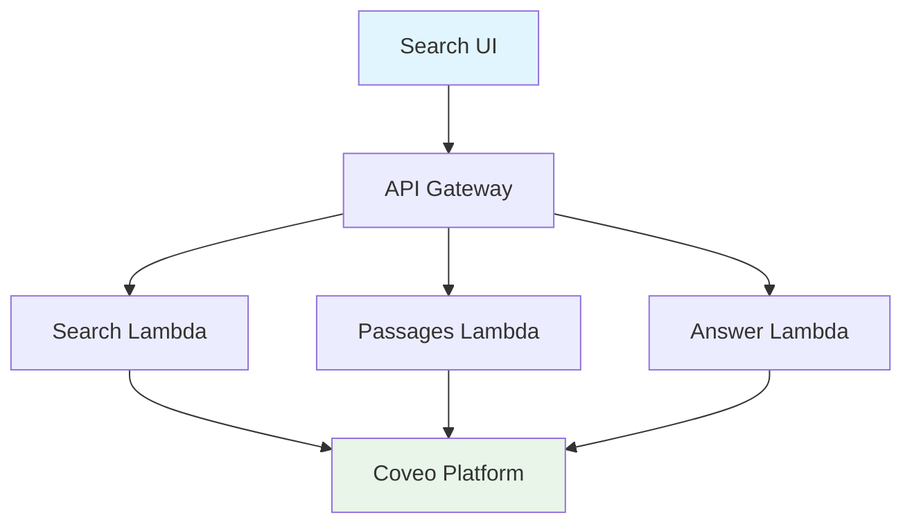
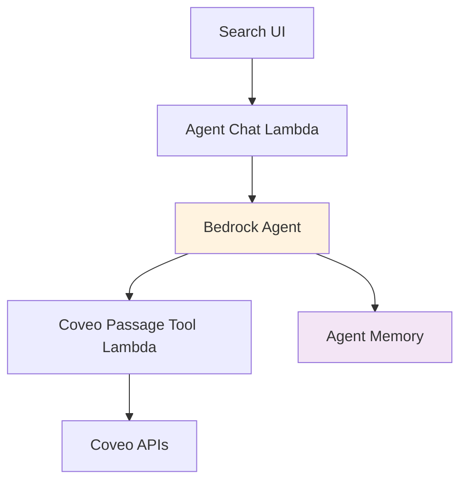
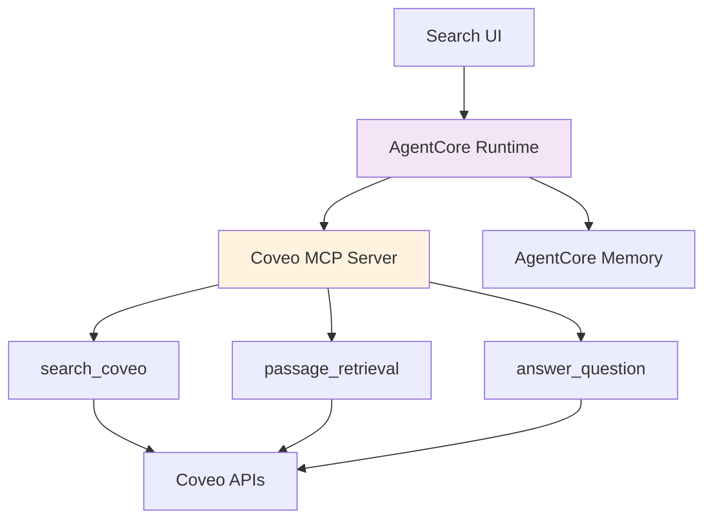
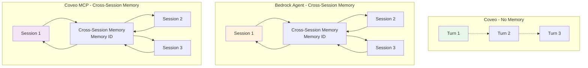
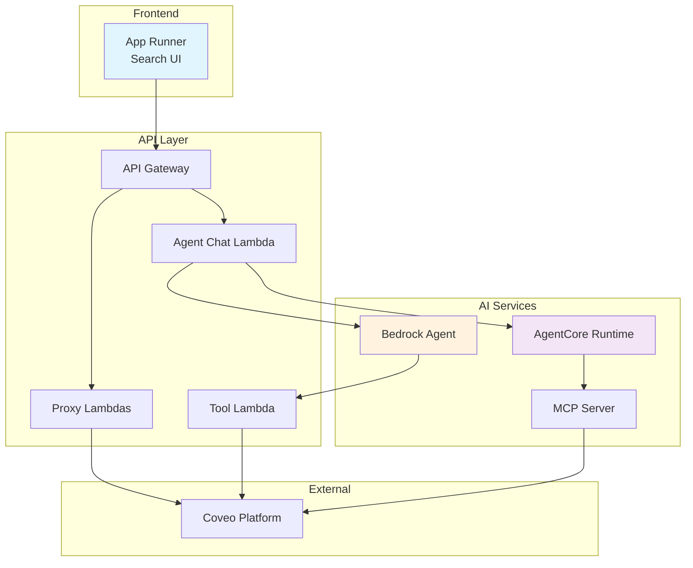

# Architecture Diagrams

This page compiles all architecture diagrams from the workshop for quick reference.

## Overall Workshop Architecture

### Three Integration Patterns

```mermaid
graph TB
    subgraph "Pattern 1: Direct API"
        UI1[Search UI] --> Lambda1[Proxy Lambdas]
        Lambda1 --> Coveo1[Coveo APIs]
    end
    
    subgraph "Pattern 2: Bedrock Agent"
        UI2[Search UI] --> Agent[Bedrock Agent]
        Agent --> Tool[Passage Tool]
        Tool --> Coveo2[Coveo APIs]
    end
    
    subgraph "Pattern 3: AgentCore + MCP"
        UI3[Search UI] --> Runtime[AgentCore Runtime]
        Runtime --> MCP[MCP Server]
        MCP --> Coveo3[Coveo APIs]
    end
    
    style UI1 fill:#e8f5e9
    style UI2 fill:#fff3e0
    style UI3 fill:#f3e5f5
```

## Lab 1: Direct Coveo Integration

### High-Level Architecture

## Lab 2: Bedrock Agent + Coveo 

### Agent Architecture

## Lab 3: AgentCore with Coveo MCP

### AgentCore Architecture

## Lab 4: Chatbot Comparison

### Memory Comparison

## Deployment Architecture

### AWS Infrastructure

---

For detailed diagrams specific to each lab, refer to the individual lab architecture pages.
