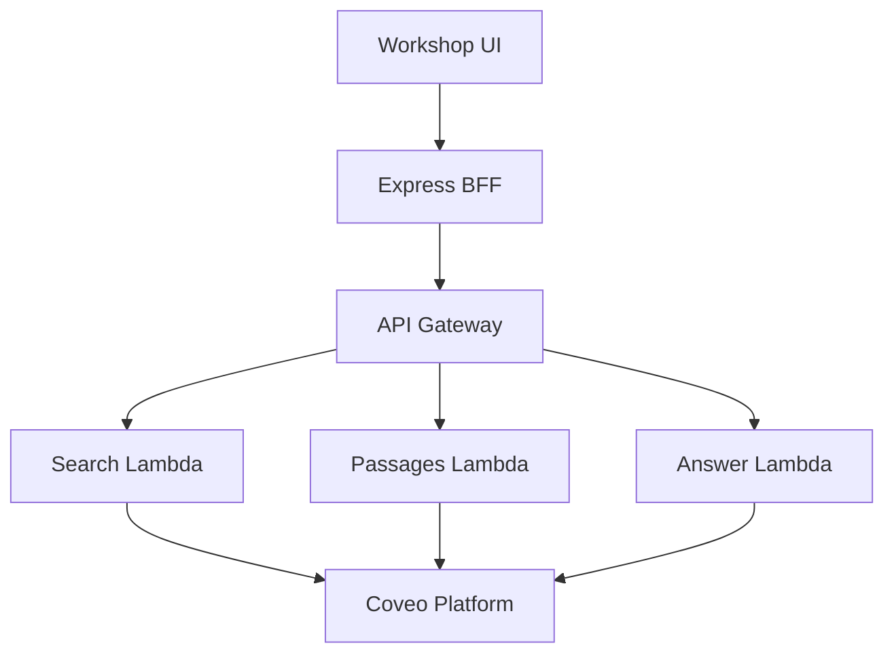
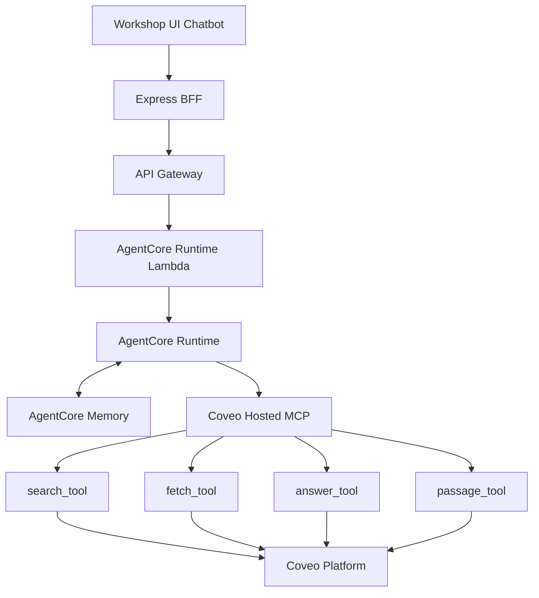
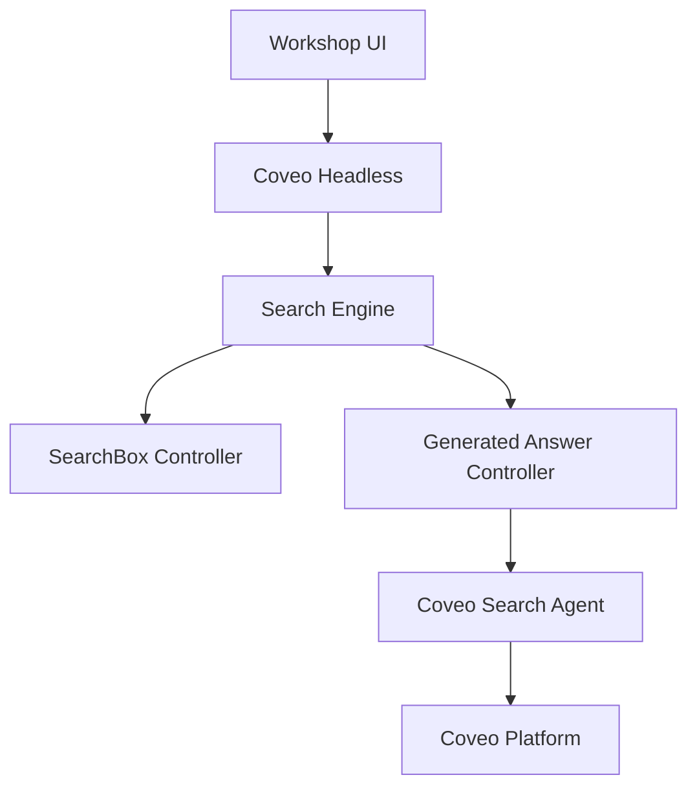
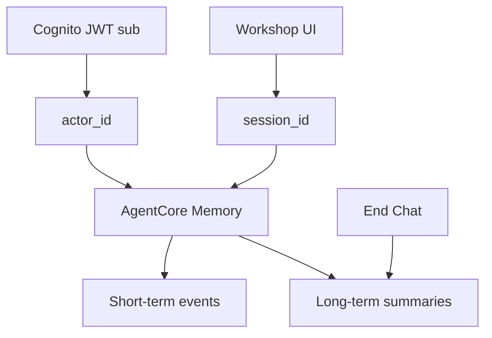

# Architecture Diagrams

This page compiles the live workshop architecture diagrams.

## Overall Workshop Architecture

```mermaid
graph TB
    subgraph "Lab 1: Direct APIs"
        UI1[Workshop UI]
        BFF1[Express BFF]
        API1[API Gateway]
        L1[Search / Passages / Answer Lambdas]
        C1[Coveo Platform]
        UI1 --> BFF1 --> API1 --> L1 --> C1
    end

    subgraph "Lab 2: AgentCore + Hosted MCP"
        UI2[Workshop UI Chatbot]
        BFF2[Express BFF]
        API2[API Gateway]
        L2[AgentCore Runtime Lambda]
        Runtime[AgentCore Runtime]
        Memory[AgentCore Memory]
        MCP[Coveo Hosted MCP]
        C2[Coveo Platform]
        UI2 --> BFF2 --> API2 --> L2 --> Runtime
        Runtime <--> Memory
        Runtime --> MCP --> C2
    end

    subgraph "Lab 3: Native Coveo Search Agent"
        UI3[Workshop UI]
        Headless[Coveo Headless]
        SearchAgent[Coveo Search Agent]
        C3[Coveo Platform]
        UI3 --> Headless --> SearchAgent --> C3
    end
```

## Lab 1: Direct Coveo APIs

```mermaid
graph TB
    UI[Workshop UI] --> BFF[Express BFF]
    BFF --> API[API Gateway]
    API --> Search[Search Lambda]
    API --> Passages[Passages Lambda]
    API --> Answer[Answer Lambda]
    Search --> Coveo[Coveo Platform]
    Passages --> Coveo
    Answer --> Coveo
```

## Lab 2: AgentCore + Hosted MCP

```mermaid
graph TB
    UI[Workshop UI Chatbot] --> BFF[Express BFF]
    BFF --> API[API Gateway]
    API --> Lambda[AgentCore Runtime Lambda]
    Lambda --> Runtime[AgentCore Runtime]
    Runtime <--> Memory[AgentCore Memory]
    Runtime --> MCP[Coveo Hosted MCP]
    MCP --> Search[search_tool]
    MCP --> Fetch[fetch_tool]
    MCP --> Answer[answer_tool]
    MCP --> Passage[passage_tool]
    Search --> Coveo[Coveo Platform]
    Fetch --> Coveo
    Answer --> Coveo
    Passage --> Coveo
```

## Lab 3: Native Coveo Search Agent

```mermaid
graph TB
    UI[Workshop UI] --> Headless[Coveo Headless]
    Headless --> Engine[Search Engine]
    Engine --> SearchBox[SearchBox Controller]
    Engine --> GeneratedAnswer[Generated Answer Controller]
    GeneratedAnswer --> SearchAgent[Coveo Search Agent]
    SearchAgent --> Coveo[Coveo Platform]
```

## Memory Flow For Lab 2

```mermaid
graph TB
    JWT[Cognito JWT sub] --> Actor[actor_id]
    UI[Workshop UI] --> Session[session_id]
    Actor --> Memory[AgentCore Memory]
    Session --> Memory
    Memory --> ShortTerm[Short-term events]
    Memory --> LongTerm[Long-term summaries]
    End[End Chat] --> LongTerm
```
